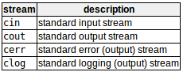

c++使用一种方便的抽象称为streams，在连续介质（如屏幕、键盘或文件）中执行输入和输出操作。  
流是字符的源/目的地，这些字符是按顺序提供/接受的（即，一个接一个）。  
标准库定义了一些流对象，这些流对象可用于访问程序运行环境中认为的字符的标准源和目的地：  


# Standard output(cout,cerr,clog)标准输出
默认的标准输出是屏幕。  
cerr和clog工作原理类似cout，用于识别特定目的的流：错误信息和日志记录。  
对于格式化输出操作，cout和插入操作符（<<）一起使用。
```c++
cout << "Output sentence";  // prints Output sentence on screen
cout << 120;                // prints number 120 on screen
cout << x;                  // prints the value of x on screen
```
<<操作符将跟随它的数据插入到它前面的流中。  
```c++
cout << "Hello";            // prints Hello
cout << Hello;              // prints the content of variable Hello
```
多个插入操作（<<）可以链接在一个语句中。或者链接变量和文字。
```c++
cout << "This" << " is a " << "single C++ statement";
// if age = 24,zipcode = 90064
cout << "I am " << age << " years old and my zipcode is " << zipcode;
// 输出：I am 24 years old and my zipcode is 90064
```
cout不会自动在末尾添加换行符。
有两个方法插入换行符。法一：在应该换行处添加'\n'；法二：在应该换行处添加endl
```c++
cout << "First sentence.\n";
cout << "Second sentence.\nThird sentence.";
cout << "First sentence." << endl;
cout << "Second sentence." << endl;
```
endl除了换行以外，还有一个操作是流的缓冲区更新（即时输出的意思），有开销的？！！

# Standard input(cin)标准输入
默认的标准输入是键盘。  
用于访问它的c++流对象是cin。  
对于格式化输入操作，cin和提取操作符（>>）一起使用。  
\>>操作符将跟随它的流存储到变量中。
```c++
int age;
cin >> age;
```  
仅当用户按下ENTER或RETURN键时才传输数据到程序。  
\>>操作符根据变量类型确定如何解释输入的字符。  
使用cin时，如果用户输入不完整，运行时会出现无效值，使用stringstream更好地控制用户输入。  
多个提取操作（>>）可以链接在一个语句中请求多个数据。可以用空格、制表符或换行符分割两个输入。  
```c++
cin >> a >> b;
// 等价于
cin >> a;
cin >> b;
```

# cin and strings
```c++
string mystring;
cin >> mystring;
```
问题：cin提取总是将空格等作为提取值的结束，因此提取字符串意味着总是提取单个单词，而不是短语或整个句子。  
解决：为了获得完整的行，使用getline(cin,mystring)。

# stringstream
标准库\<sstream>定义了stringstream，允许将字符串视为流，从而允许从/到字符串进行提取或插入操作，有利于字符串与数值之间的转换。
```c++
string mystr ("1024")；
int myint;
stringstream(mystr) >> myint;
```
