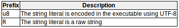

# Constants常量
具有固定值的表达式
- literal constants字面值常量：整数、浮点数、字符、字符串、布尔值、指针和用户定义的字面值  
    - Integer Numerals数值常量：不包含引号或任何其他特殊字符，表示以小数为基数的整数的简单数字序列，常用的：decimal十进制、octal八进制（数字前面有个零字符）、hexadecimal十六进制（数字前面有0x）
        ```c++
        75      // decimal
        0113    // octal
        0x4b    // hexadecimal
        ```
        后缀表示整型的特殊属性，常见后缀：  
         
        ```c++
        // u可以和l或ll组合，大小写随意
        75      // int
        75u     // unsigned int
        75l     // long
        75ul    // unsigned long
        75lu    // unsigned long
        ```
    - Floating Point Numerals浮点数：用小数和/或指数表示实值。包括一个小数点，一个e字符（表示“10的X倍”，其中X是在e字符后面的一个整数值）或一个小数点和一个e字符。浮点数默认类型为double。
        ```c++
        3.14159 // 3.14159
        6.02e23 // 6.02 x 10 ^ 23
        1.6e-19 // 1.6 x 10 ^ -19
        3.0     // 3.0
        ```
        后缀表示浮点型的特殊属性，常见后缀：  
        
        ```c++
        // 大小写随意
        3.14159L // long double
        6.02e23f // float
        ```
    - Character and string literals字符和字符串字面值  
        用引号括起来。与变量标识符和保留关键字区分开。单个字符用‘单引号’，字符串用“双引号”。
        ```c++
        'z'
        'p'
        "Hello world"
        "How do you do?"
        ```
        特殊字符需要加反斜杠转义，常见单字符转义码列表：  
        
        ```c++
        "\n"
        "\t"
        "Left \t Right"
        "one\ntwo\nthree"
        ```
    - 其他字面值  
        三个关键字面值：true，false（布尔型变量的可能值）和nullptr（空指针的值）。

# Typed constant expressions类型的常量表达式
```c++
const double pi = 3.1415926;
const char tab = '\t';
```
计算机将字符（ASCII）和文字表示为数字代码（反斜杠+八进制base-8/十六进制base-16的数字）。如：\x4A  
通过一个或多个空格（包括制表符、换行符和其他有效的空白字符）将几个字符串字面值连接起来就可以形成一个字符串字面值。
```
"this forms" "a single" " string " "of characters"
>>>
"this forms a single string of characters"
```
使用反斜杠（\）分格长字符串
```c++
x = "string expressed in \
two lines"  // 等价于x = "string expressed in two lines"
```
前缀表示不同的字符属性，常见的前缀：  
  
附加的前缀：  
  
以上前缀均区分大小写！！！  
原始字符串中，反斜杠、单引号、双引号都是有效字符。  
```c++
R"sequence（and a final）sequence"  
```
这里sequence可以是任意字符串（包括空串）。  
```c++
R"(string with \backslash)"
R"&%$(string with \backslash)&%$"   
// 同"string with \\backslash"
```
R可以和任何其他前缀组合。

# Preprocessor definitions预处理器定义（# define）
命名常数值的另一种机制  
```c++
# define identifier replacement  
```
在预编译阶段，指令之后的代码中所有出现的指定标识符都被解释为替换量。  
盲目替换，不会检查类型和语法的有效性。  
不属于语句，结尾不应有分号（；），如果有分号，算作替换量的一部分
