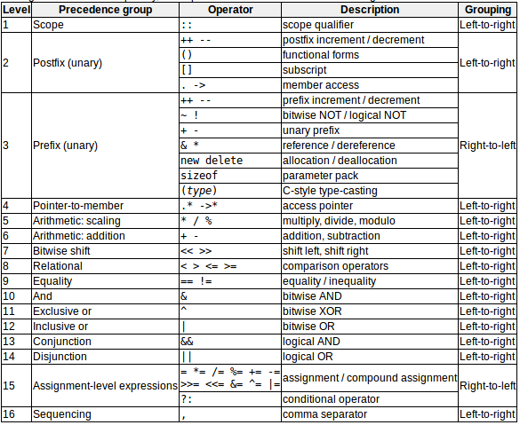

# Assignment operator(=)赋值运算符
将值赋给变量，从右到左，只影响等号左侧的量。  
```c++
x=5;
x=y;
```
赋值操作会计算表达式
```c++
y = 2 + (x = 5);    // 等价于x=5;y=2+x;
```
支持连续赋值
```c++
x=y=z=5;        // 总是从右往左
```

# Arithmetic operators(+,-,*,/,%)算术运算符
支持的算术运算符：  
  
其中%表示取模运算，即两个值相除的余数

# Compound assignment(+=,-=,*=,/=,%=,>>=,<<=,&=,^=,|=)复合赋值
通过对变量执行操作来修改其当前值，将结果分配给第一个操作数。  
  

# Increment and decrement(++,--)增减
递增运算符（++）和递减运算符（--）将存储在变量中的值增加或减少1。  
等价于+=1和-=1。  
```c++
//x加1
++x;
x+=1;
x=x+1
```
前缀和后缀在赋值时会产生不同结果  
  

# Relational and comparison operators(==,!=,>,<,>=,<=)关系和比较运算符
常见的关系运算符：  
  
```c++
(7 == 5)        // evaluates to false
(5 > 4)         // evaluates to true
(3 != 2)        // evaluates to true
(6 >= 6)        // evaluates to true
(5 < 5)         // evaluates to false
// a=2,b=3,c=6
(a == 5)        // evaluates to false,since a is not equal to 5
(a*b >= c)      // evaluates to true,since (2*3 >= 6) is true
(b+4 > a*c)     // evaluates to false,since (3+4 > 2*6) is false
((b=2) == a)    // evaluates to true!!
```

# Logical operators(!,&&,||)逻辑运算符
!等价于NOT  
  

```c++
!(5 == 5)       // evaluates to false because the expression at its right (5 == 5) is true
!(6 <= 4)       // evaluates to true because (6 <= 4) would be false
!true           // evaluates to false
!false          // evaluates to true
((5 == 5) && (3 > 6))   // evaluates to false (true && false)
((5 == 5) || (3 > 6))   // evaluates to true (true || false)
```
短路评估：从左向右结合关系，若表达式1为真，则||不检查表达式2是否为真  
  


# Conditional ternary operator(?)条件三元运算符
condition ？ result1  ： result2  
若条件为真，则整个表达式计算为result1，否则计算为result2  
```c++
7==5 ? 4 : 3    // evaluates to 3, since 7 is not equal to 5.
7==5+2 ? 4 : 3  // evaluates to 4, since 7 is equal to 5+2.
5>3 ? a : b     // evaluates to the value of a, since 5 is greater than 3.
a>b ? a : b     // evaluates to whichever is greater, a or b.
```

# Comma operator(,)逗号操作符
在一个语句中，用于分隔两个或多个表达式。  
当必须对表达式集求值时，只考虑最右的表达式。
```c++
a=(b=3,b+2) //a = 3+2 = 5,b = 3
```

# Bitwise operator(&,|,^,~,<<,>>)按位运算符
位操作符修改变量时考虑的是表示它们存储的值的位模式。  
 

# Explicit type casting operator显式类型强制转换操作符
将给定类型的值转换为另一种类型  
法一：类C，在表达式前面加上括号。  
```c++
int i;
float f = 3.14;
i = (int) f;
```
法二：使用函数表示法。  
```c++
i = int (f);
```

# sizeof 
一个参数（可以是类型或变量），并返回该类型或对象的字节大小
```c++
x = sizeof(char);
```
返回的值是一个编译时常量，所以它总是在程序执行之前被确定

# Other operators
后续出现的，比如引用指针或面向对象编程的细节的操作符

# Precedence of operators操作符的优先级
一个表达式可以有多个运算符。  
表达式的部分可以用括号括起来来覆盖优先级，或者显式地明确预期的效果？  
```c++
x = 5 + 7 % 2;      // %优先于+被计算
x = 5 + (7 % 2);    // x = 6(same as without parenthesis)
x = (5 + 7) % 2;    // x = 0
```
从最大优先级到最小优先级，如下表：  
  
>- 当一个表达式有两个优先级相同的运算符时，分组决定哪个运算符首先被求值：从左到右或从右到左；  
>- 将所有子语句括在括号中（甚至那些由于优先级而不必要的子语句）可以提高代码的可读性。
