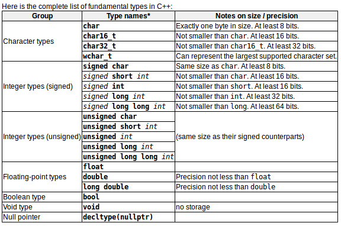
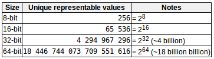

# variables变量  
每个变量都需要一个名称来标识它并与其他变量区分开来  
# identifiers标识符  
一个或多个字母、数字或下划线字符(_)的序列，不能有空格、标点符号和符号  
任何情况下都不能以数字开头  
保留字不能用  
>Notes:c++语言里”区分大小写“，大小写不同也不是同一个标识符！！！

# reserved keywords保留（关键）字：  
alignas,alignof,and,and_eq,asm,auto,bitand,bitor,bool,break,case,catch,char,char16_t,char32_t,class,compl,const,constexpr,const_cast,continue,decltype,default,delete,do,double,dynamic_cast,else,enum,explicit,export,extern,false,float,for,friend,goto,if,inline,int,long,mutable,namespace,new,noexcept,not,not_eq,nullptr,operator,or,or_eq,private,protected,public,register,reinterpret_cast,return,short,signed,sizeof,static,static_assert,static_cast,struct,switch,template,this,thread_local,throw,true,try,typedef,typeid,typename,union,unsigned,using,virtual,void,volatile,wchar_t,while,xor,xor_eq

# fundamental data types基本数据类型
不同类型的变量所占内存、存储方式、解释方式都不尽相同  
  
一个类型拥有的比特数越多，它所代表的值就越明显，但同时也会消耗内存中的更多空间  
  
使用numeric_limits类（详见标准库\<limits\>）可以获得特定系统和编译器实现中的基本类型的属性  

- 算术类型(字符、整数、浮点数和布尔值)  
- 空类型（void）
- 指针类型（nullptr）
- 复合类型（基于上面的基本类型）

# Declaration of Variables声明变量
强类型语言：要求每个变量在首次使用之前都要声明其类型（告知编译器在内存中为变量保存多少大小及如何解释其值）  
声明多个同类型变量可以：int a,b,c;

# Initialization of variables变量初始化
法一：类c初始化，type identifier = initial_value;
```c++
int x=0;
```

法二：构造函数初始化，type identifier (initial_value);
```c++
int x(0);
```

法三：统一初始化，type identifier {initial_value};
```c++
int x{0};
```

# Type deduction:auto and decltype
当一个新变量被初始化时，编译器可以通过初始化器自动地判断变量的类型。使用auto作为变量的类型说明符  
```c++
int foo = 0；
auto bar = foo；    // the same as:int bar = foo;
```
未初始化的变量也可以使用decltype说明符使用类型判断：  
```c++
int foo = 0;
decltype(foo) bar;  // the same as:int bar;
```

# Introduction to strings字符串
string类:复合数据类型，能够存储字符序列，如单词或句子。使用时需要包含头文件\<string\>  
有效的初始化：  
```c++
string mystring = "This is a string";
string mystring("This is a string");
string mystring{"This is a string"};
```
字符串的用法类似其他基本数据类型