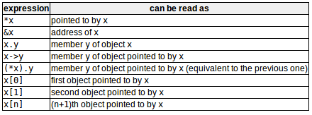

类：数据结构的扩展概念，既可以包含数据成员、也可以包含作为成员的函数。  
对象：类的实例化。（也可以看作，类是类型，对象是变量）
```c++
// 类声明
class class_name{
    access_specifier_1:
        member1;
    access_specifier_2:
        member2;
    // ......
}object_names;
/*
class_name --- 类的有效标识符
object_name --- 该类对象的可选名称列表
{} --- 声明主体可以包含成员（数据声明或函数声明），也可以包含访问说明符（私有private、公共public、受保护protected、没有标记时默认为私有）
*/
// example
class Rectangle{
        int width,height;
    public:
        void set_values(int,int);
        int area(void);
}rect;

rect.set_values(3,4);
myarea = rect.area();
```
访问说明符修改成员的权限：  
- `私有成员`只能从同一类的其他成员（或从他们的“朋友”）中访问（为了使私有成员变量不以其他以外的方式被修改）
- `受保护成员`可以从同一类的其他成员（或从他们的“朋友”）访问，也可以从他们派生类的成员访问
- `公共成员`可以从对象可见的任何地方访问

作用域操作符（:）:指定被定义的成员所属的类，等同于直接在类内包含了函数定义。(唯一的区别可能在编译器优化上，将在类内直接实现的函数自动认为是由编译器内联的成员函数)  
类允许使用面向对象范式进行编程：数据和函数都是对象的成员，减少了将处理程序或其他状态变量作为参数传递和携带给函数的需要，因为它们是调用其成员的对象的一部分。

# Constructors构造函数
问题：在调用set_values函数之前，成员变量未被赋值（值未确定）  
解决方案：构造函数，每当创建该类的新对象时，就会自动调用该函数，从而允许类初始化成员变量或分配存储空间。
```c++
class Rectangle{
    //...
    public:
        Rectangle(int,int); // 声明无返回值，函数名与类名相同
    //...
};

Rectangle::Reactangle(int a,int b)
{
    // ...
}
int main()
{
    //...
    Rectangle rect(3,4);    // 只在创建新对象时执行一次,不是显式调用的
    //...
}
```

# Overloading constructors重载构造函数
构造函数可重载：具有不同数量的参数和/或不同类型的参数，编译器会自动调用参数匹配的构造函数。  
`默认构造函数`：声明对象时没有使用任何参数初始化，调用默认构造函数。
```c++
Rectangle rectb;    // ok，调用默认构造函数
Recrangle rectc();  // wrong,没有调用默认构造函数，这里空括号会使rectc被解释成函数声明而不是对象声明！！！（新手常见错误）
```

# Uniform initialization统一初始化
构造函数的调用（风格相关）：  
- class_name object_name (initialization_value);
- class_name object_name = initialization_value;
- class_name object_name {value,value,...};
- class_name object_name = {value,value,...};

```c++
// {}相比()，不会和函数声明混淆
Rectangle rectb;    // 调用默认构造函数
Rectangle rectc();  // 函数声明（未调用默认构造函数）
Rectangle rectd{};  // 显式调用默认构造函数
```
（存在缺陷：首选initialization_list作为其类型）

# Member initialization in constructors构造函数中的成员初始化
通过在构造函数的主体之前插入冒号(:)和类成员的初始化列表来初始化。
```c++
class Rectangle{
        int width,height;
    public:
        Rectangle(int,int);
        int area(){ return width*height; }
};

// 以下构造函数均等价
Rectangle::Rectangle(int x,int y){ width = x; height = y;}
Rectangle::Rectangle(int x,int y):width(x){height = y;}
Rectangle::Rectangle(int x,int y):width(x),height(y){}
```
对于基本类型的成员以上方法没有区别，但成员对象（其类型是类的成员）如果在冒号之后没有初始化，那么它们是默认构造的。  
默认构造类的所有成员有时很方便，但有时可能是一种浪费（当成员在构造函数中被重新初始化时），有时甚至不能进行默认构造（当类没有默认构造函数时）。 --- 此时成员应在成员初始化列表中初始化。
```c++
// 见例子../../codes/Classes/classes6.cpp
Cylinder::Cylinder(double r,double h):base{r},height{h}{}
// base的类型是Circle，Cylinder需要调用base的构造函数，唯一的方法是在成员初始化列表中（这里用{}代替了()---统一初始化的语法）
```

# Pointers to classes类的指针
```c++
Rectangle * prect;
```
可以操作对象和指针的操作符：  
  

# Classes defined with struct and union用struct和union定义的类
- 使用struct声明的类的成员默认具有公共访问权；使用class声明的类的成员默认具有私有访问权。其他情况等价。
- 使用union一次只存储一个数据成员，默认具有公共访问权。
