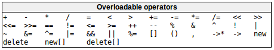
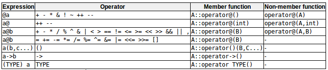

# Overloading operators重载操作符
问题：类无法直接像基本类型一样使用操作符。  
解决方案：重载操作符，支持任何类型（包括类）定义它们的行为。  
可以重载的操作符列表：  
  
操作符函数用来重载操作符：  
```c++
type operator sign(parameters){/*...body...*/}
// example
CVector operator + (const CVector&);
// 可以隐式调用，也可以显式调用
CVector a,b,c;
c = a + b;
// 等价于
c = a.operator+(b);
```
虽然操作符重载是常规函数，可以有任何行为，但`强烈建议`重载执行的操作与运算符的数学意义或通常意义相关！！！  
每个操作符所需的参数（这些参数不能重载），使用时用操作符替换@：  
  
(其中，a是A类对象，b是B类对象，c是C类对象)  
对于一些操作符可以两种形式重载：成员函数or非成员函数。

# The keyword this关键字this
this：表示一个指向其成员函数正在执行的对象的指针。在类的成员函数中用于引用对象本身。  
用途：  
- 检查传递给成员函数的参数是否是对象本身。
- 通过引用返回对象的operaor=成员函数。
```c++
CVector& CVector::operator=(const CVector& param)
{
    x = param.x;
    y = param.y;
    return *this;
}
```

# Static members静态成员
类可以包含静态成员（数据或函数）。  
- 类的静态数据成员（类变量，同一类所有对象只有一个公共变量）  
静态成员享有类作用域，为了避免多次声明它们，需要在类外初始化。  
```c++
int Dummy::n=0;
// 可以被该类的任何对象引用，也可以直接通过类名引用（仅限静态成员），以下等价
cout << a.n;
cout << Dummy::n;
```
- 静态成员函数不能访问类的非静态成员，不能使用关键字this。

# Const member functions常量成员函数
```c++
const MyClass myobject;
```
类对象被限定为const对象时，从类外部对其数据成员的访问被限制为只读。  
>Note:  
>$\quad\quad$构造函数仍然被调用，且允许初始化和修改这些数据成员。

只有将const对象的成员函数本身指定为const成员，才能被const对象调用。  
const既可以用于限定成员函数返回的类型，又可以指定成员函数为常量，两者的使用是独立的。  
```c++
int get() const{ return x; }    // const成员函数
const int& get(){ return x; }   // 成员函数返回一个const&
const int& get() const{ return x; } // const成员函数返回一个const&
```
指定为const的成员函数不能修改非静态数据成员，也不能调用其他非const成员函数。  
const成员不能修改对象的状态。  
const对象只能访问const成员函数，非const对象没有限制。  
（ 大多数以类作为参数的函数实际上是通过const引用来获取类的。）  
成员函数的`静态性可能会被重载`：比如同名的两个成员函数，一个是const一个不是，只有当对象本身是const时才调用const版本，否则调用非const版本。

# Class templates类模板
允许类拥有使用模板参数作为类型的成员。  
```c++
template <class T>  // --- 此处T为模板参数
class mypair{
        T values[2];
    public:
        mypair(T first,T second)
        {
            values[0]=first;
            values[1]=second;
        }
        T getmax();
};

T mypair<T>::getmax(){ //... }  // --- 第一个T为函数返回类型，第二个T为指定该函数的模板参数也是类模板参数
mypair<int> myobject(115,36);
mypair<double> myfloats(3.0,2.18);
```

# Template specialization模板特化
模板特化：当将特定类型作为模板参数传递时，可以为模板定义不同的实现。  
```c++
// 类模板特化
template <class T> class mycontainer{//...};    // 通用模板，可以对任意类型做相同操作
template <> class mycontainer <char> {//...};   // 特化模板，对于某类型参数做特殊操作,template后面是一个空参数列表，因为特化的类型已知且不需要模板参数
```
>Note:特化时`必须重新定义所有成员`，包括实现与泛型模板类相同的成员函数