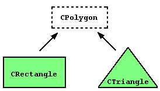
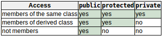

# Friend functions友元函数
友元函数：非成员函数，可以访问类的私有成员和受保护成员。  
```c++
class MyClass{
    //...
    friend function_name(){//use some members in this class}
    //...
};
```
典型应用：在两个不同的类之间执行的操作，访问这两个类的私有成员或受保护成员。

# Friend classes友元类
友元类：其成员可以访问另一个类的私有或受保护成员的类。 
```c++
class A;
class B{
    //...
    funcb(){//use class A}
    //...
};
class A{
    friend class B;
    //...
};
```
友元的特性：  
- 友元未必对等。只有需要授予访问权限时，才会指定某个函数或类为友元，以便可以访问自己的私有或受保护成员，但反过来并不成立（无法访问对方除非被授权）。
- 友元并不能传递。必须明确指定。

# Inheritance between classes类间继承
继承：扩展c++中的类，创建保留基类特征的新类的过程。  
基类与派生类：派生类继承基类的成语，在基类的基础上可以添加自己的成员。  
  
```c++
// 派生类定义
class derived_class_name:public base_class_name
{
    /*...*/
};
/*
derived_class_name --- 派生类名称
base_class_name --- 基类名称
public --- 公共访问说明符可以替换为任何其他访问说明符（private或protected），限制了从基类继承的成员的访问级别。
*/
// example---多边形派生出矩形和三角形
class Polygon
{
    protected:
        int width,height;
    public:
        set_values(){}
};
class Rectangle:public Polygon
{
    /*...*/
};
// 以下的访问权限为
Polygon::width          // protected
Rectangle::width        // protected
Polygon::set_values()   // public
Rectangle::set_values() // public
```
继承的访问说明符：  
- public：在派生类中，基类中public成员继承了这个访问说明符，private和protected成员保留限制  
- protected：在派生类中，基类中public成员继承了这个访问说明符，private和protected成员保留限制
- private：在派生类中，基类中public和protected成员继承了这个访问说明符，private成员保留限制
- 没有指定访问说明符时，编译器假定class声明的类是私有的，struct声明的类是公共的。
- 通常情况下使用public，当基类需要其他访问级别时，通常可以将它们表示为成员变量更好。  

根据不同的函数可以访问不同的访问类型，总结如下：  
  
其中“not members”表示来自类之外的任何访问，如来自main、来自另一个类或函数。

# What is inherited from the base class?从基类继承了什么？
以public方式继承基类的派生类可以访问基类的每个成员，除了：  
- 基类的构造函数和析构函数
- 基类的赋值操作（=）
- 基类的友元
- 基类的私有成员

无特殊说明时，派生类的构造函数调用基类的默认构造函数。可以使用初始化列表中用于初始化成员变量的相同语法调用基类的不同构造函数：  
```c++
derived_constructor_name(parameters):base_constructor_name(parameters){...}
// example
Daughter(int a)         // 没有指定：调用默认构造函数
Son(int a):Mother(a)    // 指定的构造函数：调用这个特定的构造函数
```

# Multiple inheritance多重继承
类可以从多个类继承
```c++
class Rectangle:public Polygon,public Output;
class Triangle:public Polygon,public Output;
```
