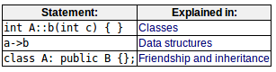

>Note:  
>$\quad\quad$在此之前需要对指针和类继承有一个适当的了解。

  

# Pointers to base class指向基类的指针
类继承的一个关键特性：指向派生类的指针与其指向基类的指针类型`兼容`  
`多态性`：利用以上特性的艺术（orz）  
问题：指向基类的指针不能访问派生类的区域成员，而很多成员在不同的派生类里实现是不同的  
解决方案：见下

# Virtual members虚成员
虚成员：可以在派生类中重新定义的成员函数，同时通过引用保留其调用属性。（关键字virtual）  
virtual关键字允许派生类中和基类成员同名的成员通过市长指针被调用，且当指针的类型是指向派生类对象的基类指针。  
多态类：声明或继承虚函数的类称为多态类

# Abstract base classes抽象基类
抽象基类：只能作为基类使用的类，不需要定义就可以拥有虚成员函数（称为纯虚函数），包含至少一个纯虚函数的类。  
抽象基类不能用于实例化对象，但是可以创建指向抽象基类的指针并利用它的多态性。
```c++
// abstract class CPolygon
class Polygon{
    protected:
        int width,height;
    public:
        void set_values(int a,int b){ width=a; height=b; }
        virtual int area()=0;       // 纯虚函数
};

Polygon mypolygon;  // Polygon是抽象基类，此句无效。
Polygon * ppoly1;   // 有效，当指向派生（非抽象）类的对象是，可以解引用。可以访问派生类中适当的成员函数，还可以调用适当的虚成员
```
虚成员和抽象类（多态性）还可以结合对象数组或动态分配的对象。