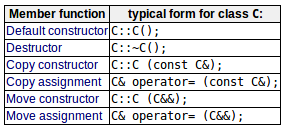
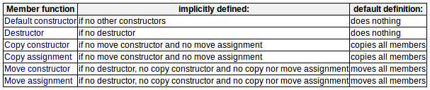

>[Note]  
>$\quad\quad$本章要求正确理解动态内存分配  

特殊成员函数：在某些情况下隐式定义为类成员的成员函数。如下：  
  

# Default constructor默认构造函数
默认构造函数：在声明类的对象但未使用任何参数初始化时调用的构造函数。（编译器假定类具有隐式定义的默认构造函数）  
```c++
class Example{
    public:
        int total;
        void accumulate(int x){total += x;} 
};

Example ex; // 调用隐式默认构造函数
```
一旦类具有显式声明的接受任意数量的参数的构造函数，编译器就不再提供隐式默认构造函数，且不再允许在没有参数的情况下声明该类的新对象。
```c++
class Example2{
    public:
        int total;
        Example2(int initial_value):total(initial_value){}
        void accumulate(int x){total += x;}
};

Example2 ex(100);   // ok:调用构造函数
Example2 ex;        // 无效：没有默认构造函数
```

# Destructor析构函数
析构函数：负责类在其生命周期结束时所需的必要清理。
```c++
class Example4{
    Example4(){// 可分配存储空间}
    ~Example4(){// 可释放存储空间}
};
```  
对象的析构函数在其生命周期结束时被调用。

# Copy constructor拷贝构造函数
拷贝构造函数：当将对象作为参数传递给它自己类型的命名对象时，将调用它的拷贝构造函数来构造副本。
```c++
MyClass::MyClass(const MyClass&);
```
如果类没有自定义拷贝或移动（或赋值）构造函数，则提供隐式拷贝构造函数（执行一个浅拷贝）。
```c++
class MyClass{
    public:
        int a,b;
        string c;
}

MyClass::MyClass(const MyClass& x):a(x.a),b(x.b),c(x.c){}
```
`浅拷贝`的问题：只复制类的成员本身（复制指针值），意味着两个对象（副本和原件）共享同一块内存空间，在某种程度上析构对象时都将尝试释放同一块内存空间（可能会导致在运行时程序崩溃）。  
解决方案：使用`深拷贝`，即复制内容本身到其他内存空间中去。

# Copy assignment拷贝赋值(操作符=)
myclass& operator = (const MyClass&);
```c++
// 区分构造函数和拷贝赋值
MyClass foo;
MyClass bar(foo);   // 对象初始化：调用拷贝构造函数
MyClass baz = foo;  // 对象初始化：调用拷贝构造函数，虽然有等号，但只是调用单参数构造函数的另一种语法～
foo = bar;          // 对象已经初始化：调用拷贝赋值（操作符=的重载，将类本身的值或引用作为参数，返回值通常是*this的引用）
```
如果类没有自定义拷贝或移动（或赋值）构造函数，则提供隐式拷贝赋值（执行一个浅拷贝）。  
`问题`：不仅存在多次释放指定对象所占内存的可能，还可能存在通过未释放指定对象之前的其他指定对象所占内存，赋值带来了内存泄漏。  
`解决方案`：通过释放前一个对象所占内存并执行深拷贝的拷贝赋值。
```c++
Example5& operator= (const Example5& x)
{
    delete ptr;         // 释放当前string指针
    ptr = new string(x.content());  // 分配新的string内存空间并拷贝
    return *this;
}
// 或可重用同一个string对象（string成员不是常量）
Example5& operator= (const Example5& x)
{
    *ptr = x.content();
    return *this;
}
```

# Move constructor and assignment移动构造函数和赋值
移动：将一个对象（源）的值转移到另一对象（目标）接管。（且值的源是一个未命名的对象，如函数的返回值或类型转换）  
MyClass(MyClass);   // 移动构造函数
MyClass& operator= (MyClass&&); // 移动赋值,MyClass&&(rvalue引用)
```c++
MyClass fn();       // 函数返回一个MyClass对象
MyClass foo;        // 默认构造函数
MyClass bar = foo;  // 拷贝构造函数
MyClass baz = fn(); // 移动构造函数
foo = bar;          // 拷贝赋值
baz = MyClass();    // 移动赋值
```
拷贝与移动的区别：  
- 从A拷贝到B意味着新内存分配给B，然后将A的全部内容拷贝到分配给B的新内存中。
- 从A移动到B意味着已经分配给A的内存被转移到B，而没有分配任何新的存储，只涉及到复制指针。

>Note:  
>$\quad\quad$编译器已经优化了许多正式需要在所谓的返回值优化中调用移动构造函数。rvalue引用尽量只在move构造函数中使用，不必要的使用可能是非常难以跟踪的错误源。？？？（这个要之后再查查）

# Implicit members隐式成员
以上六个特殊成员函数是在特定情况下隐式声明在类上的成员：  
  
>Note:  
>$\quad\quad$每个类可以显式地选择哪些隐式成员函数默认定义，哪些删掉。  

```c++
function_declaration = default;
function_declaration = delete;
```
为了将来的兼容性，鼓励显式定义一个拷贝/移动构造函数或一个拷贝/移动赋值但不同时定义两者的类，没有显式定义的其他特殊成员函数指定为delete或default。