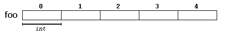
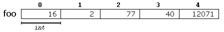
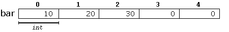
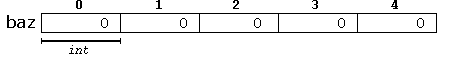
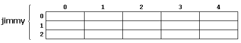
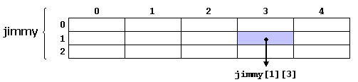
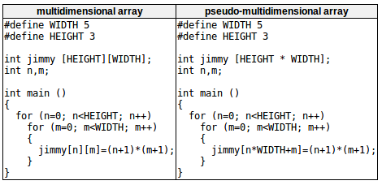
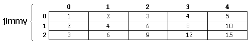
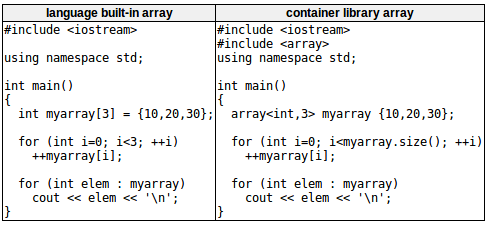

数组：放置在连续内存位置的一系列相同类型的元素，可以通过向唯一标识符添加索引来单独引用这些元素。  
  
编号从0开始，每个白板代表数组的一个元素。  
每个元素在内存中的地址号相隔=类型所占内存长度。  
数组使用前也必须声明：  
```c++
type name[elements];  
/*
type --- 有效类型
name --- 有效标识符
elements --- 根据元素的数量指定数组的长度,必须是常量表达式（因为数组是静态内存块，其大小必须在程序运行之前在编译时就确定）
*/
// example
int foo[5];
```

# Initializing arrays初始化数组
默认情况下，本地作用域的常规数组未初始化意味着每个元素的值不确定。  
可以在声明时显式初始化为特定值：  
```c++
int foo[5] = {16,2,77,40,12071};
```
  
特定值的数量小于等于数组声明的元素数量，小于的情况无特定值的元素会被设置成默认值。  
```c++
int bar[5] = {10,20,30};
```
  
```c++
int baz = {}; 
```
  
允许数组初始化时[]为空，编译器会自动假设数组的大小与大括号内的数值数量相匹配：  
```c++
int foo[] = {16,2,77,40,12071};
// 数组foo大小为5*int
```
数组的通用初始化：  
```c++
int foo[] = {10,20,30};
// 等价于
int foo[]{10,20,30};
```
静态数组以及直接在名称空间（除函数之外）中声明的数组，总是初始化的。如果没有指定显式初始化器，则所有元素都初始化默认值。

# Accessing the values of an array访问数组的值
访问数组元素的语法：  
```c++
name[index]
// example
foo[2] = 75;    // 将75存储在foo的第三个元素中
x = foo[2];     // 将foo的第三个元素的值复制到名为x的变量中
// 可访问的元素是foo[0]~foo[4],如访问foo[5]，实际是foo的第六个元素，将会超出数组访问范围，在运行时才会报错（编译时不报错）
```
数组[]的两种含义  
```c++
int foo[5];     // 声明一个新数组
foo[2] = 75;    // 访问数组中的一个元素
```
有效的数组操作  
```c++
foo[0] = a;     // 将变量a的值赋值给foo的第一个元素
foo[a] = 75;    // 将值75赋值给foo的第a个元素
b = foo[a+2];   // 将foo的第a+2个元素的值赋值给变量b
foo[foo[a]] = foo[2] + 5;   // 将foo的第二个元素的值加上5的结果，赋值给foo的第foo[a]个元素，其中foo[a]应该是一个整数，对应foo数组有效访问范围的某个位置。
```

# Multidimensional arrays多维数组
数组的数组  
```c++
int jimmy[3][5];
```
  
```c++
jimmy[1][3]
```
  
数组可以有若干维度  
```c++
char century[100][365][24][60][60];
// 1b*100*365*24*60*60 > 3gb
```
可以用简单的索引相乘的数组来声明和存储高维数组  
```c++
int jimmy[3][5];
// 等价于
int jimmy[15];  // 3*5=15
```
编译器自动记住每个虚维的深度。？？  
  
上面的两段代码的内存赋值结果相同，如下：  
  
为了提高代码的可读性并且更易修改，常使用定义的常量作为宽度和高度，而不是直接使用它们的数值。

# Arrays as parameters数组作为参数
允许将数组的地址作为参数传递给函数。
```c++
// 函数参数声明为数组类型，省略数组实际大小
void procedure(int arg[])
{
    // ...
}
int myarray[40];    // 实际要调用的数组声明

{
    // ...
    procedure(myarray); // 一个有效的调用
    // ...
}
```
多维数组,额外维度需要显式给出  
```c++
base_type[][depth][depth]
// example
void procedure(int myarray[][3][4])
```
>Note:  
>$\quad\quad$在某种程度上,将数组作为参数传递总会丢失一个维度。（原因：数组不能直接复制，因此真正传递的是指针。这是新手程序员常见的错误来源。）

# Library arrays库数组
问题：以上的数组继承自C语言，有些特性很好，但是由于限制了它的复制并很容易分解为指针，可能会受到**过度优化**的影响。  
解决方案：c++提供了数组类模板(定义在\<array>中)作为标准容器。  
以下是同一个例子的两个版本：  
  
以相同的语法访问数组元素，主要区别在数组的声明、以及包含库数组的附加头，还有访问库数组大小的方法。（更多方法详见\<array>头文件）