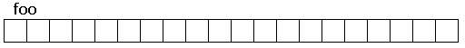
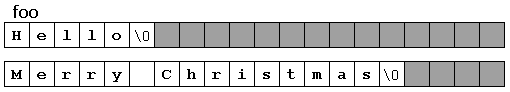

# Character sequences字符序列
字符串除了用string类以外，还可以用char类型数组表示：
```c++
char foo[20];
```
  
字符序列以'\0'结尾。  
  


# Initialization of null-terminated character sequences初始化以null结尾的字符序列
两种方法初始化字符数组
```c++
char myword[] = {'H','e','l','l','o','\0'};
// 等价于
char myword[] = "Hello";    // 会自动在结尾加'\0'
```
同数组，字符数组也不能被整体赋值，一旦声明了，只能单独赋值。  
```c++
myword[0] = 'B';
myword[1] = 'y';
myword[2] = "e";
myword[3] = '\0';
```

# Strings and null-terminated character sequences
string类：c++为字符串提供的标准库中的特定类型  
以null结尾的字符序列数组：c语言用来表示字符串  
标准库重载字符串相关函数以便支持两种表示。  
前者不需要定义大小，而后者必须显式或隐式地定义大小。  
二者可以相互转换：  
```c++
char myntcs[] = "some text";
string mystring = myntcs;   // 将c-string转为string
cout << mystring;           // 打印为库字符串
cout << mystring.c_tr();    // 打印为c-string
// 使用字符串成员函数c_str或data将string转为c-string
```