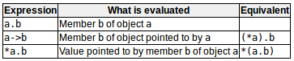

# Data structures数据结构
数据结构：用一个名称组合在一起的一组数据元素。这些数据元素（成员）可以具有不同的类型和不同的长度。  
```c++
struct type_name{
    member_type1 member_name1;
    member_type2 member_name2;
    member_type3 member_name3; 
}object_names;
/*
type_name --- 结构类型的名称,可以像使用其他类型一样使用它。
object_name --- 具有该结构类型的对象的一组有效标识符。
{} --- 包含数据成员的列表，每个成员都指定了一个类型和一个有效标识符作为其名称。
*/
// example
struct product{
    int weight;
    double price;
};

product apple;
product banana,melon;
// or
struct product{
    int weight;
    double price;
}apple,banana,melon;
// 类型名称和对象名称至少要有一个
// 访问成员
apple.weight
apple.price
banana.weight
banana.price
melon.weight
melon.price
```  
数据结构的特性之一是能够分别引用它们的成员或整个结构，只需要使用结构的名称。  
可以构造结构类型的数组来构造该类型的表或数据库。

# Pointers to structures指向结构的指针
```c++
struc movies_t{
    string title;
    int year;
};

movies_t amovie;    // movies_t类型的对象
movies_t * pmovie;  // 指向movies_t对象的指针

pmovie = &amovie;

// 访问成员，以下均等价
amovie.title
pmovie -> title     // 箭头操作符（->）,反引用操作符
(*pmovie).title
```
指针和结构成员的操作符的可能组合：  
  

# Nesting structures嵌套结构
结构作为成员出现在其他结构中。  
```c++
struct movies_t{
    string title;
    int year;
};

struct friends_t{
    string name;
    string email;
    movies_t favorite_movie;
}charlie,maria;

friends_t * pfriends = &charlie;
// 以下访问均有效
charlie.name
maria.favorite_movie.title
charlie.favorite_movie.year
pfriends->favorite_movie.year
```