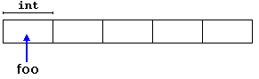

当程序的内存需求只能在运行时确定（如内存需求取决于用户输入时），程序需要动态分配内存。  

# Operators new and new[]
动态内存使用操作符new分配。  
```c++
pointer = new type      // 用于分配包含一个type类型的元素的内存
pointer = new type [number of elements] // 用于分配type类型元素的块（数组）
// example
int * foo;
foo = new int [5];
// 访问
foo[0]
*foo
```
  
声明普通数组和使用new为内存块分配动态内存的区别：  
- 一个常规数组中需要一个常量表达式，因此大小须在运行之前确定。而new执行的动态内存分配允许在运行时使用任何变量值作为分配内存的大小。  

程序请求动态内存由系统从内存堆中分配。然而，计算机内存资源有限，不一定所有new请求都会成功，检查方法有二：  
- 通过处理异常。当分配失败时，将引发类型为bad_alloc的异常。如果不处理异常则程序终止执行。new默认使用的方法。
```c++
int * foo = new int [5];  // 当分配失败时，将引发类型为bad_alloc的异常。
```
- nothrow。当分配失败时，new返回空指针，程序正常继续执行。
```c++
int * foo;
foo = new (nothrow) int [5];    // 当分配失败时，new返回空指针，程序正常继续执行。
if (foo == nullptr)
{
    // 分配内存出错。采取措施。
}
```
nothrow可能比较低效，因为要显式地检查每个分配之后返回的指针值。因此通常首选异常机制。但是nothrow机制用着比较简单。

# Operators delete and delete[]
当当前分配的动态内存不再需要时，可以释放它。  
```c++
delete pointer; // 用于释放使用new分配的单个元素的内存
delete[] pointer;   // 用于释放使用new[]分配的块（数组）内存
```
pointer应该是指向先前用new分配的内存块的指针，或者是null指针。（对于null指针，delete不起作用）

# Dynamic memory in C动态存储器（C语言）
在c++中，头文件\<cstdlib\>（即C语言的\<stdlib.h\>）定义了malloc、calloc、realloc和free，也可以用来分配和释放动态内存。但是因为和new返回的内存块可能不兼容，所以不应该混用（新手常见错误）。
