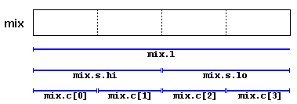
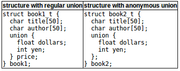

# Type aliases(typedef/using)类型别名
两种方法：  
- 使用typedef关键字。  
```c++
typedef existing_type new_type_name;
/*
existing_type --- 任何类型（基本类型或者复合类型）
new_type_name --- 给定类型的新名称
*/
// example
typedef char C;
typedef unsigned int WORD;
typedef char * pChar;
typedef char field [50];

// 以下用法有效
C mychar,anotherchar,*ptc1;
WORD myword;
pChar ptc2;
field name;
```
- 直接用=。  
```c++
using new_type_name = existing_type;
// example
using C = char;
using WORD = unsigned int;
using pChar = char *;
using field = char [50];
```
以上两种方法语义上是等价的。  
区别：  
typedef在模板使用上有限制，而using没有。（所以using更通用，虽然typedef历史更长且很常见）  
>Note:  
>$\quad\quad$typedef和using都不会创建新的不同的数据类型，只是创建现有类型的同义词。  

类型别名的`好处`是可以减少冗长或令人困惑的类型名称的长度，常常作为`底层类型抽象`的工具。  
（如，通过使用int的别名莱茵用特定类型的参数而不是直接用int，以后的版本中很容易将类型替换成long或其他，而不用修改每处）

# Unions联合体
允许以不同的数据类型访问内存的一部分。  
```c++
union type_name{
    member_type1 member_name1;
    member_type2 member_name2;
    member_type3 member_name3;
    //.
    //.
}object_names;
// 所有成员元素都占据内存中的相同物理空间，内存大小为最大的成员元素的大小。？
// example
union mytypes_t{
    char c;
    int i;
    float f;
}mytypes;
mytypes.c
mytypes.i
mytypes.f
// 虽然不同成员属于不同类型，但在内存中相同位置，改变一个会影响其他。  
// 不能存储不同的值，因为每个值都是独立于其他值的？
```
union的用途：  
- 能够访问一个值，可以是一个完整的值，也可以是一个数组或较小的元素结构。  
```c++
union mix_t{
    int I;
    struct{
        short hi;
        short Io;
    };
    char c[4];
}mix;
```
我们可以根据访问这些字节的方式使用它们(以下是mix在小端系统内的对齐情况)  
   
内存中union成员的精确对齐和顺序取决于系统，可能会产生可移植性问题。

# Anonymous unions匿名联合体
当union是类（或结构）成员时，可以不使用名称声明它们。（即匿名联合体）直接通过成员名从对象中访问。  
  
```c++
book1.price.dollars
book1.price.yen
// 等价于
book2.dollars
book2.yen
// dollars和yen实际上共享同一个内存位置。
```

# Enumerated types(enum)枚举类型
用一组自定义标识符（称为枚举器）作为可能值定义的类型。  
```c++
enum type_name{
    value1,
    value2,
    value3,
    //.
    //.
}object_name;
/*
type_name --- 创建类型
valuei --- 接受的值
object_name --- 这种类型的对象（变量）实例化
*/
// example
enum colors_t{black,blue,green,cyan,red,purple,yellow,white};
// 不基于任何类型而是创建全新的数据类型
// 以下是有效的
colors_t mycolor;
mycolor = blue;
if(mycolor == green)
    mycolor = red;
```
用enum声明的枚举类型的值可以隐式地转换为整数类型，反之亦然。（默认值等于其位置，从0开始，自动加一）  
```c++
enum months_t{january=1,february,march,april,
                may,june,july,august,
                september,october,november,december}y2k;
```
隐式转换的工作方式有两种：类型months_t的值可以指定为1，或者整数变量可以指定为1.？？

# Enumerated types with enum class枚举类型与枚举类
使用enum类或enum结构体声明，保持类型安全性。
```c++
enum class Colors{black,blue,green,cyan,red,purple,yellow,white};

Colors mycolor;
mycolor = Color::blue;
if(mycolor == Colors::green)
    mycolor = Colors::red;
```
还可以使用基础类型来确定枚举类型的大小。
```c++
enum class EyeColor:char{blue,green,brown};
// EyeColor与char（1字节）大小相同，但类型不同
```
