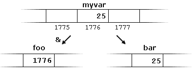
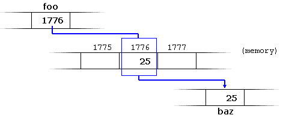
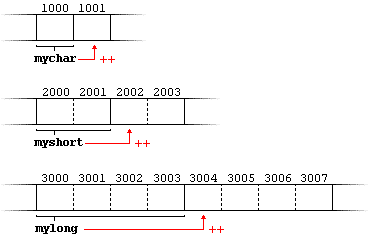
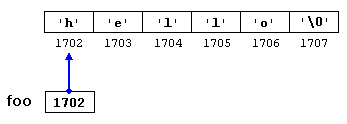
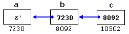

通过变量可以访问其在内存中的位置，而不需要考虑数据的物理地址。  
内存是一串连续单元，每个单元都有一个固定大小（一般是1字节）并且每个单元都有唯一的地址。  
操作系统：决定运行时决定特定的内存位置

# Address-of operator(&)取地址运算符
取地址运算符：获得变量的地址  
```c++
foo = &myvar;
```
假设myvar在运行时放置在内存地址1776中。
```c++
myvar = 25;
foo = &myvar;
bar = myvar;
```
执行结果如下：  

foo被称为指针，在底层编程中有许多用途。  

# Dereference operator(*)解引用运算符
指针：“指向”它们存储地址的变量  
指针可以用来直接访问所指变量：  
```c++
baz = foo;  // baz等于foo（1776）
baz = *foo; // baz等于foo指向的值（25）
```
  
- &：取地址运算符，可以简单地读为“地址”
- *：解引用运算符，可以解读为“指针指向的值”
用&获得的地址可以用*解除引用。
```c++
myvar = 25;
foo = &myvar;
// 以下结果均为true
myvar == 25
&myvar == 1776
foo == 1776
*foo == 25
*foo == myvar
```

# Declaring pointers声明指针
在解引用时需要知道类型，因此指针的声明需要包含指针将要指向的数据类型。  
```c++
type * name;
/*
type --- 指针指向的数据类型
*/
// example
int * number;
char * character;
double * decimals;
// 每个指针指向不同的数据类型，但实际上，都是指针，而且它们都可能占用内存中相同的空间（指针在内存中的大小取决于程序运行的平台）。但实际上指针类型取决于他们所指向的类型。
```
>Note:  
>$\quad\quad$不要把声明指针的（\*）与解引用操作符（\*）搞混。  

通过指针间接设置变量的值。指针在生命周期内可能指向不同的变量。  
```c++
//  同时声明多个同类型指针，每个标识符前加*。
int * p1,* p2;
// 更好的选择是对每个变量使用不同的语句。
```

# Pointers and arrays指针和数组
数组可以隐式地转换为正确类型的指针。
```c++  
int myarray[20];  
int * mypointer;

mypointer = myarray;    // 有效的赋值
/*
    相同点：支持相同的操作集。
    主要区别：数组名不能被赋值，而指针可以被赋值。
*/
myarray = mypointer;    // 无效的赋值
```
数组元素的索引（[\]）实际上是一个解引用操作符（称为偏移操作符），这一点和*一样。进一步，会将[\]中的数字加到解引用的地址上。  
```c++
a[5] = 0;   // a[偏移5个单位] = 0，其中的单位取决于数组中存储的变量类型
// 等价于
*(a+5) = 0; // (a+5)指向的值 = 0
```

# Pointer initialization指针初始化
指针可以在定义的时刻被初始化指向特定的位置，且初始化的是指针指向的地址而不是指向的地址内的值。  
```c++
int myvar;
int * myptr = &myvar;
// 等价于
int myvar;
int * myptr;
myptr = &myvar;
// 不要混淆的例子(没有意义且无效的代码，新手常犯的错误)
int myvar;
int * myptr;
*myptr = &myvar;
```  

# Pointer arithmetics指针算法
指针只允许做加减法。  
```c++
// 假设在给定的系统中，char占用1字节，short占用2字节，long占用4字节
// 且分别指向内存位置1000，2000，3000
char *mychar;
short *myshort;
long *mylong;
++mychar;
++myshort;
++mylong;
/*
mychar = 1001
myshort = 2002
mylong = 3004
*/
// 等价于
mychar = mychar + 1;
myshort = myshort +1;
mylong = mylong + 1;
```
  
后缀运算符（++或--）的优先级高于前缀运算符（*）  
```c++
*p++    // 与*(p++)相同：递增指针，解引用未递增地址
*++p    // 与*(++p)相同：增加指针，解引用增加地址
++*p    // 与++(*p)相同：解引用指针，并增加其指向的值
(*p)++  // 解引用指针，并对其指向的值进行递增

*p++ = *q++;
// 等价于
*p = *q;
++p;
++q;  
```

# Pointers and const指针和常量
当不希望指针修改所指向的值时，将指针指向的类型限定为const。  
```c++
int x;
int y = 10;
const int * p = &y; // 指向非const的指针可以隐式地转换为指向const的指针，反过来是不行的！！！
X  = *p;        // ok:读取p
*p = x;         // error：修改const p，p只能读不能写
```
指向const元素的指针两个用例：  
- 作为函数参数（不能改变其值）。  
- 指针本身也可以是常量
```c++
int x;
        int*        p1 = &x;    // 指向非const int的非const指针
const   int*        p2 = &x;    // 指向const int的非const指针
        int* const  p3 = &x;    // 指向非const int的const指针
const   int* const  p4 = &x;    // 指向const int的const指针
```
const限定符在指针类型前后均可，含义相同。（又是风格问题哇～）  
```c++
const int * p2a = &x;       // 指向const int的非const指针
int const * p2b = &x;       // 指向const int的非const指针
```

# Pointers and string literals指针和字符串
字符串除了赋值给字符数组以外，还可以直接使用指针访问。  
```c++
const char * foo = "hello"; // 假设字符串的起始地址是1702
```
  
```c++
*(foo+4)
// 等价于
foo[4]
```

# Pointers to pointers指向指针的指针
```c++
char a;
char * b;
char ** c;
a = 'z';
b = &a;
c = &b;
```
假设每个变量的本地内存随机为7230，8092和10502.  
  
每个变量的值在其相应的单元内表示，它们在内存中的各自地址由它们下面的值表示。  
变量c是指向指针的指针。  
- c的类型是char**，值是8092
- \*c的类型是char\*，值是7230
- \**c的类型是char，值是'z'

# void pointers空指针
空指针表示指向一个没有类型的值的指针（因此也是一个未确定长度和未确定解引用属性的指针）。  
空指针非常灵活，但限制是它们指向的数据不能直接引用，因此（在解引用指向的一个具体的数据类型）需要被转换成其他指针类型。  
用途：  
- 将泛型参数传递给函数

# Invalid pointers and null pointers无效指针和null指针
因为指针实际上可以指向任何地址，所以可能出现无效指针。  
```c++
// 未初始化指针和指向数组中不存在的元素的指针
int * p;                // 未初始化指针（局部变量）
int myarray[10];
int * q = myarray + 20; // 元素超出边界
```
访问以上指针的引用（指向的值）会导致未定义的行为，从运行时错误地访问某个随机值。  
当指针需要显式地指向任何地方时，可以使用null指针：  
```c++
// 以下null指针的定义均等价
int * p = 0;
int * q = nullptr;
int * r = NULL;
```
>Note:  
>$\quad\quad$null指针是任何指针都可以用来表示它指向“任何地方”的值，而void指针是指针的一种类型，可以指向没有特定类型的某个地方。一个引用存储在指针中的值，另一个引用它指向的数据类型。

# Pointers to functions指向函数的指针
用途：将函数作为参数传递给另一个函数。  
函数指针的声明：
```c++
// minus是指向一个函数的指针，该函数有两个int类型的参数，它被直接初始化为指向函数subtraction
int (*minus)(int,int) = subtraction;
```
