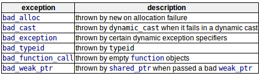
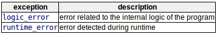

异常提供了一种通过将控制传递给特殊函数（称为处理程序）来对程序中的异常情况（如运行时错误）作出反应的方法。
```c++
// 将部分代码封装在try块中，如果出现异常则抛出（throw）并将控制权转移到异常处理程序（catch）；否则，正常执行，忽略catch部分。抛出表达式的参数传递给catch用于检查异常类型。只有匹配了的异常处理函数会处理该异常（多个异常处理程序）
try
{
    // code here
}
catch(int param){cout << "int exception";}
catch(char param){cout << "char exception";}
catch(...){cout << "default exception";}        // ...作为参数，则无论抛出何种类型的异常，该处理程序都将捕获。
```
处理完异常，在try-catch块后面恢复执行。  
还可以多层嵌套try-catch块，可以通过throw不带参数将内部块异常转发给外部块的catch
```c++
try
{
    try
    {
        // code here
    }
    catch(int n)
    {
        throw;
    }
}
catch(...)
{
    cout << "Exception occurred";
}
```

# Exception specification异常规范
旧代码可能包含动态异常规范。（被c++弃用，但还支持）
```c++
double myfunction(char param)throw(int);    // 如果这个抛出的异常类型不是int类型，那么该函数将调用std::unexpected,而不是寻找处理程序或调用std::terminate
int myfunction(int param)throw();   // 抛出说明符为空且没有类型，则任何一场都会调用std::unexpected
int myfunction(int param);      // 没有抛出说明符，则永远不会调用std::unexpected,而是走正常异常处理
```

# Standard exceptions标准异常
std::exception:c++标准库提供一个基类，专门用来声明作为异常抛出的对象（\<exception\>)  
这个类有一个虚成员函数（what），返回一个以null结尾的字符序列（char *），可以在派生类中重写该函数，以包含异常的某种描述。  
c++标准库的组件抛出的所有异常都继承自该异常：  
  
另外，在头文件中还定义了两种通用异常类型用来报告错误：  
  
需要检查标准异常的一个典型例子是内存分配！