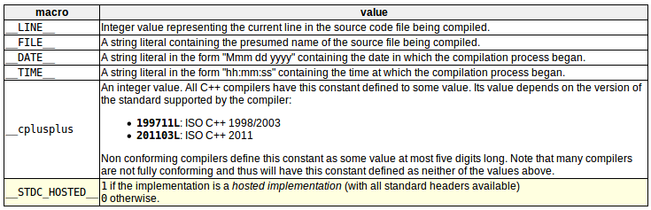
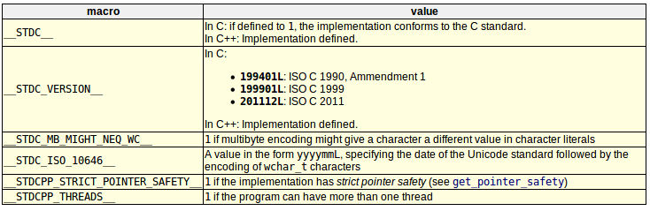

预处理指令：在实际编译代码之前检查代码，并且提前解析这些指令。  
结尾没有分号，以换行符为分隔，如要多行扩展则需要再换行符前面加上一个反斜杠（\）

# macro definitions宏定义(#define、#undef)
```c++
# define identifier replacement
// 替换代码其余部分中出现的任何标识符（可以是表达式、语句、块或任何东西），只是替换。
// example1
#define TABLE_SIZE 100
int table1[TABLE_SIZE];
// 等价于
int table1[100];
// example2
#define getmax(a,b) a>b?a:b
```
一个宏将持续到它没有被`#undef`预处理器指令定义为止
```c++
#define TABLE_SIZE 100
int table1[TABLE_SIZE];     // 相当于int table1[100];
#undef TABLE_SIZE
#define TABLE_SIZE 200
int table2[TABLE_SIZE];     // 相当于int table2[200];
```
函数宏定义在替换序列中接受两个特殊的操作符（#和##）
```c++
// 操作符#后面跟着一个参数名，替换为包含传递的参数的字符串文字
#define str(x) #x
cout << str(test);
// 等价于
cout << "test";
// 操作符##连接两个参数（参数之间没有空格）
#define glue(a,b) a##b
glue(c,out) << "test";
// 等价于
cout << "test";
```
>Note:  
>$\quad\quad$预处理器替换发生在语法检查之前，宏定义可能产生棘手的情况。严重依赖复杂宏的代码可读性会降低，很多情况下，预期的语法和程序员在c++中预期的普通表达式不同！！

# Conditional inclusions(#ifdet,#ifndef,#if,#endif,#else and #elif)条件包含
条件包含允许在满足特定条件的情况下包含或丢弃程序代码的一部分。  
`#ifdef`只允许在定义了作为参数指定的宏时才编译程序的某个部分，不管值是什么
```c++
// 只有在TABLE_SIZE之前是用#define定义的、独立于它的值时才编译
#ifdef TABLE_SIZE
int table[TABLE_SIZE]
#endif
```
`#ifndef`和#endif指令之间的代码只有在之前没有定义指定标识符的情况才会编译
```c++
#ifndef TABLE_SIZE
#define TABLE_SIZE 100
#endif
int table[TABLE_SIZE]
```
`#if、#else、#elif`指令用于指定一些条件，以便编译它们所包围的部分代码时满足这些条件。
```c++
#if TABLE_SIZE>200
#undef TABLE_SIZE
#define TABLE_SIZE 200

#elif TABLE_SIZE<50
#undef TABLE_SIZE
#define TABLE_SIZE 50

#else
#undef TABLE_SIZE
#define TABLE_SIZE
#endif

int table[TABLE_SIZE];
```
#ifdef和#ifndef可以通过#if、#elif和！来实现  
```c++
#if defined ARRAY_SIZE
#define TABLE_SIZE ARRAY_SIZE
#elif !defined BUFFER_SIZE
#define TABLE_SIZE 128
#else
#define TABLE_SIZE BUFFER_SIZE
#endif
```

# Line control(#line)线路控制？---需要再去查查相关资料
当我们编译一个程序时，在编译过程中发生了一些错误，编译器会显示一条错误信息，包括错误发生的文件的名称和行号，更容易锁定到错误代码。  
#line指令允许我们控制代码文件中的行号和发生错误时希望显示的文件名  
```c++
#line number "filename“
/*
number --- 将分配给下一行代码的新行号。从此处起，连续行数将一一递增
"filename" --- 可选参数，允许重新定义将显示的文件名
*/
// example
#line 20 "assigning variable"
int a?;
// 这段代码将生成一个错误，该错误将显示为文件”assign variable“中的错误，第20行
```

# Error directive(#error)错误指令
当找到编译过程时，该指令终止编译过程，生成一个编译错误，该错误可以指定参数
```c++
// 如果宏名__cplusplus没有定义（在所有编译器里都是默认定义的），这个示例将终止编译过程。
#ifdef __cplusplus
#error A C++ compiler is required!
#endif
```

# Source file inclusion(#include)源文件包含
使用#include，将用指定头文件或文件的全部内容替换该指令。  
使用#include两种方法：
```c++  
/*
法一：用于包含实现提供的头文件（标头，iostream、string...），可以是文件或是其它形式的。
*/
#include <header>
/*
法二：以实现定义的方式搜索文件，通常包括当前路径。如果没有找到该文件，编译器将该指令解释为头包含（用<>代替“”）
*/
#include "file"
```

# Pragma directive(#pragma)编译指示指令
用于向编译器指定不同的选项。（更多信息需要参考编译器资料）  
如果编译器不支持#pragma的特定参数，将被忽略，不会生成语法错误

# Predefined macro names预定义的宏的名称
以下宏名始终被定义（都是以__开头和结尾）：  
  
以下宏名是可选定义的，通常取决于某个特性是否可用：  
  
特定的实现可以定义额外的常量