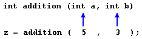
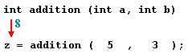
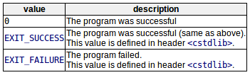
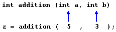
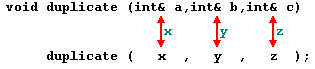

函数允许在代码段中构造程序来执行单个任务。  
是一组给定名称的语句，可以从程序的某个点调用。  
```c++
//  函数定义
type name (parameter1,parameter2,...){statements}
/*
type --- 函数返回值类型；
name --- 可以调用函数的标识符；
parameters（数量视需要而定） --- 每个参数由一个类型和一个标识符组成，彼此逗号分隔。参数的目的是允许从调用函数的位置将参数传给函数；
statements --- 函数的主体。由一组大括号{}包围，指定了函数的实际功能。
*/
```
函数声明中的参数与函数调用中传递的参数有明确的对应关系：  
  
子函数调用返回局部变量  
  
参数传入常量值和变量都是可以的，子函数调用返回的结果可以作为表达式的一部分继续使用。

# Functions with no type.The use of void无类型函数
无返回类型时，type部分填为void。  
参数列表为空时，()中可以为空，也可以显式为void。  
无论声明函数还是调用函数，都不能省略标识符后面的()，这是函数与其他类型的区别。

# The return value of main
只有当main函数执行没有遇到return语句，编译器假定函数以隐式return语句结束（编译器不同时处理结果不同）
```c++
return 0
```
但正常情况下，所有具有返回类型的函数都应该以包含返回值的适当的返回语句结束  


# Arguments passed by value and by reference参数通过值和引用传递
传值（x）：子函数使用的是传入参数的副本  
  
传引用,即参数的别名（&x）：子函数使用的是传入参数本身  
  

# Efficiency considerations and const references
以下方法对于基本数据类型基本没有效率差别，但使用复合数据类型时有效提高效率。
```c++
string concatenate(string a,string b)
{
    return a+b;
}
```
传引用可以节省复制变量副本的开销。  
```c++
string concatenate(string& a,string& b)
{
    return a+b;
}
```
传引用可以修改传递参数。（如果不希望被修改，设置为常量）
```c++
string concatenate(const string& a,const string& b)
{
    return a+b;
}
```

# Inline functions内联函数
问题：调用函数通常会导致一定的开销（堆叠参数、跳转等等）。  
解决方案：将非常短的函数，简单地在调用函数的地方插入函数的代码（而不是调用函数）。  
具体：在函数声明时用内联说明符（inline）告知编译器，对于特定函数，内联展开优先于通常的函数调用机制。  
```c++
inline string concatenate(const string& a,const string& b)
{
    return a+b;
}
```
调用时不需要指定内联。  
优化是委托给编译器的任务，所以编译器可能会以内联以外的方式进行优化。

# Default values in parameters参数中的默认
有多个参数时可以包含一些有默认值的参数，当传入参数较少时，使用默认值；当传入参数足够时，忽略默认值。

# Declaring functions声明函数
声明在使用前。应该包括所有涉及的类型（返回类型及其参数类型），类似定义的语法，但结尾用分号代替{}。  
定义可以在其他位置。  
```c++
int protofunction (int first,int second);
// 等价于
int protofunction (int,int);
```  
总之尽量写上标识符，增加代码可读性

# Recursivity递归性
函数自己调用自己