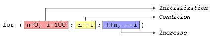

语句是程序的每一条指令，以分号（；）结尾。  
复合语句是一组语句  
{statement1;statement2;statement3;}  
程序流程控制：用于指定程序在什么情况下必须执行什么操作，何时执行，以及在什么情况下执行。  
顺序执行，重复代码段，决策分支  

# Selection statements:if and else选择语句
if关键字用于在条件成立时执行语句或块。
```c++  
if (condition) statement
```
```c++
if(x == 100)
    cout << "x is 100";
```
多条语句用{}
```c++
if (x == 100)
{
    cout << "x is ";
    cout << x;
}
// 等价于if (x == 100){cout << "x is "; cout << x;}
```
if选择语句还可以指定不满足条件时发生的情况。  
if (condition) statement1 else statement2
```c++
if (x == 100)
    cout << "x is 100";
else
    cout << "x is not 100";
```
若干if-else组合可检查一系列值。
```c++
if (x > 0)
    cout << "x is positive";
else if (x < 0)
    cout << "x is negative";
else
    cout << "x is 0";
```

# Iteration statements(loops)迭代语句
循环重复语句一定的次数，或者当条件满足时重复。  
关键字while、do和for。
- while循环  
```c++
while (expression) statement  
```
只在表达式为真时循环语句，若不为真则结束循环。  
需要考虑以某种方式更改在条件中检查的值，使其在某一点变为false，否则将陷入死循环。
- do-while循环  
```c++
do statement while (condition);  
```
语句块至少执行一次。  
- for循环   
    ```c++
    for (initialization;condition;increase) statement;  
    ```
    多次迭代，还提供具体的位置来包含初始化和递增表达式（计数器变量）。  
    三个字段可选，可以为空，但必须有分号相隔。(最好不要这么做吧？？)  
    可以处理多个计数器。  
    ```c++
    for(;;)== while(true)
    for (n=0,i=100;n!=i;++n,--i)
    {
        // whatever here ...
    }
    ```
    

# Range-based for loop基于范围的for循环
```c++
for (declaraion:range) statement;  
```
遍历范围内的所有元素，范围是元素的序列（包括数组、字符串、容器和支持函数开始和结束的任何其他类型）  
循环是自动的，不需要显示声明任何计数器变量。  
常使用类型推断的自动元素类型

# Jump statements跳转语句
允许通过执行跳转到特定位置来更改程序流。
- break语句  
跳出循环，即是结束条件还没有满足。用来结束无限循环或在自然结束条件之前终止程序。  
- continue语句  
程序在当前迭代中跳过循环的其余部分，跳转到下一个迭代的开始。
- goto语句  
允许绝对跳转到程序中的另一个点。  
无条件跳转忽略嵌套级别，并且不会展开任何自动堆栈。（要非常小心！！）最好在同一语句块中使用，特别是存在局部变量的时候。  
目标点由一个标签（有效标识符+：）标识，该标签作为goto语句的参数。  

# Another selection statement:switch
在许多可能的常量表达式中检查一个值  
```c++
switch (expresion)  
{  
    case constant1:  
        group-of-statements-1;  
        break;  
    case constant2:  
        group-of-statements-2;  
        break; 
    // .
    // .
    // .
    default:
        default-group-of-statements
}  
```
if-else也可以完成
```c++
// switch example
switch(x){
    case 1:
        cout << "x is 1";
        break;
    case 2:
        cout << "x is 2";
        break;
    default:
        cout << "value of x unknown";
}
// 等价于
// if-else equivalent
if (x == 1){
    cout << "x is 1";
}
else if (x == 2){
    cout << "x is 2";
}
else {
    cout << "value of x unknown";
}
```
break语句不能省,会按顺序打印（按标签而不是条件执行）
```c++
switch (x){
    case 1:
    case 2:
    case 3:
        cout << "x is 1, 2 or 3";
        break;
    default:
        cout << "x is not 1, 2 nor 3"; 
}
```
