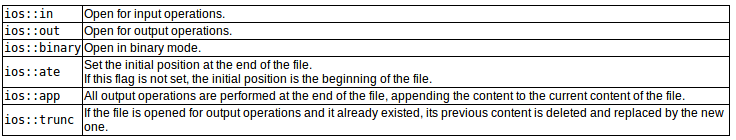
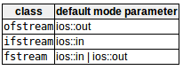
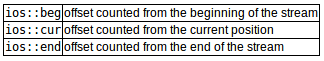
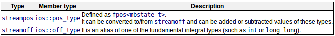

c++提供了以下类来执行输出和输入字符到/从文件：  
- `ofstream`:用于写入文件的流类    
- `ifstream`:从文件中读取的流类
- `fstream`:用于读写文件的流类

以上类直接或间接地派生自istream和ostream  
cin是istream的对象，cout是ostream的对象  
需要将这些流与物理文件关联起来

# Open a file
将对象关联到一个实际文件。  
```c++
open(filename,mode);
/*
filename --- 表示要打开的文件名称的字符串
mode --- 可选参数，见下表tb1，其中标志可以用OR（|）组合
*/
//example
ofstream mtfile;
myfile.open("example.bin",ios::out | ios::app | ios::binary);
//等价于
ofstream myfile("example.bin",ios::out | ios::app | ios::binary);   // 在一条语句中构造对象并打开，构造函数自动调用open成员函数
if (myfile.is_open()){/*ok,继续输出*/}  // is_open函数：检查文件流类是否成功打开文件
```
table1：  
  
这些流类的每个打开的成员函数都有一个默认模式，如果mode没有，则会使用以下默认模式：  
  

# Closing a file
close成员函数将刷新相关缓冲区并关闭文件  
```c++
myfile.close();
```
调用此成员函数后，可以重用流对象来打开另一个文件，并且该文件可以再次被其他进程打开。  
如果对象在与打开的文件关联时被销毁，析构函数将自动调用close成员函数

# Text files
文本文件流打开模式中不包含ios::binary标识，用来存储文本，因此会发生格式转换，且不一定对应于其二进制值。  
对文本文件的读写见例子`codes/Standard library/writing on a text file.cpp` 
和`codes/Standard library/reading a text file.cpp`。    

# Checking state flags
以下成员函数用于检查流的特定状态（返回bool值）：  
成员函数|功能|备注|
:---:|:---:|:---:|
bad()|如果读写操作失败，返回true|试图写入一个未打开以进行写入的文件或写入的设备没有剩余空间|
fail()|与bad()相同的情况或发生格式错误时，返回true|试图读取整数时提取字母字符|
eof()|打开供读取的文件已到达末尾，返回true|无|
good()|在调用前一个函数返回true的相同情况下，返回false|最通用的状态标志，和bad()并不是完全相反，good()同时检查的状态更多|
clear()|重置状态标志|无|
# get and put stream positioning获取和放置流定位
所有i/o流对象保持至少一个内部位置：  
- 与istream一样，ifstream保持一个内部get位置，其中包含了要在下一个输入操作中读取的元素的位置
- 与ostream一样，ofstream保留一个内部put位置，用于编写下一个元素
- 与iostream一样，fstream保留get和put位置

内部流位置指向流中执行下一个读或写操作的位置。这些位置可以通过以下成员函数观察和修改：  
`tellg()`和`tellp()`  
这两个没有参数的成员函数返回成员类型streampos的值，该类型表示当前get位置（tellg）或put位置（tellp）  
`seekg()`和`seekp()`  
这些函数允许更改get和put位置的位置。有两种重载原型，第一种：  
```c++
seekg(position)
seekp(position)
// 使用这个原型，流指针被更改为绝对位置（从文件的开始计数）。该参数的类型为streampos，与函数tellg和tellp返回的类型相同
```
第二种：  
```c++
seekg(offset,direction);
seekp(offset,direction);
// 使用这个原型，get或put位置被设置为相对于由参数方向确定的特定点的偏移值。offset是streamoff类型。direction是seekdir类型（一种枚举类型，用于确定计算偏移量的点，可以取下表中任何值）
```
  
用于变量开始和结束的类型：  
```c++
streampos size；
/*
streampos --- 用于缓冲区和文件定位的特殊类型，是file.tellg()返回的类型。
            这种类型的值可以安全地从相同类型的其他值中减去，也可以转换为足够大的整数类型，以包含文件的大小。
*/
```
这些流定位函数使用两种特殊类型：streampos和streamoff。这些类型也被定义为流类的成员类型：  
  
??上面的每个成员类型都是非成员等价的别名（它们是完全相同的类型）。使用哪一个并不重要。成员类型更通用，因为它们在所有流对象上都是相同的（甚至在使用外来字符类型的流上也是如此），但是由于历史原因，非成员类型在现有代码中被广泛使用??

# Binary files
问题：对于二进制文件，使用提取和插入操作符（<<和>>）以及getline之类的函数读写数据是没有效率的，因为我们不需要格式化任何数据，而且数据很可能没有在行中格式化。  
解决方案：文件流包括两个专门用于按顺序读写二进制数据的成员函数：write和read。  
```c++
// write是ostream的成员函数（由ofstream继承）；read是istream的成员函数（由ifstream继承）。类fstream的对象两者都有。
write(memory_block,size);
read(memory_block,size);
/*
memory_block --- 类型为char*，表示存储读取数据元素的字节数组的地址，或者表示从该数组获取要写入的数据元素的地址。
size --- 整数值，指定从/到内存块读写的字符数。
*/
```

# Buffers and Synchronization
当我们操作文件流时，这些文件流与类型为streambuf的内部缓冲区对象相关联。  
这个缓冲区对象可以表示充当流和物理文件之间中介的内存块。  
例如，对于ofstream，每当调用成员函数put（写单个字符）时，该字符可能被插入这个中间缓冲区，而不是直接写入与该流关联的物理文件。  
操作系统还可以为文件的读写定义其他缓冲层。当缓冲区被刷新时，它所包含的所有数据都被写入物理介质（如果它是输出流）。这个过程称为同步，发生在以下任何一种情况下：  
- 当文件被关闭：在关闭文件之前，所有尚未刷新的缓冲区被同步，所有挂起的数据被写入或读取到物理介质。
- 缓冲区满时：缓冲区具有一定的大小。当缓冲区已满时，它将自动同步。
- 明确地使用操作器：当某些操作器在流上使用时，将发生显式同步。这些操作器是：flush和endl
- 显式地使用成员函数sync()：调用流的成员函数sync()会导致立即同步。如果流没有关联的缓冲区，或者在失败的情况下，这个函数返回一个int等于-1。否则（如果流缓冲区同步成功），它返回0。