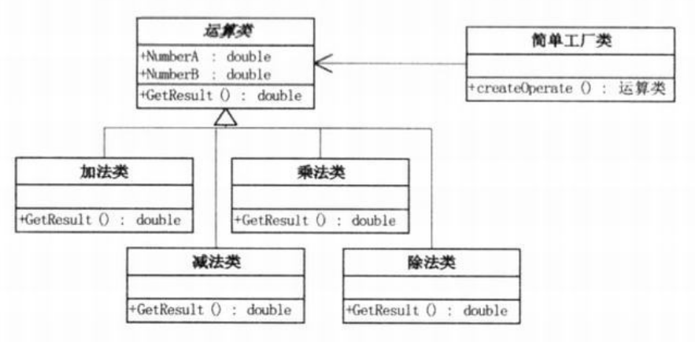
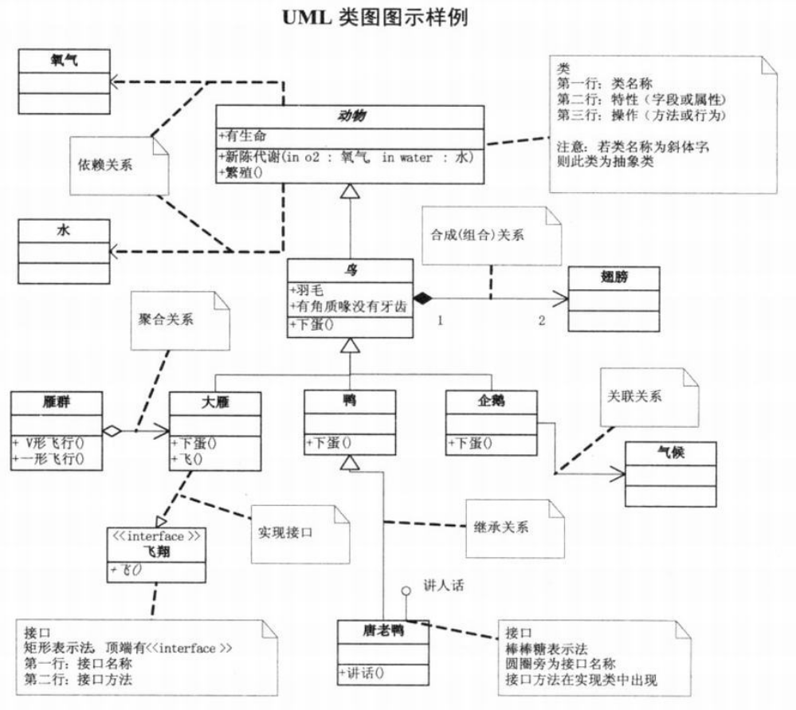

问题：使用任意一种面向对象语言实现一个计算器控制台程序，要求输入两个数和运算符号，输出结果。
```c#
// 小菜的代码 --- version1.01
class Program
{
    static void Main(string[] args)
    {
        Console.Write("请输入数字A：    ");
        string A = Console.ReadLine();
        Console.Write("请选择运算符号（+、-、*、/）：   ");
        string B = Console.ReadLine();
        Console.Write("请输入数字B：    ");
        string C = Console.ReadLine();
        string D = "";

        if (B == "+")
            D = Convert.ToString(Convert.ToDouble(A) + Convert.ToDouble(C));
        if (B == "-")
            D = Convert.ToString(Convert.ToDouble(A) - Convert.ToDouble(C));
        if (B == "*")
            D = Convert.ToString(Convert.ToDouble(A) * Convert.ToDouble(C));
        if (O == "/")
            D = Convert.ToString(Convert.ToDouble(A) / Convert.ToDouble(C));

        Console.WriteLine("结果是： " + D);
    }
}
/*
初学者代码的问题：
- 命名不规范，没有什么实际含义，不易理解，可读性差
- 判断分支的写法，连用大量if，计算机可能需要做很多无意义的判断
- 除法没有考虑到除数为零的情况
（悄咪咪 - 不知道是印刷错误还是什么，最后代码里出现的O是什么鬼？）
*/
```
```c#
// 小菜的代码 --- version1.02
class Program
{
    static void Main(string[] args)
    {
        try
        {
            Console.Write("请输入数字A：    ");
            string strNumberA = Console.ReadLine();
            Console.Write("请选择运算符号（+、-、*、/）：   ");
            string strOperate = Console.ReadLine();
            Console.Write("请输入数字B：    ");
            string strNumberB = Console.ReadLine();
            string strResult = "";
            switch(strOperate)
            {
                case "+":
                    strResult = Convert.ToString(Convert.ToDouble(strNumberA) + Convert.ToDouble(strNumberB));
                    break;
                case "-":
                    strResult = Convert.ToString(Convert.ToDouble(strNumberA) - Convert.ToDouble(strNumberB));
                    break;
                case "*":
                    strResult = Convert.ToString(Convert.ToDouble(strNumberA) * Convert.ToDouble(strNumberB));
                    break;
                case "/":
                    if (strNUmberB != "0")
                        strResult = Convert.ToString(Convert.ToDouble(strNumberA) / Convert.ToDouble(strNumberB));
                    else
                        strResult = "除数不能为0";
                    break;
            }
            Console.WriteLine("结果是： " + strResult);
            Console.ReadLine();
        }
        catch (Exception ex)
        {
            Console.WriteLine("您的输入有错： " + ex.Message);
        }
    }
}
/*
虽然实现问题所述的功能没有问题了，但是是否符合出题人意图呢？
初学者碰到问题的时候，直觉地用计算机能够理解的逻辑来描述和表达待解决的问题及具体的求解过程。
但是这样写出来的程序基本上只能满足当前需求，不容易维护，不容易扩展，更不容易复用，因而质量不高。
*/
///与传统印刷术相比，活字印刷的好处
/*
- 可维护：要改时，只需要改要改的字
- 可复用：所有的字可以在后来印刷中反复使用
- 可扩展：需要加字的话，只需另刻字加入即可
- 灵活性好：单个字可以横排也可以竖排，可以移动以满足不同要求
*/
///代码上的启示
/*
- 通过封装、继承、多态把程序的耦合度降低
- 用设计模式使得程序更加的灵活、容易修改、且易于复用
*/
```
```c#
// 小菜的代码 --- version1.03
// Operation运算类
public class Operation
{
    public static double GetResult(double numberA,double numberB,string operate)
    {
        double result = 0d;
        switch(operate)
        {
            case "+":
                result = numberA + numberB;
                break;
            case "-":
                result = numberA - numberB;
                break;
            case "*":
                result = numberA * numberB;
                break;
            case "/":
                result = numberA / numberB;
                break;
        }
        return result;
    }
}

// 客户端代码
static void Main(string[] args)
{
    try
    {
        Console.Write("请输入数字A： ");
        string strNumberA = Console.ReadLine();
        Console.Write("请选择运算符号(+、-、*、/)： ");
        string strOperate = Console.ReadLine();
        Console.Write("请输入数字B： ");
        string strNumberB = Console.ReadLine();
        string strResult = "";
        strResult = Convert.ToString(Operation.GetResult(Convert.ToDouble(strNumberA),Convert.ToDouble(strNumberB),strOperate));
        Console.WriteLine("结果是： " + strResult);
        Console.ReadLine();
    }
    catch(Exception ex)
    {
        Console.WriteLine("您的输入有错： " + ex.Message);
    }
}
/*
考虑代码的复用和单纯的ctrl+c&ctrl+v的区别
- 封装：让计算与显示分开，尽可能避免重复。（当业务逻辑发生改变时，不需要对界面逻辑做任何改动）
*/
```
```c#
// 小菜的代码 --- version1.04
// Operation运算类
public class Operation
{
    private double _numberA = 0;
    private double _numberB = 0;

    public double NumberA
    {
        get { return _numberA; }
        set { _numberA = value; }
    }
    public double NumberB
    {
        get { return _numberB; }
        set { _numberB = value; }
    }
    public virtual double GetResult()
    {
        double result = 0;
        return result; 
    }
}

// 加减乘除类
class OperationAdd : Operation
{
    public override double GetResult()
    {
        double result = 0;
        result = NumberA + NumberB;
        return result;
    }
}

class OperationSub : Operation
{
    public override double GetResult()
    {
        double result = 0;
        result = NumberA - NumberB;
        return result;
    }
}

class OperationMul : Operation
{
    public override double GetResult()
    {
        double result = 0;
        result = NumberA * NumberB;
        return result;
    }
}

class OperationDiv : Operation
{
    public override double GetResult()
    {
        double result = 0;
        if (NumberB == 0)
            throw new Exception("除数不能为0.");
        result = NumberA / NumberB;
        return result;
    }
}
/*
考虑代码的松耦合和紧耦合
只想添加一个新的业务逻辑，但不小心的话可能影响或改动旧的业务逻辑～
- 继承：使用虚函数  
但还要考虑如何去实例化对象 --- 简单工厂模式
*/
```
# 简单工厂模式
```c#
// 小菜的代码 --- version1.05
// 简单运算工厂类
public class OperationFactory
{
    public static Operation createOperate(string operate)
    {
        Operation oper = null;
        switch(operate)
        {
            case "+":
                oper = new OperationAdd();
                break;
            case "-":
                oper = new OperationSub();
                break;
            case "*":
                oper = new OperationMul();
                break;
            case "/":
                oper = new OperationDiv();
                break;
        }
        return oper;
    }
}

// 客户端代码
Operation oper;
oper = OperationFactory.createOperate("+");
oper.NumberA = 1;
oper.NumberB = 2;
double result = oper.GetResult();
/*
工厂的职责 --- 决定实例化哪个对象，会不会增加可实例化的对象（如增加开根运算），考虑用一个单独的类来做这个创造的过程
- 对业务逻辑对应的类做修改只影响该类业务逻辑，还可以添加新的业务逻辑
*/
```
以上涉及的类之间的关系及其结构图：  
  

# UML类图
一个UML类图图示样例  
  
- 类图分三层：  
  - 第一层显示`类的名称`，如果是抽象类，则用*斜体*显示。
  - 第二层是`类的特性`，通常就是字段和属性。
  - 第三层是`类的操作`，通常是方法或行为。
  - 访问权限：’`+`‘表示public， ‘`-`’表示private， ‘`#`’表示protected。
- 接口图（和类图的区别主要是顶端有`<<interface>>`)
  - 第一行是`接口名称`
  - 第二行是`接口方法`
  - 另一种接口图表示方法（棒棒糖表示法）
    ```c#
    // 接口的例子
    // 飞翔：接口
    interface IFly
    {
        void Fly();
    }
    // 唐老鸭：接口
    interface ILanguage
    {
        void Speak();
    }
    ```

- 关系（类与类、类与接口之间的连线）
  - 继承关系：空心三角形+实线
  - 实现接口：空心三角形+虚线
    ```c#
    // 实现接口
    class Bird : Animal
    {
        // 继承动物类
    }
    class WideGoose : IFly
    {
        // 实现飞翔接口
    }
    ```
  - 关联关系：实线箭头
    ```c#
    // 企鹅知天气
    class Penguin : Bird
    {
        private Climate climate;
    }
    ```
  - 聚合关系:空心的菱形+实线箭头，表示一种弱的“拥有”关系，体现的是A对象可以包含B对象，但B对象不是A对象的一部分
    ```c#
    // 雁群与大雁
    class WideGoose Aggregate
    {
        private WideGoose[] arrayWideGoose;
    }
    ```
  - 合成/组合关系：实心的菱形+实线箭头，表示一种强的“拥有”关系，体现了严格的部分和整体的关系，部分和整体的生命周期一样
    ```c#
    // 鸟与翅膀
    class Bird
    {
        private Wing wing;
        public Bird()
        {
            wing = new Wing();
        }
    }
    ```
  - 基数：关系两端的数字。表示某个类可以有几个实例，如一只鸟的翅膀有两只。`组合关系、关联关系、聚合关系`均可以有`基数`。
  - 依赖关系：虚线箭头
    ```c#
    // 动物需要氧气和水
    abstract class Animal
    {
        public Metabolism(Oxygen oxygen,Water water)
        {
            // ...
        }
    }
    ```

>Note:  
>$\quad\quad$编程是一门技术，更加是一门艺术。