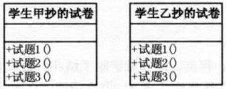
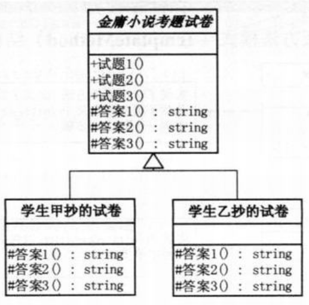
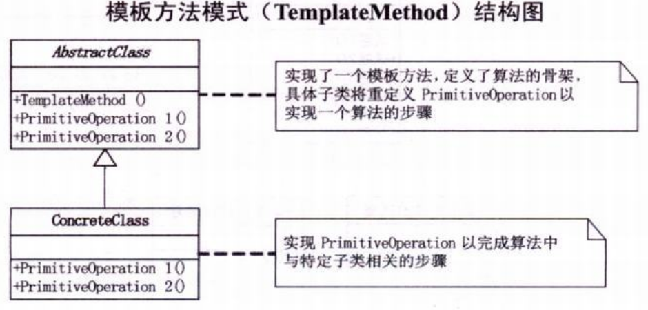

问题：面试题，写一个抄题目的程序。  
第一版结构图：  
  
```c#
// 小菜的代码 --- version1.01
// 学生甲抄的试卷
class TestPaperA
{
    // 试题1
    public void TestQuestion1()
    {
        Console.WriteLine("杨过得到，后来给了郭靖，炼成倚天剑、屠龙刀的玄铁可能是[] a.球磨铸铁 b.马口铁 c.高速合金钢 d.碳素纤维 ");
        Console.WriteLine("答案：b");
    }
    // 试题2
    public void TestQuestion2()
    {
        Console.WriteLine("杨过、程英、陆无双铲除了情花，造成[] a.使这种植物不再害人 b.使一种珍稀物种灭绝 c.破坏了那个生物圈的生态平衡 d.造成该地区沙漠化");
        Console.WriteLine("答案：a");
    }
    // 试题3
    public void TestQuestion3()
    {
        Console.WriteLine("蓝凤凰致使华山师徒、桃谷六仙呕吐不止，如果你是大夫，会给他们开什么药[] a.阿司匹林 b.牛黄解毒片 c.氟哌酸 d.让他们喝大量的生牛奶 e.以上全不对");
        Console.WriteLine("答案：c");
    }
}
// 学生乙抄的试卷
class TestPaperA
{
    // 试题1
    public void TestQuestion1()
    {
        Console.WriteLine("杨过得到，后来给了郭靖，炼成倚天剑、屠龙刀的玄铁可能是[] a.球磨铸铁 b.马口铁 c.高速合金钢 d.碳素纤维 ");
        Console.WriteLine("答案：d");
    }
    // 试题2
    public void TestQuestion2()
    {
        Console.WriteLine("杨过、程英、陆无双铲除了情花，造成[] a.使这种植物不再害人 b.使一种珍稀物种灭绝 c.破坏了那个生物圈的生态平衡 d.造成该地区沙漠化");
        Console.WriteLine("答案：b");
    }
    // 试题3
    public void TestQuestion3()
    {
        Console.WriteLine("蓝凤凰致使华山师徒、桃谷六仙呕吐不止，如果你是大夫，会给他们开什么药[] a.阿司匹林 b.牛黄解毒片 c.氟哌酸 d.让他们喝大量的生牛奶 e.以上全不对");
        Console.WriteLine("答案：a");
    }
}
// 客户端代码
static void Main(string[] args)
{
    Console.WriteLine("学生甲抄的试卷：");
    TestPaperA studentA = new TestPaperA();
    studentA.TestQuestion1();
    studentA.TestQuestion2();
    studentA.TestQuestion3();

    Console.WriteLine("学生乙抄的试卷：");
    TestPaperB studentB = new TestPaperB();
    studentB.TestQuestion1();
    studentB.TestQuestion2();
    studentB.TestQuestion3();

    Console.Read();
}
/*
- 两张试卷除了答案，其余均相同，如果分开写既容易错，又难以维护
- 如果要修改题目，两方均需要改代码，如果有人抄错了就影响结果
- 最好的办法是出一份试卷，打印多份，让学生填写答案即可。将试题和答案分开，公共的试题代码写到父类当中，其余试卷继承该父类即可。
*/
```
```c#
// 小菜的代码 --- version1.02
// 金庸小说考题试卷
class TestPaper
{
    // 试题1
    public void TestQuestion1()
    {
        Console.WriteLine("杨过得到，后来给了郭靖，炼成倚天剑、屠龙刀的玄铁可能是[] a.球磨铸铁 b.马口铁 c.高速合金钢 d.碳素纤维 ");
    }
    // 试题2
    public void TestQuestion2()
    {
        Console.WriteLine("杨过、程英、陆无双铲除了情花，造成[] a.使这种植物不再害人 b.使一种珍稀物种灭绝 c.破坏了那个生物圈的生态平衡 d.造成该地区沙漠化");
    }
    // 试题3
    public void TestQuestion3()
    {
        Console.WriteLine("蓝凤凰致使华山师徒、桃谷六仙呕吐不止，如果你是大夫，会给他们开什么药[] a.阿司匹林 b.牛黄解毒片 c.氟哌酸 d.让他们喝大量的生牛奶 e.以上全不对");
    }
}
// 学生子类
// 学生甲抄的试卷
class TestPaperA ： TestPaper
{
    public new void TestQuestion1()
    {
        base.TeatQuestion1();
        Console.WriteLine("答案：b");
    }

    public new void TestQuestion2()
    {
        base.TeatQuestion2();
        Console.WriteLine("答案：a");
    }

    public new void TestQuestion3()
    {
        base.TeatQuestion3();
        Console.WriteLine("答案：c");
    }
}
// 学生乙抄的试卷
class TestPaperB ： TestPaper
{
    public new void TestQuestion1()
    {
        base.TeatQuestion1();
        Console.WriteLine("答案：d");
    }

    public new void TestQuestion2()
    {
        base.TeatQuestion2();
        Console.WriteLine("答案：b");
    }

    public new void TestQuestion3()
    {
        base.TeatQuestion3();
        Console.WriteLine("答案：a");
    }
}
// 客户端代码不变，略
/*
- 既然用了继承，并且肯定这个继承有意义，就应该要成为子类的模板，所有重复的代码都应该要上升到父类去，而不是让每个子类都去重复。
- 当我们要完成在某一细节层次一致的一个过程或一系列步骤，但其个别步骤在更详细的层次上的实现可能不同时，我们通常考虑用模板方法模式来处理。
*/
```
新版本的结构图：  

```c#
// 小菜的代码 --- version1.03
// 举例：将version1.01中的TestQuestion1()的实现作如下修改
// 原来的代码
public void TestQuestion1()
{
    Console.WriteLine("杨过得到，后来给了郭靖，炼成倚天剑、屠龙刀的玄铁可能是[] a.球磨铸铁 b.马口铁 c.高速合金钢 d.碳素纤维 ");
    Console.WriteLine("答案：b");   // 只有这里不同的学生会有不同的结果，其他全部都是一样的
}
// 修改后的代码
public void TestQuestion1()
{
    Console.WriteLine("杨过得到，后来给了郭靖，炼成倚天剑、屠龙刀的玄铁可能是[] a.球磨铸铁 b.马口铁 c.高速合金钢 d.碳素纤维 ");
    Console.WriteLine("答案：" + Answer1());   // 改成一个虚方法
}
protected virtual string Answer1()
{
    return "";  // 此方法的目的就是给继承的子类重写，因为这里每个人的答案都是不同的
}
// 学生甲抄的试卷
class TestPaperA ： TestPaper
{
   protected override string Answer1()
   {
       return "b";
   }
   protected override string Answer2()
   {
       return "a";
   }
   protected override string Answer3()
   {
       return "c";
   }
}
// 学生乙抄的试卷
class TestPaperB ： TestPaper
{
   protected override string Answer1()
   {
       return "d";
   }
   protected override string Answer2()
   {
       return "b";
   }
   protected override string Answer3()
   {
       return "a";
   }
}
// 客户端代码
static void Main(string[] args)
{
    Console.WriteLine("学生甲抄的试卷：");
    TestPaper studentA = new TestPaperA();  // 将子类变量的声明改成了父类，利用了多态性，实现了代码的复用
    studentA.TestQuestion1();
    studentA.TestQuestion2();
    studentA.TestQuestion3();

    Console.WriteLine("学生乙抄的试卷：");
    TestPaper studentB = new TestPaperB();
    studentB.TestQuestion1();
    studentB.TestQuestion2();
    studentB.TestQuestion3();

    Console.Read();
}
/*
- 添加一个虚方法，来分离不变和改变
*/
```
# 模板方法模式
>Note:  
>$\quad\quad$`模板方法模式`,定义一个操作中的算法的骨架，而将一些步骤延迟到子类中。模板方法使得子类可以不改变一个算法的结构即可重定义该算法的某些特定步骤。  

  
```c#
// AbstractClass抽象类，定义并实现了一个模板方法。
abstract class AbstractClass
{
    // 一些抽象行为，放到子类去实现
    public abstract void PrimitiveOperation1();
    public abstract void PrimitiveOperation2();

    public void TemplateMethod()
    {
        // 模板方法，给出了逻辑的骨架，而逻辑的组成是一些相应的抽象操作，它们都推迟到子类实现
        PrimitiveOperation1();
        PrimitiveOperation2();
        Console.WriteLine("");
    }
}    
// ConcreteClass,实现父类所定义的一个或多个抽象方法。可以有若干个对应一个抽象类，实现不同的顶级逻辑步骤
class ConcreteClassA ： AbstractClass
{
    // 与ConcreteClassB不同的方法实现
    public override void PrimitiveOperation1()
    {
        Console.WriteLine("具体类A方法1实现");
    }
    public override void PrimitiveOperation2()
    {
        Console.WriteLine("具体类A方法2实现");
    }
}
class ConcreteClassB : AbstractClass
{
    // 与ConcreteClassA不同的方法实现
    public override void PrimitiveOperation1()
    {
        Console.WriteLine("具体类B方法1实现");
    }
    public override void PrimitiveOperation2()
    {
        Console.WriteLine("具体类B方法2实现");
    }
}
// 客户端调用
static void Main(string[] args)
{
    AbstractClass c;

    c = new ConcreteClassA();
    c.TemplateMethod();

    c = new ConcreteClassB();
    c.TemplateMethod();

    Console.Read();
}
```
- 模板方法模式是通过把不变行为搬移到超类，去除子类中的重复代码来体现它的优势。
- 模板方法模式就是提供了一个很好的代码复用平台。（从高层次看执行步骤是相同的，但有些实现不同）
- 当不变的和可变的行为在方法的子类实现中混合在一起的时候，不变的行为就会在子类中重复出现。我们通过模板方法模式把这些行为搬移到单一的地方，这样就帮助子类摆脱重复的不变行为的纠缠。
- 这个模式非常常用，以至于用完了都没意识到～～～吼吼吼>o<