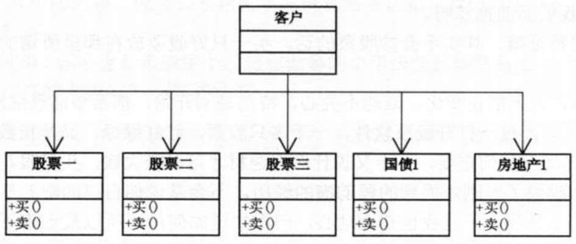
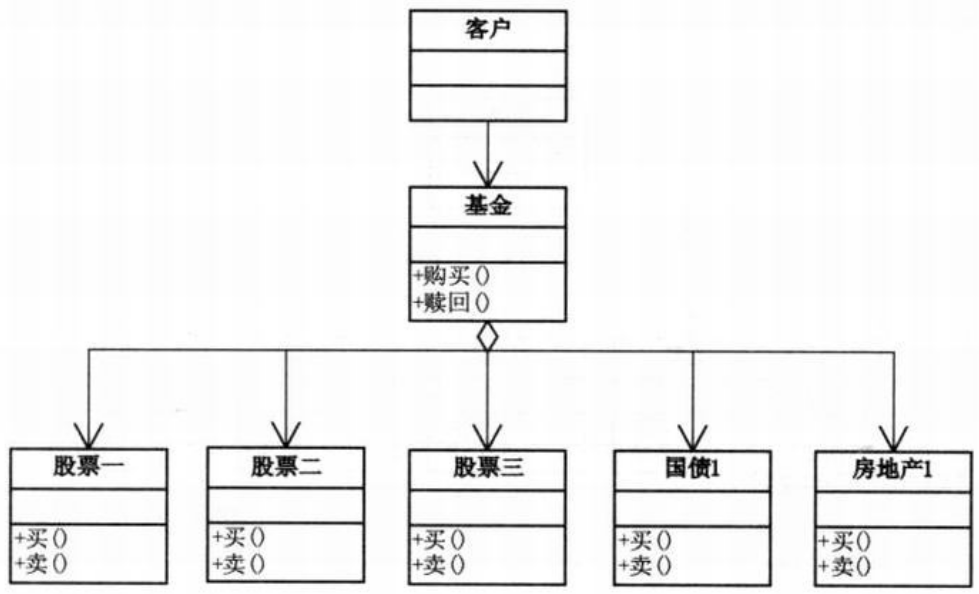
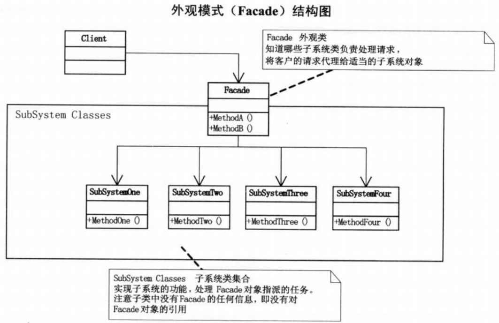
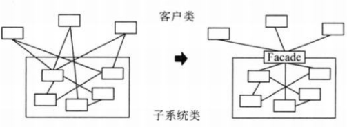

问题：炒股票
- 方案一：投资者直接买股票（耦合性过高）
- 方案二：投资者买基金，基金经理人用这些钱去做投资，然后大家获利  

方案一结构图：  
  
```c#
// 小菜的代码 --- version1.01,股民投资炒股版
// 具体股票、国债、房产类
// 股票1
class Stock1
{
    // 卖股票
    public void Sell()
    {
        Console.WriteLine("股票1卖出");
    }
    // 买股票
    public void Buy()
    {
        Console.WriteLine("股票1买入");
    }
}
// 股票2
class Stock2
{
    // 代码类似股票1，略
}
// 股票3
class Stock3
{
    // 代码类似股票1，略
}
// 国债1
class NationalDebt1
{
    // 代码类似股票1，略
}
//房地产1
class Realty1
{
    // 代码类似股票1，略
}
// 客户端调用
static void Main(string[] args)
{
    // 用户需要了解股票、国债、房产情况，需要参与这些项目的具体买和卖。耦合性很高
    Stock1 gu1 = new Stock1();
    Stock2 gu2 = new Stock2();
    Stock3 gu3 = new Stock3();
    NationalDebt1 nd1 = new NationalDebt1();
    Realty1 rt1 = new Realty1();

    gu1.Buy();
    gu2.Buy();
    gu3.Buy();
    nd1.Buy();
    rt1.Buy();

    gu1.Sell();
    gu2.Sell();
    gu3.Sell();
    nd1.Sell();
    rt1.Sell();

    Console.Read();
}
```
方案二结构图：  
  
```c#
// 小菜的代码 --- version1.02,股民投资基金版
// 基金类如下
class Fund
{
    // 基金类，它需要了解所有的股票或其他投资方式的方法或属性，进行组合，以备外界调用
    Stock1 gu1;
    Stock2 gu2;
    Stock3 gu3;
    NationalDebt1 nd1;
    Realty1 rt1;
    public Fund()
    {
        gu1 = new Stock1();
        gu2 = new Stock2();
        gu3 = new Stock3();
        nd1 = new NationalDebt1();
        rt1 = new Realty1();
    }
    public void BuyFund()
    {
        gu1.Buy();
        gu2.Buy();
        gu3.Buy();
        nd1.Buy();
        rt1.Buy();
    }
    public void SellFund()
    {
        gu1.Sell();
        gu2.Sell();
        gu3.Sell();
        nd1.Sell();
        rt1.Sell();
    }
}
// 客户端如下
static void Main(string[] args)
{
    // 此时用户不需要了解股票，甚至可以对股票一无所知，买了基金就回家睡觉，一段时间后再赎回就可以大把数钱。参与股票的具体买卖都由基金公司完成。客户端代码非常简捷明了。
    Fund jijin = new Fund();
    // 基金购买
    jijin.BuyFund();
    // 基金赎回
    jijin.SellFund();

    Console.Read();
}
```
>Note:  
>$\quad\quad$`外观模式(Facade)/门面模式`,为子系统中的一组接口提供一个一致的界面，此模式定义了一个高层接口，这个接口使得这一子系统更加容易使用。

  
```c#
class SubSystemOne
{
    public void MethodOne()
    {
        Console.WriteLine("子系统方法一");
    }
}
class SubSystemTwo
{
    public void MethodTwo()
    {
        Console.WriteLine("子系统方法二");
    }
}
class SubSystemThree
{
    public void MethodThree()
    {
        Console.WriteLine("子系统方法三");
    }
}
class SubSystemFour
{
    public void MethodFour()
    {
        Console.WriteLine("子系统方法四");
    }
}
// 外观类
class Facade
{
    // 外观类，它需要了解所有的子系统的方法或属性，进行组合，以备外界调用
    SubSystemOne one;
    SubSystemTwo two;
    SubSystemThree three;
    SubSystemFour four;

    public Facade()
    {
        one = new SubSystemOne();
        two = new SubSystemTwo();
        three = new SubSystemThree();
        four = new SubSystemFour();
    }
    public void MethodA()
    {
        Console.WriteLine("\n方法组A() --- ");
        one.MethodOne();
        two.MethodTwo();
        four.MethodFour();
    }
    public void MethodB()
    {
        Console.WriteLine("\n方法组B() --- ");
        two.MethodTwo();
        three.MethodThree();
    }
}
// 客户端调用
static void Main(string[] args)
{
    // 由于Facade的作用，客户端可以根本不知三个子系统类的存在
    Facade facade = new Facade();

    facade.MethodA();
    facade.MethodB();

    Console.Read();
}
/*
- 外观模式完美地体现了依赖倒转原则和迪米特法则的思想
*/
```
外观模式的使用：  
- 首先，在设计初期阶段，应该要有意识的将不同的两个层分离。（经典三层结构，数据访问层和业务逻辑层、业务逻辑层和表示层）层与层之间建立外观Facade。
- 其次，在开发阶段,子系统往往因为不断的重构演化而变得越来越复杂。增加外观Facade可以提供一个简单的接口，减少它们（很小很小的类）之间的依赖。
- 第三，在维护一个遗留的大型系统时，可能这个系统已经非常难以维护和扩展了（包含很重要的功能，新系统必须以此为基础），为新系统开发一个外观Facade类，来提供设计粗糙或高度复杂的遗留代码的恶比较清晰简单的接口，让新系统与Facade对象交互，Facade与遗留代码交互所有复杂的工作。  
  
- 因此，对于`复杂难以维护的老系统`，直接去改或去扩展都可能产生很多问题，分为两个小组，一个开发Facade与老系统的交互，另一个只要了解Facade的接口，直接开发新系统调用这些接口即可。
