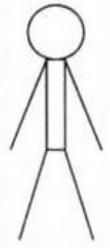
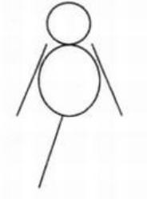
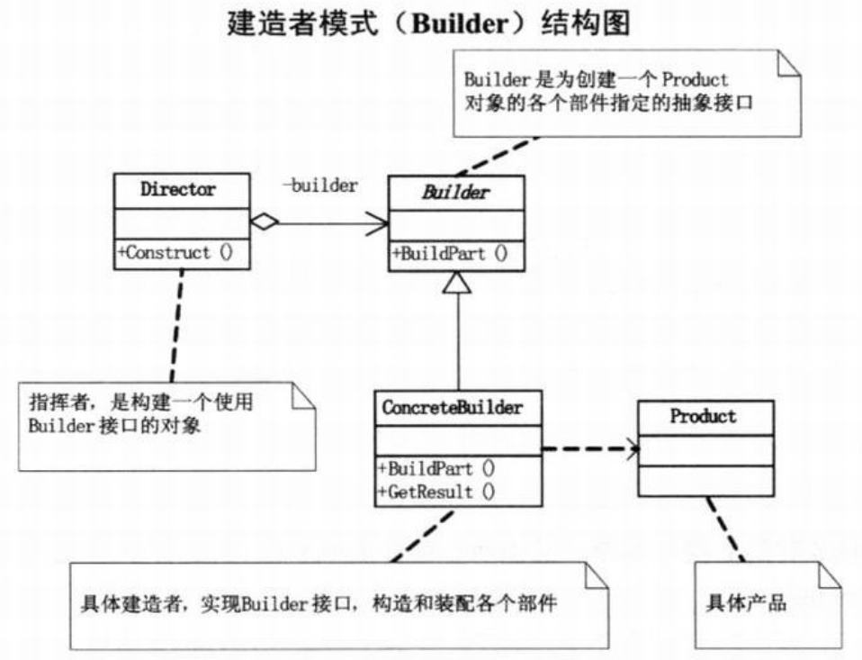
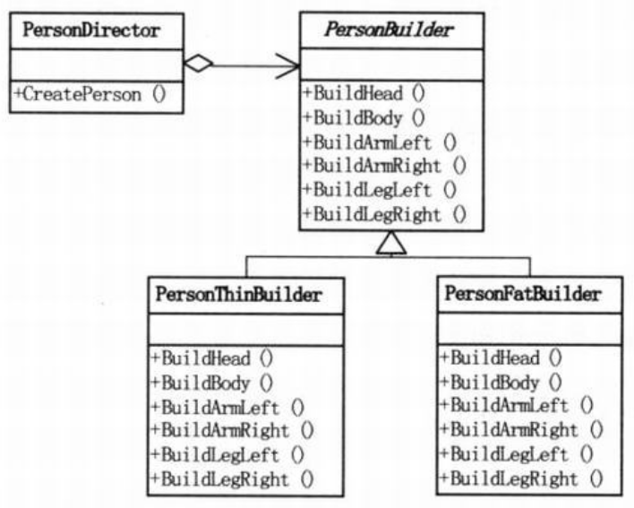

问题：中式炒菜 --- 不同的厨子，不同时间，不同的味道   
--->违背依赖倒转原则，抽象不应该依赖细节细节应该依赖于抽象  
要求用程序画一个小人，要求小人要有头、身体、两手、两脚  
- 小人1号：  
 
```c#
// 小菜的代码 --- version1.01
Pen p = new Pen(Color.Yellow);
Graphics gThin = pictureBox1.CreateGraphics();
gThin.DrawEllipse(p,50,20,30,30);   // 头
gThin.DrawRectangle(p,60,50,10,50); // 身体
gThin.DrawLine(p,60,50,40,100);     // 左手
gThin.DrawLine(p,70,50,90,100);     // 右手
gThin.DrawLine(p,60,100,45,150);    // 左脚
gThin.DrawLine(p,70,100,85,150);    // 右脚
```
- 小人2号：  
  
```c#
// 小菜的代码 --- version1.01
Graphics gFat = pictureBox2.CreateGraphics();

gFat.DrawEllipse(p,50,20,30,30);   // 头
gFat.DrawRectangle(p,45,50,40,50); // 身体
gFat.DrawLine(p,50,50,30,100);     // 左手
gFat.DrawLine(p,80,50,100,100);     // 右手
gFat.DrawLine(p,60,100,45,150);    // 左脚
/*
- 少了一条腿：gFat.DrawLine(p,70,100,85,150);
*/
```
- 分离小人建造的过程
```c#
// 小菜的代码 --- version1.02
// 瘦人的类
class PersonThinBuilder
{
    private Graphics g;
    private en p;

    public PersonThinBuilder(Graphics g,Pen p)
    {
        // 初始化时确定画板和颜色
        this.g = g;
        this.p = p;
    }
    public void Build()
    {
        // 建造小人
        g.DrawEllipse(p,50,20,30,30);   // 头
        g.DrawRectangle(p,60,50,10,50); // 身体
        g.DrawLine(p,60,50,40,100);     // 左手
        g.DrawLine(p,70,50,90,100);     // 右手
        g.DrawLine(p,60,100,45,150);    // 左脚
        g.DrawLine(p,70,100,85,150);    // 右脚
    }
}
// 胖人的类，类似瘦人，略
// 客户端代码
Pen p = new Pen(Color.Yellow);

Graphics gThin = pictureBox1.CreateGraphics();
PersonThinBuilder ptb = new PersonThinBuilder(gThin,p);
ptb.Build();

Graphics gFat = pictureBox1.CreateGraphics();
PersonFatBuilder pfb = new PersonTFatBuilder(gFat,p);
pfb.Build();
/*
- 虽然可以复用画小人的程序，但是如果添加新的小人（高个的），可能又会缺胳膊少腿
- 最好的办法是规定，凡是建造小人，必须有头、身体以及四肢
- 建造小人的过程是稳定的，只是建造细节不同
*/
```
# 建造者模式
>Note:  
>$\quad\quad$`建造者模式(Builder)/生成器模式`,将一个复杂对象的构建与它的表示分离，使得同样的构建过程可以创建不同的表示。

  
```c#
// Product类 --- 产品类，由多个部件组成
class Product
{
    IList<string> parts = new List<string>();

    public void Add(string part)
    {
        // 添加产品部件
        parts.Add(part);
    }
    
    public void Show()
    {
        Console.WriteLine("\n产品 创建 ----");
        foreach(string part in parts)
        {
            // 列举所有的产品部件
            Console.WriteLine(part);
        }
    }
}
// Builder类 --- 抽象建造者类，确定产品由两个部件PartA和PartB组成，并声明一个得到产品建造后结果的方法GetResult（是为创建一个Product对象的各个部分指定的抽象接口）
abstract class Builder
{
    public abstract void BuildPartA();
    public abstract void BuildPartB();
    public abstract Product GetResult();
}
// ConcreteBuilder1类 --- 具体建造者类（实现Builder接口，构造和装配各个部件）
class ConcreteBuilder1 : Builder
{
    private Product product = new Product();

    // 建造具体的两个部件是部件A和部件B
    public override void BuildPartA()
    {
        product.Add("部件A");
    }

    public override void BuildPartB()
    {
        product.Add("部件B");
    }

    public override Product GetResult()
    {
        return product;
    }
}
// ConcreteBuilder2类 --- 具体建造者类
class ConcreteBuilder2 : Builder
{
    private Product product = new Product();

    // 建造具体的两个部件是部件X和部件Y
    public override void BuildPartA()
    {
        product.Add("部件X");
    }

    public override void BuildPartB()
    {
        product.Add("部件Y");
    }

    public override Product GetResult()
    {
        return product;
    }
}
// Director类 --- 指挥者类（构建一个使用Builder接口的对象。用于创建一些复杂的对象，这些对象内部构建间的建造顺序通常是稳定的，但对象内部的构建通常面临着复杂的变化）
class Director
{
    public void Construct(Builder builder)
    {
        // 用来指挥建造过程
        builder.BuildPartA();
        builder.BuildPartB();
    }
}
// 客户端代码，客户不需要知道具体的建造过程
static void Main(string[] args)
{
    Director director = new Director();
    Builder b1 = new ConcreteBuilder1();
    Builder b2 = new ConcreteBuilder2();

    director.Construct(b1);
    Product p1 = b1.GetResult();    // 指挥者用ConcreteBuilder1的方法来建造产品
    p1.Show();

    director.Construct(b2);
    Product p2 = b2.GetResult();    // 指挥者用ConcreteBuilder2的方法来建造产品
    p2.Show();

    Console.Read();
}
```
- 如果我们用了建造者模式，那么用户就只需指定需要建造的类型就可以得到它们，而具体建造的过程和细节就不需知道了  
- 建造者模式是在`当创建复杂对象的算法应该独立于该对象的组成部分以及它们的装配方式时`适用的模式  
- 建造者模式的好处就是使得建造代码与表示代码分离，由于建造者隐藏了该产品是如何组装的，所以若需要改变一个产品的内部表示，只需要再定义一个具体的建造者就可以了。
#
代码结构图（加入建造者模式）：  
  
```c#
// 小菜的代码 --- version1.03
abstract class PersonBuilder
{
    protected Graphics g;
    protected Pen p;

    public PersonBuilder(Graphics g,Pen p)
    {
        this.g = g;
        this.p = p;
    }

    public abstract void BuildHead();
    public abstract void BuildBody();
    public abstract void BuildArmLeft();
    public abstract void BuildArmRight();
    public abstract void BuildLegLeft();
    public abstract void BuildLegRight();
}
// 瘦人类
class PersonThinBuilder : PersonBuild
{
    public PersonThinBuilder(Graphics g,Pen p) : base(g,p)
    { }

    public override void BuildHead()
    {
        g.DrawEllipse(p,50,20,30,30);
    }

    public override void BuildBody()
    {
        g.DrawRectangle(p,60,50,10,50);
    }

    public override void BuildArmLeft()
    {
        g.DrawLine(p,60,50,40,100);
    }

    public override void BuildArmRight()
    {
        g.DrawLine(p,70,50,90,100);
    }

    public override void BuildLegLeft()
    {
        g.DrawLine(p,60,100,45,150);
    }

    public override void BuildLegRight()
    {
        g.DrawLine(p,70,100,85,150);
    }
}
// 指挥者
class PersonDirector
{
    private PersonBuilder pb;
    public PersonDirector(PersonBuilder pb)
    {
        this.pb = pb;   // 用户告诉指挥者，我需要什么样的小人
    }
    public void CreatePerson()
    {
        // 根据用户的选择建造小人
        pb.BuildHead();
        pb.BuildBody();
        pb.BuildArmLeft();
        pb.BuildArmRight();
        pb.BuildLegLeft();
        pb.BuildLegRight();
    }
}
// 客户端代码
Pen p = new Pen(Color.Yellow);
PersonThinBuilder ptb = new PersonThinBuilder(pictureBox1.CreateGraphics(),p);
PersonDirector pdThin = new PersonDirector(ptb);
pdThin.CreatePerson();

PersonFatBuilder pfb = new PersonFatBuilder(pictureBox2.CreateGraphics(),p);
PersonDirector pdFat = new PersonDirector(pfb);
pdFat.CreatePerson();
/*
- 先定义一个抽象的建造人的类，固定这个过程
- 让瘦人类去继承这个抽象类，重写抽象方法(其他小人的建造类似)
- 定义指挥者类用来控制建造过程，以及隔离用户与建造过程的关联
- 如果要细化，需要考虑这是制造小人的共性还是个别小人才需要，建造者模式是逐步建造产品的，建造方法必须足够普遍，以便为各种类型的具体建造者构造
*/
```