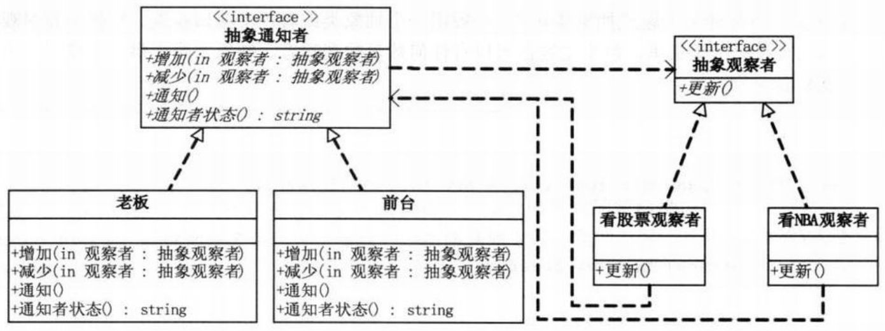
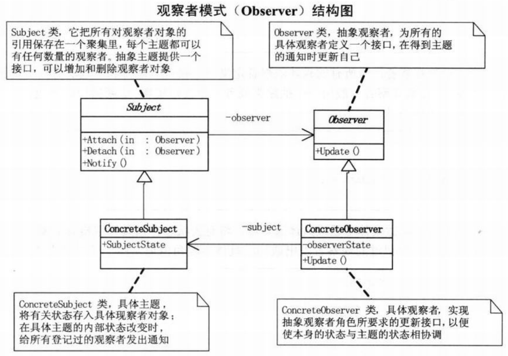

问题：如何在老板不发现的情况下走神（悄咪咪地笔芯，好孩子请勿模仿）  
```c#
// 小菜的代码 --- version1.01
// 前台秘书类
class Secretary
{
    // 同事列表
    private IList<StockObserver> observers = new List<StockObserver>();
    private string action;
    // 增加
    public void Attach(StockObserver observer)
    {
        observers.Add(observer);    // 有几个同事请前台帮忙，于是就给集合增加几个对象
    }
    // 通知
    public void Notify()
    {
        foreach(StockObserver o in observers)
            o.Update();     // 待老板来时，就给所有的登记的同事们发通知，“老板来了”
    }
    // 前台状态
    public string SecretaryAction
    {
        // 前台通过电话，所说的话或所做的事
        get { return action; }
        set { action = value; }
    }
}
// 看股票同事类
class StockObserver
{
    private string name;
    private Secretary sub;
    public StockObserver(string name,Secretary sub)
    {
        this.name = name;
        this.sub = sub;
    }
    public void Update()
    {
        // 得到前台的通知，赶快采取行动
        Console.WriteLine("{0} {1} 关闭股票行情，继续工作！",sub.SecretaryAction,name);
    }
}
// 客户端程序
static void Main(string[] args)
{
    // 前台小姐童子喆
    Secretary tongzizhe = new Secretary();
    // 看股票的同事
    StockObserver tongshi1 = new StockObserver("魏关姹",tongzizhe);
    StockObserver tongshi2 = new StockObserver("易管查",tongzizhe);

    // 前台记下了两位同事
    tongzizhe.Attach(tongshi1);
    tongzizhe.Attach(tongshi2);
    // 发现老板回来
    tongzizhe.SecretaryAction = "老板回来了！";
    // 通知两个同事
    tongzizhe.Notify();

    Console.Read();
}
/*
- 存在双向耦合，前台类需要添加观察者，观察者类需要前台的状态
*/
```
```c#
// 小菜的代码 --- version1.02
// 增加了抽象的观察者
abstract class Observer
{
    protected string name;
    protected Secretary sub;

    public Observer(string name,Secretary sub)
    {
        this.name = name;
        this.sub = sub;
    }

    public abstract void Update();
}
// 增加了两个具体观察者,重写Update方法
// 看股票的同事
class StockObserver : Observer
{
    public StockObserver(string name,Secretary sub) : base(name,sub)
    { }
    public override void Update()
    {
        Console.WriteLine("{0} {1} 关闭股票行情，继续工作！",sub.SecretaryAction,name);
    }
}
// 看NBA的同事
class NBAObserver : Observer
{
    public NBAObserver(string name,Secretary sub) : base(name,sub)
    { }
    public override void Update()
    {
        Console.WriteLine("{0} {1} 关闭NBA直播，继续工作！",sub.SecretaryAction,name);
    }
}
// 前台秘书类
class Secretary
{
    // 同事列表
    private IList<Observer> observers = new List<Observer>();
    private string action;

    // 增加
    public void Attach(Observer observer)
    {
        // 针对抽象编程，减少了与具体类的耦合
        observers.Add(observer);
    }

    // 减少
    public void Detach(Observer observer)
    {
        // 针对抽象编程，减少了与具体类的耦合
        observers.Remove(observer);
    }

    // 通知
    public void Notify()
    {
        foreach(Observer o in observers)
            o.Update();
    }

    // 前台状态
    public string SecretaryAction
    {
        get { return action; }
        set { action = value; }
    }
}
/*
- 观察者不应该依赖具体的实现，而是一个抽象的通知者
- 通知者可以删除观察者列表中的成员
*/
```
结构图（加入观察者模式）：  
  
```c#
// 小菜的代码 --- version1.03
// 添加了抽象通知者接口
// 通知者接口
interface Subject
{
    void Attach(Observer observer);
    void Detach(Observer observer);
    void Notify();
    string SubjectState
    {
        get;
        set;
    }
}
// 具体的通知者类可能是前台，也可能是老板
class Boss : Subject
{
    // 同事列表
    private IList<Observer> observers = new List<Observer>();
    private string action;
    // 增加
    public void Attach(Observer observer)
    {
        observers.Add(observer);
    }
    // 减少
    public void Detch(Observer observer)
    {
        observers.Remove(observer);
    }
    // 通知
    public void Notify()
    {
        foreach(Observer o in observers)
            o.Update();
    }
    // 老板状态
    public string SubjectState
    {
        get { return action; }
        set { action = value; }
    }
}
class Secretary
{
    // 类似Boss类，略
}
// 抽象观察者
abstract class Observer
{
    protected string name;
    protected Subject sub;

    // 原来是‘前台’，现改成‘抽象通知者’
    public Observer(string name,Subject sub)
    {
        this.name = name;
        this.sub = sub;
    }

    public abstract void Update();
}
// 看股票的同事
class StockObserver : Observer
{
    // 原来是‘前台’，现改成‘抽象通知者’
    public StockObserver(string name,Subject sub) : base(name,sub)
    { }
    public override void Update()
    {
        // 原来是‘前台’，现改成‘抽象通知者’
        Console.WriteLine("{0} {1} 关闭股票行情，继续工作！",sub.SubjectState,name);
    }
}
// 客户端代码  
// 老板胡汉三
Boss huhansan = new Boss();
// 看股票的同事
StockObserver tongshi1 = new StockObserver("魏关姹"，huhansan);
// 看NBA的同事
NBAObserver tongshi2 = new NBAObserver("易管查",huhansan);

huhansan.Attach(tongshi1);
huhansan.Attach(tongshi2);

huhansan.Detach(tongshi1);  // 魏关姹其实是没有被老板通知到，所以减去

// 老板回来
huhansan.SubjectState = "我胡汉三回来了！";
// 发出通知
huhansan.Notify();
/*
- 抽象通知者还是依赖抽象观察者，一旦抽象接口没了，通知的功能就完不成了
- 每个具体观察者的更新方法不同，也可能不需要更新，根本不是同名的方法
*/
```
# 观察者模式
>Note:  
>$\quad\quad$`观察者模式(Observer)/发布-订阅模式(Publish/Subscribe)`，定义了一种一对多的依赖关系，让多个观察者对象同时监听某一个主题对象。这个主题对象在状态发生变化时，会通知所有观察者对象，使它们能够自动更新自己。

  
```c#
// Subject类 --- 主题或抽象通知者，一般用一个抽象类或一个接口实现。把所有对观察者对象的引用保存在一个聚集里，每个主题都可以有任何数量的观察者。抽象主题提供一个接口，可以增加和删除观察者对象
abstract class Subject
{
    private IList<Observer> observers = new List<Observer>();

    // 增加观察者
    public void Attach(Observer observer)
    {
        observers.Add(observer);
    }
    // 移除观察者
    public void Detach(Observer observer)
    {
        observers.Remove(observer);
    }
    // 通知
    public void Notify()
    {
        foreach(Observer o in observers)
        {
            o.Update();
        }
    }
}
// Observer类 --- 抽象观察者，为所有的具体观察者定义一个接口（更新接口），在得到主题的通知时更新自己。一般用一个抽象类或一个接口实现。更新接口通常包含一个Update()方法（更新方法）。
abstract class Observer
{
    public abstract void Update();
}
// ConcreteSubject类 --- 具体主题或具体通知者，将有关状态存入具体观察者对象；在具体主题的内部状态改变时，给所有登记过的观察者发出通知。具体主题角色通常用一个具体子类实现
class ConcreteSubject : Subject
{
    private string subjectState;
    // 具体被观察者状态
    public string SubjectState
    {
        get { return subjectState; }
        set { subjectState = value; }
    }
}
// ConcreteObserver类 --- 具体观察者，实现抽象观察者角色所要求的更新接口，以便使本身的状态与主题的状态相协调。具体观察者角色可以保存一个指向具体主题对象的引用。具体观察者角色通常用一个具体子类实现
class ConcreteObserver : Observer
{
    private string name;
    private string observerState;
    private ConcreteSubject subject;

    public ConcreteObserver(ConcreteSubject subject,string name)
    {
        this.subject = subject;
        this.name = name;
    }

    public override void Update()
    {
        observerState = subject.SubjectStat;
        Console.WriteLine("观察者{0}的新状态是{1}",name,observer);
    }

    public ConcreteSubject Subject
    {
        get { return subject; }
        set { subject = value; }
    }
}
// 客户端代码
static void Main(string[] args)
{
    ConcreteSubject s = new ConcreteSubject();

    s.Attach(new ConcreteObserver(s,"X"));
    s.Attach(new ConcreteObserver(s,"Y"));
    s.Attach(new ConcreteObserver(s,"Z"));

    s.SubjectState = "ABC";
    s.Notify();

    Console.Read();
}
```
观察者模式特点：  
- 将一个系统分割成一系列相互协作的类有一个很不好的副作用，那就是需要维护相关对象间的一致性。我们不希望为了维持一致性而使各类紧密耦合，这样会给维护、扩展和重用都带来不便。
- 当一个对象的改变需要同时改变其他对象，而且它不知道具体有多少对象有待改变时，应该考虑使用观察者模式
- 一个抽象模型有两个方面，其中一方面依赖于另一方面，这时用观察者模式可以将这两者封装在独立的对象中使它们各自独立地改变和复用
- 观察者模式所做的工作其实就是在解除耦合。让耦合的双方都依赖于抽象，而不是依赖于具体。从而使得各自的变化都不会影响另一边的变化
- 实际编程中，具体的观察者完全有可能是风马牛不相及的类，但它们都需要根据通知者的通知来做出Update的操作，所以实现一个`抽象观察者的接口`可能更现实。
    ```c#
    interface Observer
    {
        void Update();
    }
    ```
- 使用第三方库或其他控件时，不可能用接口的方式来实现观察者模式。（通知者和观察者之间根本就互相不知道）有客户端来决定通知谁。
# 事件委托
```c#
// 小菜的代码 --- version1.04
// 看股票的同事
class StockObserver
{
    private string name;
    private Subject sub;
    public StockObserver(string name,Subject sub)
    {
        this.name = name;
        this.sub = sub;
    }
    // 关闭股票行情
    public void CloseStockMarket()
    {
        // 方法“更新”名改为“关闭股票程序”
        Console.WriteLine("{0} {1} 关闭股票行情，继续工作！",sub.SubjectState,name);
    }
}
// 看NBA的同事
class NBAObserver
{
    private string name;
    private Subject sub;
    public NBAObserver(string name,Subject sub)
    {
        this.name = name;
        this.sub = sub;
    }
    // 关闭NBA直播
    public void CloseNBADirectSeeding()
    {
        // 方法“更新”名改为“关闭NBA直播”
        Console.WriteLine("{0} {1} 关闭NBA直播，继续工作！",sub.SubjectState,name);
    }
}
// 通知者接口 --- 不再依赖抽象观察者，因此没有“增加”和“减少”的方法
interface Subject
{
    void Notify();
    string SubjectState
    {
        get;
        set;
    }
}
// 声明一个委托，名称叫“EventHandler（事件处理程序）”，无参数，无返回值
delegate void EventHandler();
// 老板类和前台秘书类
class Boss : Subject
{
    // 声明一事件Update，类型为委托EventHandler
    public event EventHandler Update;   // 声明一“EventHandler(事件处理程序)”的委托事件，名称叫“Update(更新)”

    private string action;

    public void Notify()
    {
        Update();   // 在访问“通知”方法时，调用“更新”
    }
    public string SubjectState
    {
        get { return action; }
        set { action = value; }
    }
}
class Secretary : Subject
{
    // 与老板类类似，略
}
// 客户端代码
// 老板胡汉三
Boss huhansan = new Boss();

// 看股票的同事
StockObserver tongshi1 = new StockObserver("魏关姹",huhansan);
// 看NBA的同事
NBAObserver tongshi2 = new NBAObserver("易管查",huhansan);

// 将“看股票者”的“关闭股票程序”方法和“看NBA者”的“关闭NBA直播”方法挂钩到“老板”的“更新”上，也就是将两不同类的不同方法委托给“老板”类的“更新”了
huhansan.Update += new EventHandler(tongshi1.CloseStockMarket);
huhansan.Update += new EventHandler(tongshi2.CloseNBADirectSeeding);

// 老板回来
huhansan.SubjectState = "我胡汉三回来了！";
// 发出通知
huhansan.Notify();
```
>Note:  
>$\quad\quad$`委托`就是一种引用方法的类型。一旦为委托分配了方法，委托将与该方法具有完全相同的行为。

- 委托方法的使用可以像其他任何方法一样，具有参数和返回值。
- 委托可以看作是对函数的抽象，是函数的‘类’，委托的实例将代表一个具体的函数
- 一个委托可以搭载多个方法，所有方法被依次唤起。可以使得委托对象所搭载的方法并不需要属于同一个类
- `委托的前提`：委托对象所搭载的所有方法必须具有相同的原形和形式，也就是拥有相同的参数列表和返回值类型