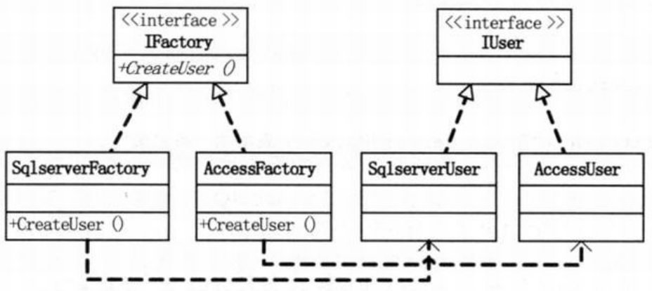
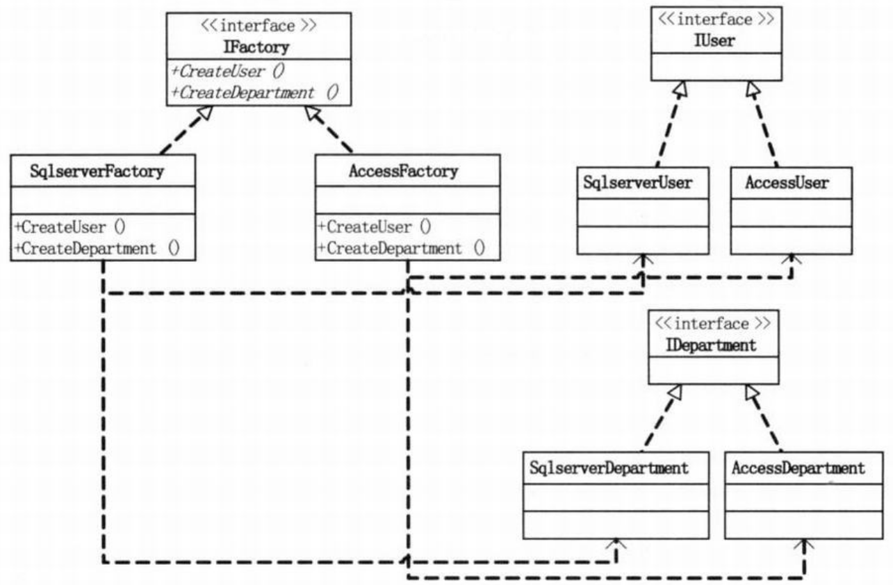
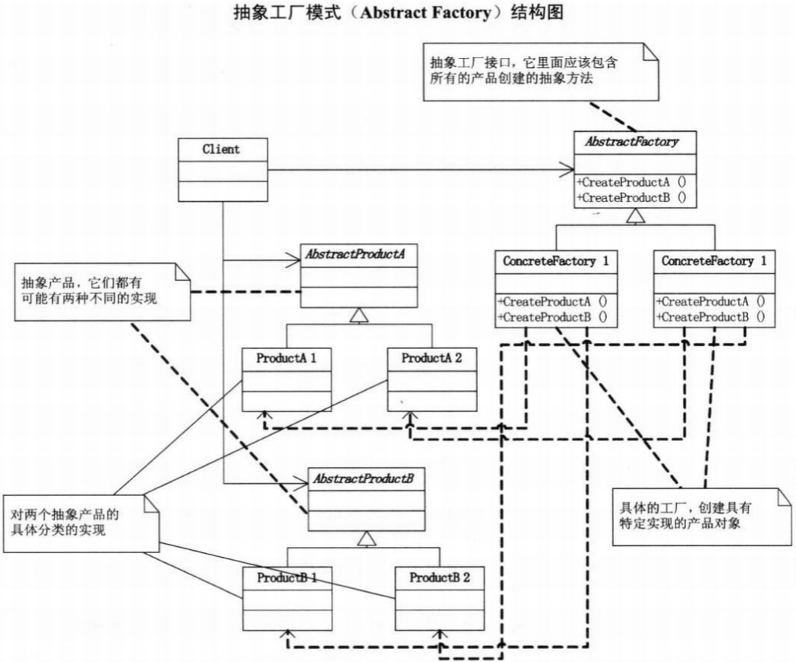
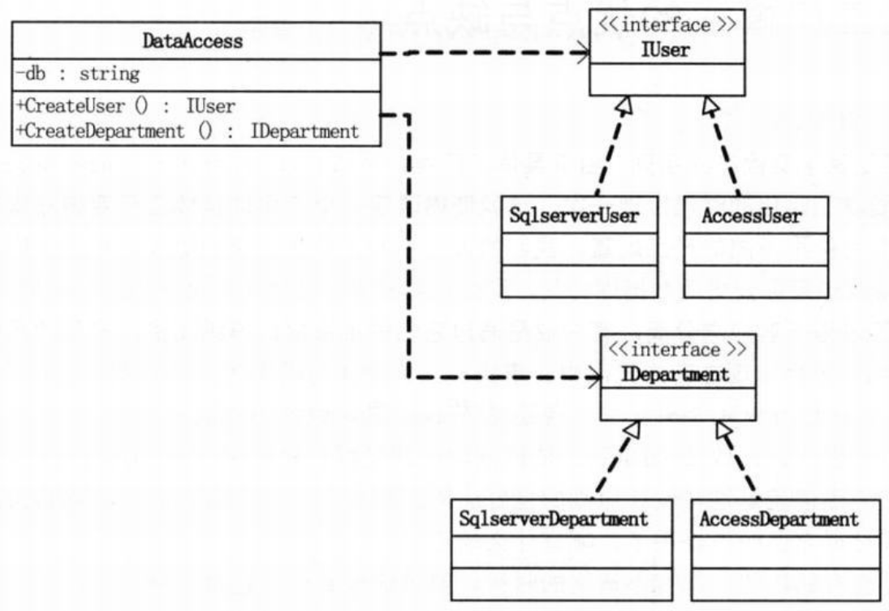
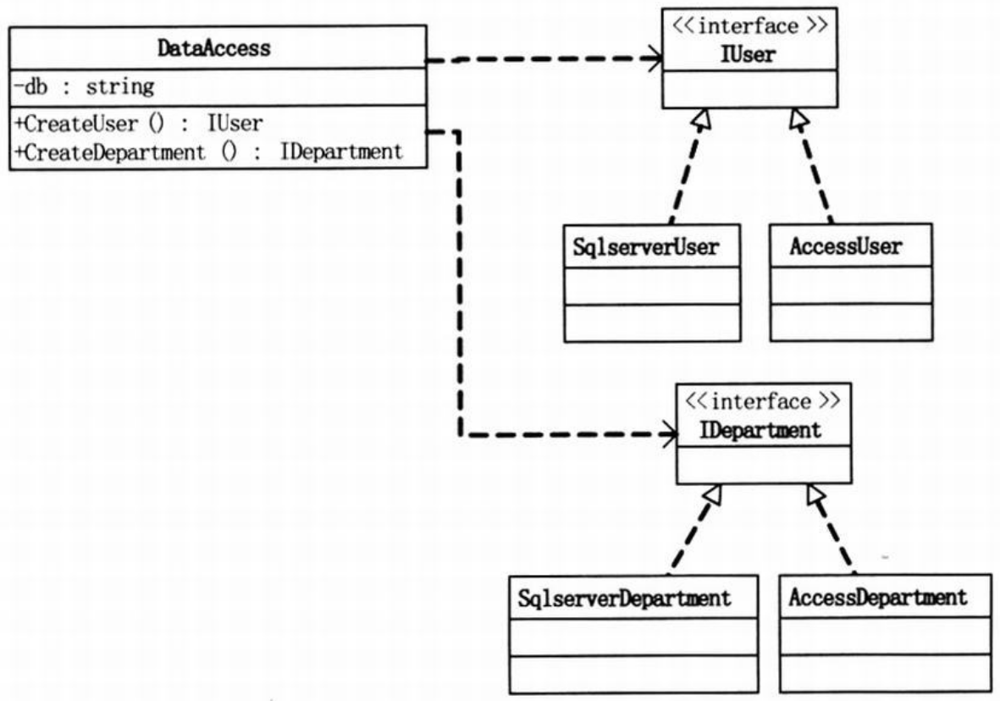

问题：换DB --- 菜鸟程序员碰到问题，只会用时间来摆平（>_<...好扎心...）  
要求写一段数据访问的代码，以“新增用户”和“得到用户”为例  
```c#
// 小菜的代码 --- version1.01
// 用户类 --- 这里为了简单，假设只有ID和Name两个字段，其余省略
class User
{
    private int _id;
    public int ID
    {
        get { return _id; }
        set {_id = value;}
    }
    private string _name;
    public string Name
    {
        get { return _name; }
        set { _name = value; }
    }
}
// SqlserverUser类 --- 用于操作User表，假设只有“新增用户”和“得到用户”方法，其余方法以及具体的SQL语句省略
class SqlserverUser
{
    public void Insert(User user)
    {
        Console.WriteLine("在SQL Server 中给 User表增加一条记录");
    }
    public User GetUser(int id)
    {
        Console.WriteLine("在SQL Server 中根据ID得到 User表一条记录");
        return null;
    }
}
// 客户端代码
static void Main(string[] args)
{
    User user = new User();

    SqlserverUser su = new SqlserverUser(); // 与SQL Server耦合

    su.Insert(user);    // 插入用户
    
    su.GetUser(1);      // 得到ID为1的用户

    Console.Read();
}
/*
- 用“工厂方法模式”来封装new SqlserverUser()所造成的变化
- 工厂方法模式是定义一个用于创建对象的接口，让子类决定实例化哪一个类
*/
```
代码结构图：  
  
```c#
// 小菜的代码 --- version1.02
// IUser接口，用于客户端访问，解除与具体数据库访问的耦合
interface IUser
{
    void Insert(User user);

    User GetUser(int id);
}
// SqlserverUser类，用于访问SQL Server 的User  
class SqlserverUser : IUser
{
    public void Insert(User user)
    {
        Console.WriteLine("在SQL Server中给 User表增加一条记录");
    }
    public User GetUser(int id)
    {
        Console.WriteLine("在SQL Server中根据 ID 得到User表一条记录");
        return null;
    }
}
// AccessUser类,用于访问Access的User
class AccessUser : IUser
{
    public void Insert(User user)
    {
        Console.WriteLine("在Access中给 User表增加一条记录");
    }
    public User GetUser(int id)
    {
        Console.WriteLine("在Access中根据 ID 得到User表一条记录");
        return null;
    }
}
// IFactory接口，定义一个创建访问User表对象的抽象的工厂接口
interface IFactory
{
    IUser CreateUser();
}
// SqlServerFactory类，实现IFactory接口，实例化SqlserverUser
class SqlServerFactory : IFactory
{
    public IUser CreateUser()
    {
        return new SqlserverUser();
    }
}
// AccessFactory类，实现IFactory接口，实例化AccessUser
class AccessFactory : IFactory
{
    public IUser CreateUser()
    {
        return new AccessUser();
    }
}
// 客户端代码
static void Main(string[] args)
{
    User user = new User();

    IFactory factory = new SqlServerFactory(); // 若要更改成Access数据库，只需要将本句改成IFactory factory = new AccessFactory();

    IUser iu = factory.CreateUser();

    iu.Insert(user);
    iu.GetUser(1);
    
    Console.Read();
}
/*
- 业务逻辑与数据访问的解耦
- 如果增加别的表该怎么做
*/
```
代码结构图：  
  
```c#
// 小菜的代码 --- version1.03
// IDepartment接口，用于客户端访问，解除与具体数据库访问的耦合
interface IDepartment
{
    void Insert(Department department);

    Department GetDepartment(int id);
}
// SqlserverDepartment类，用于访问SQL Server的Department
class SqlserverDepartment : IDepartment
{
    public void Insert(Department department)
    {
        Console.WriteLine("在SQL Server中给 Department表增加一条记录");
    }
    public Department GetDepartment(int id)
    {
        Console.WriteLine("在SQL Server中根据 ID 得到Department表一条记录");
        return null;
    }
}
// AccessDepartment类，用于访问Access的Department
class AccessDepartment : IDepartment
{
    public void Insert(Department department)
    {
        Console.WriteLine("在Access中给 Department表增加一条记录");
    }
    public Department GetDepartment(int id)
    {
        Console.WriteLine("在Access中根据 ID 得到Department表一条记录");
        return null;
    }
}
// IFactory接口，定义一个创建访问User表对象的抽象的工厂接口
interface IFactory
{
    IUser CreateUser();

    IDepartment CreateDepartment(); // 增加的接口方法
}
// SqlServerFactory类，实现IFactory接口，实例化SqlserverUser和SqlserverDepartment
class SqlServerFactory : IFactory
{
    public IUser CreateUser()
    {
        return new SqlserverUser();
    }
    public IDepartment CreateDepartment()   // 增加了SqlserverDepartment工厂
    {
        return new SqlserverDepartment();
    }
}
// AccessFactory类，实现IFactory接口，实例化AccessUser和AccessDepartment
class AccessFactory : IFactory
{
    public IUser CreateUser()
    {
        return new AccessUser();
    }
    public IDepartment CreateDepartment()   // 增加了OleDBDepartment工厂
    {
        return new AccessDepartment();
    }
}
// 客户端代码
static void Main(string[] args)
{
    User user = new User();
    Department dept = new Department();

    // IFactory factory = new SqlServerFactory();   // 只需确定实例化哪一个数据库访问对象给factory
    IFactory factory = new AccessFactory();

    IUser iu = factory.CreateUser();    // 则此时已与具体的数据库访问解除了依赖

    iu.Insert(user);
    iu.GetUser(1);

    IDepartment is = factory.CreateDepartment();    // 则此时已与具体的数据库访问解除了依赖
    id.Insert(dept);
    id.GetDepartment(1);
    
    Console.Read();
}
/*
- 涉及到多个产品系列的问题
*/
```
# 抽象工厂模式
>Note:  
>$\quad\quad$`抽象工厂模式(Abstract Factory)`，提供一个创建一系列相关或相互依赖对象的接口，而无需指定它们具体的类。

  
- AbstractProductA和AbstractProductB是两个抽象产品
- ProductA1、ProductA2和ProductB1、ProductB2就是对两个抽象产品的具体分类的实现
- IFactory是一个抽象工厂接口，它里面应该包含所有的产品创建的抽象方法
- ConcreteFactory1和ConcreteFactory2就是具体的工厂
- 通常是在运行时刻再创建一个ConcreteFactory类的实例，这个具体的工厂再创建具有特定实现的产品对象，也就是说，为创建不同的产品对象，客户端应使用不同的具体工厂

`抽象工厂模式的优缺点`：  
- `好处一`是易于交换产品系列，由于具体工厂类在一个应用中只需要在初始化的时候出现一次，这就使得改变一个应用的具体工厂变得非常容易，它只需要改变具体工厂即可使用不同的产品配置。
- `好处二`是让具体的创建实例过程与客户端分离，客户端是通过它们的抽象接口操纵实例，产品的具体类名也被具体工厂的实现分离，不会出现在客户代码中。
- `缺点一`是如果要新增功能，则要改动若干的类（如增加项目表Project，则至少需要增加三个类IProject、SqlserverProject、AccessProject，还需改动IFactory、SqlserverFactory、AccessFactory）。编程是门艺术，这样大批量的改动，显然是非常丑陋的做法。

`对抽象工厂模式的改进`：  
- 方案一：用简单工厂来改进抽象工厂  
  
```c#
// 小菜的代码 --- version1.04
class DataAccess
{
    private static readonly string db = "Sqlserver";
    // private static readonly string db = "Access";

    public static IUser CreateUser()
    {
        IUser result = null;
        switch(db)  // 由于db的实现设置，所以此处可以根据选择实例化出相应的对象
        {
            case "Sqlserver":
                result = new SqlserverUser();
                break;
            case "Access":
                result = new AccessUser();
                break;
        }
        return result;
    }
    public static IDepartment CreateDepartment()
    {
        IDepartment result = null;
        switch(db)
        {
            case "Sqlserver":
                result = new SqlserverDepartment();
                break;
            case "Access":
                result = new AccessDepartment();
                break;
        }
        return result;
    }
}
// 客户端代码
static void Main(string[] args)
{
    User user = new User();
    Department dept = new Department();

    IUser iu = DataAccess.CreateUser(); // 直接得到实际的数据库访问实例，而不存在任何依赖

    iu.Insert(user);
    iu.GetUser(1);

    IDepartment id = DataAccess.CreateDepartment(); // 直接得到实际的数据库访问实例，而不依赖任何依赖
    id.Insert(dept);
    id.GetDepartment(1);

    Console.Read();
}
/*
- 虽然客户端没有出现任何一个SQL Server 或Access的字样，达到了解耦的目的，但是当要增加新的数据库访问（如Oracle）时，改动就很麻烦了
*/
```
- 方案二：用反射+抽象工厂的数据访问程序  
`依赖注入(Dependency Injection)`  
>`反射`:  
>$\quad\quad$Assembly.Load("程序集名称").CreateInstance("命名空间.类名称")

  
```c#
// 小菜的代码 --- version1.05
// 利用反射来克服抽象工厂模式的先天不足,DataAccess类
// 常规写法
IUser result = new SqlserverUser();
// 反射的写法
using System.Reflection;    // 先引用System.Reflection的命名空间
IUser result = (IUser)Assembly.Load("抽象工厂模式"/*当前“程序集”的名称*/).CreateInstance("抽象工厂模式.SqlserverUser"/*当前“命名空间”名称.要实例化的“类名”*/);  // 可以通过字符串变量来决定用哪一个数据库
```
- 方案三：用反射+配置文件实现数据访问程序 
```xml
<!--添加一个App.config文件-->
<?xml version="1.0" encoding="utf-8"?>
<configuration>
    <appSettings>
        <add key="DB" value="Sqlserver"/>   <!--配置文件，可以换成Access或 Oracle-->
    </appSetting>
</configuration>
```
```c#
// 添加引用System.configuratio15.，并在程序开头添加using System.Configuration;,然后更改DataAccess类的字段DB的赋值代码
private static readonly string db = ConfigurationManager.AppSettings["DB"]; // 表示读取配置文件
```
- 所有在用简单工厂的地方，都可以考虑用反射技术来去除switch或if，解除分支判断带来的耦合

>一个程序员如果从来没有熬夜写程序的经历，不能算是一个好程序员，因为没有痴迷过，所以不会有大成就。（T^T给还是菜鸟的自己）