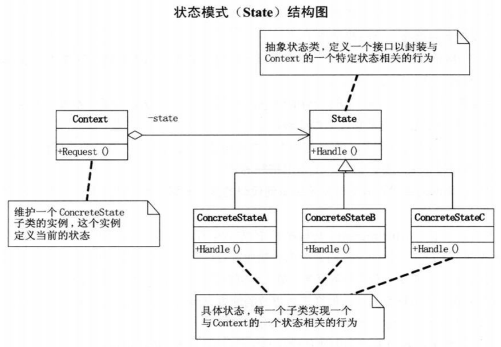
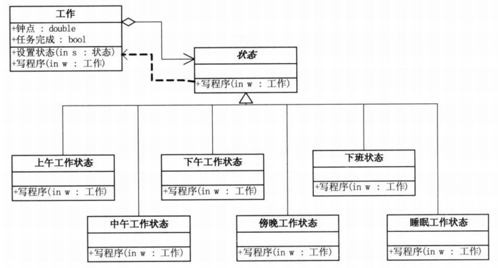

问题：上午状态好，中午想睡觉，下午渐恢复，加班苦煎熬。要求将不同时间不同状态的变化用代码实现  
```c#
// 小菜的代码 --- version1.01
// 工作状态-函数版
static int Hour = 0; // 钟点
static bool WorkFinished = false;   // 任务完成标记
// 写程序方法
public static void WriteProgram()
{
    // 定义一个“写程序”的函数，用来根据时间的不同体现不同的工作状态
    if(Hour < 12)
    {
        Console.WriteLine("当前时间： {0}点 上午工作，精神百倍",Hour);
    }
    else if (Hour < 13)
    {
        Console.WriteLine("当点时间： {0}点 饿了，午饭；犯困，午休。",Hour);
    }
    else if (Hour < 17)
    {
        Console.WriteLine("当前时间： {0}点 下午状态还不错，继续努力",Hour);
    }
    else
    {
        if (WorkFinished)
        {
            Console.WriteLine("当前时间： {0}点 下班回家了",Hour);
        }
        else
        {
            if(Hour < 21)
            {
                Console.WriteLine("当前时间： {0}点 加班哦，疲累之极",Hour);
            }
            else
            {
                Console.WriteLine("当前时间： {0}点 不行了，睡着了。",Hour);
            }
        }
    }
}
// 主程序
static void Main(string[] args)
{
    Hour = 9;
    WriteProgram();
    Hour = 10;
    WriteProgram();
    Hour = 12;
    WriteProgram();
    Hour = 13;
    WriteProgram();
    Hour = 14;
    WriteProgram();
    Hour = 17;

    WorkFinished = true;
    //WorkFinished = false; // 任务完成，则可以下班，否则就得加班了

    WriteProgram();
    Hour = 19;
    WriteProgram();
    Hour = 22;
    WriteProgram();

    Console.Read();
}
/*
- 要将过程描述转换到面向对象思维
*/
```
```c#
// 小菜的代码 --- version1.02
// 工作状态-分类版
// 工作类
public class Work
{
    private int hour;
    public int Hour
    {
        get { return hour; }
        set { hour = value; }
    }
    private bool finish = false;
    public bool TaskFinished
    {
        get { return finish; }
        set { finish = value; }
    }
    public void WriteProgram()
    {
        if(hour < 12)
        {
            Console.WriteLine("当前时间： {0}点 上午工作，精神百倍",hour);
        }
        else if (hour < 13)
        {
            Console.WriteLine("当点时间： {0}点 饿了，午饭；犯困，午休。",hour);
        }
        else if (hour < 17)
        {
            Console.WriteLine("当前时间： {0}点 下午状态还不错，继续努力",hour);
        }
        else
        {
            if (finish)
            {
                Console.WriteLine("当前时间： {0}点 下班回家了",hour);
            }
            else
            {
                if(hour < 21)
                {
                    Console.WriteLine("当前时间： {0}点 加班哦，疲累之极",hour);
                }
                else
                {
                    Console.WriteLine("当前时间： {0}点 不行了，睡着了。",hour);
                }
            }
        }
    }
}
// 客户端程序
static void Main(string[] args)
{
    // 紧急项目
    Work emergencyProjects = new Work();
    emergencyProjects.Hour = 9;
    emergencyProjects.WriteProgram();
    emergencyProjects.Hour = 10;
    emergencyProjects.WriteProgram();
    emergencyProjects.Hour = 12;
    emergencyProjects.WriteProgram();
    emergencyProjects.Hour = 13;
    emergencyProjects.WriteProgram();
    emergencyProjects.Hour = 14;
    emergencyProjects.WriteProgram();
    emergencyProjects.Hour = 17;
    emergencyProjects.WriteProgram();

    // emergencyProjects.WorkFinished = true;
    emergencyProjects.TaskFinished = false;

    emergencyProjects.WriteProgram();
    emergencyProjects.Hour = 19;
    emergencyProjects.WriteProgram();
    emergencyProjects.Hour = 22;
    emergencyProjects.WriteProgram();

    Console.Read();
}
/*
- 方法如果过长其实极有可能是有坏味道了（方法过长且有很多分支，意味着责任过大了，这实际上是很糟糕的）
- 面向对象设计其实就是希望做到代码的责任分解（单一职责原则）
- 在修改状态时不应影响其他的状态（开放-封闭原则）
*/
```
# 状态模式
>Note:  
>$\quad\quad$`状态模式(State)`，当一个对象的内在状态改变时允许改变其行为，这个对香看起来像是改变了其类。

- 状态模式主要解决的是当控制一个对象状态转换的条件表达式过于复杂时的情况。把状态的判断逻辑转移到表示不同状态的一系列类当中，可以把复杂的判断逻辑简化。

  
```c#
// State类，抽象状态类，定义一个接口以封装与Context的一个特定状态相关的行为
abstract class State
{
    public abstract void Handle(Context context);
}
// ConcreteState类，具体状态，每一个子类实现一个与Context的一个状态相关的行为
class ConcreteStateA : State
{
    public override void Handle(Context context)
    {
        context.State = new ConcreteStateB();   // 设置ConcreteStateA的下一状态是ConcreteStateB
    }
}
class ConcreteStateB : State
{
    public override void Handle(Context context)
    {
        context.State = new ConcreteStateA();   // 设置ConcreteStateA的下一状态是ConcreteStateB
    }
}
// Context类，维护一个ConcreteState子类的实例，这个实例定义当前的状态
class Context
{
    private State state;
    public Context(State state)
    {
        this.state = state; // 定义Context的初始状态
    }
    public State State
    {
        // 可读写的状态属性，用于读取当前状态和设置新状态
        get { return state; }
        set 
        {
            state = value;
            Console.WriteLine("当前状态：" + state.GetType().Name);
        }
    }
    public void Request()
    {
        state.Handle(this); // 对请求做处理，并设置下一状态
    }
}
// 客户端代码
static void Main(string[] args)
{
    Context c = new Context(new ConcreteStateA());  // 设置Context的初始状态为ConcreteStateA

    c.Request();    // 不断的请求，同时更改状态
    c.Request();
    c.Request();
    c.Request();

    Console.Read();
}
```
状态模式的好处和用处：  
- 将与特定状态相关的行为局部化，并且将不同状态的行为分割开来。
- 将特定的状态相关的行为都放入一个对象中，由于所有与状态相关的代码都存在于某个ConcreteState中，所以通过定义新的子类可以很容易地增加新的状态和转换。
- 消除庞大的分支语句
- 状态模式通过把各种状态转义逻辑分布到State的子类之间，来减少相互间的依赖
- 当一个对象的行为取决于它的状态，并且它必须在运行时刻根据状态改变它的行为时，就可以考虑使用状态模式了（比如某项业务有多个状态，一般考虑枚举常量，并依赖大量多分支判断语句，但此处可以考虑状态模式）
#
代码结构图：  
  
```c#
// 小菜的代码 --- version1.03
// 工作状态-状态模式版
// 抽象状态类，定义一个抽象方法“写程序”
public abstract class State
{
    public abstract void WriteProgram(Work w);
}
// 上午工作状态类
public class ForenoonState : State
{
    public override void WriteProgram(Work w)
    {
        if (w.Hour < 12)
        {
            Console.WriteLine("当前时间： {0}点 上午工作，降神百倍",w.Hour);
        }
        else
        {
            w.SetState(new NoonState());    // 超过12点，则转入中午工作状态
            w.WriteProgram();
        }
    }
}
// 中午工作状态类
public class NoonState : State
{
    public override void WriteProgram(Work w)
    {
        if (w.Hour < 13)
        {
            Console.WriteLine("当前时间：{0}点 饿了，午饭；犯困，午休。",w.Hour);
        }
        else
        {
            w.SetState(new AfternoonState());   // 超过13点，则转入下午工作状态
            w.WriteProgram();
        }
    }
}
// 下午工作状态类
public class AfternoonState : State
{
    public override void WriteProgram(Work w)
    {
        if (w.Hour < 17)
        {
            Console.WriteLine("当前时间：{0}点 下午状态还不错，继续努力",w.Hour);
        }
        else
        {
            w.SetState(new EveningState()); // 超过17点，则转入傍晚工作状态
            w.WriteProgram();
        }
    }
}
// 晚间工作状态类
public class EveningState : State
{
    public override void WriteProgram(Work w)
    {
        if (w.TaskFinished)
        {
            w.SetState(new RestState());    // 如果完成任务，则转入下班状态
            w.WriteProgram();
        }
        else
        {
            if (w.Hour < 21)
            {
                Console.WriteLine("当前时间：{0}点 加班哦，疲累之极",w.Hour);
            }
            else
            {
                w.SetState(new SleepingState());    // 超过21点，则转入睡眠工作状态
                w.WriteProgram();
            }
        }
    }
}
// 睡眠状态类
public class SleepingState : State
{
    public override void WriteProgram(Work w)
    {
        Console.WriteLine("当前时间：{0}点 不行了，睡着了。",w.Hour);
    }
}
// 下班休息状态
public class RestState : State
{
    public override void WriteProgram(Work w)
    {
        Console.WriteLine("当前时间：{0}点 下班回家了",w.Hour);
    }
}
// 工作类，此时没有了过长的分支判断语句
public class Work
{
    private State current;
    public Work()
    {
        current = new ForenoonState();  // 工作初始化为上午工作状态，即上午9点开始上班
    }

    private double hour;
    public double Hour
    {
        // “钟点”属性，状态转换的依据
        get { return hour;}
        set { hour = value; }
    }

    private bool finish = false;
    public bool TaskFinished
    {
        // "任务完成"属性，是否能下班的依据
        get { return finish; }
        set { finish = value; }
    }

    public void SetState(State s)
    {
        current = s;
    }

    public void WriteProgram()
    {
        current.WriteProgram(this);
    }
}
// 客户端程序
static void Main(string[] args)
{
    // 紧急项目
    Work emergencyProjects = new Work();
    emergencyProjects.Hour = 9;
    emergencyProjects.WriteProgram();
    emergencyProjects.Hour = 10;
    emergencyProjects.WriteProgram();
    emergencyProjects.Hour = 12;
    emergencyProjects.WriteProgram();
    emergencyProjects.Hour = 13;
    emergencyProjects.WriteProgram();
    emergencyProjects.Hour = 14;
    emergencyProjects.WriteProgram();
    emergencyProjects.Hour = 17;
    emergencyProjects.WriteProgram();

    // emergencyProjects.WorkFinished = true;
    emergencyProjects.TaskFinished = false;

    emergencyProjects.WriteProgram();
    emergencyProjects.Hour = 19;
    emergencyProjects.WriteProgram();
    emergencyProjects.Hour = 22;
    emergencyProjects.WriteProgram();

    Console.Read();
}
/*
- 可以更灵活地添加新的状态而不影响其他状态的代码
*/
```