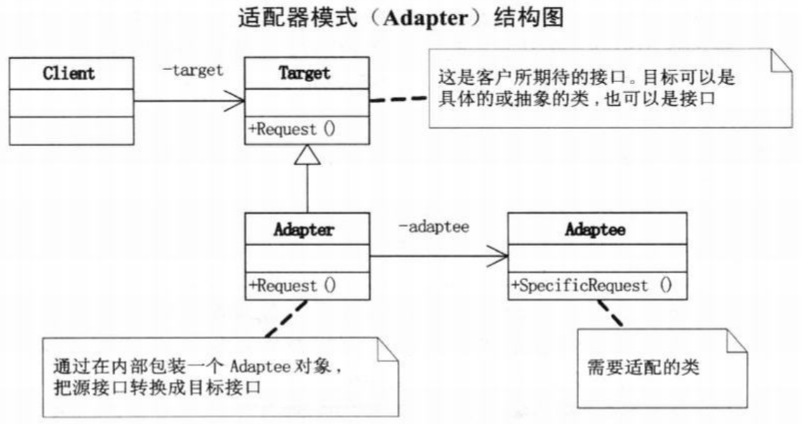
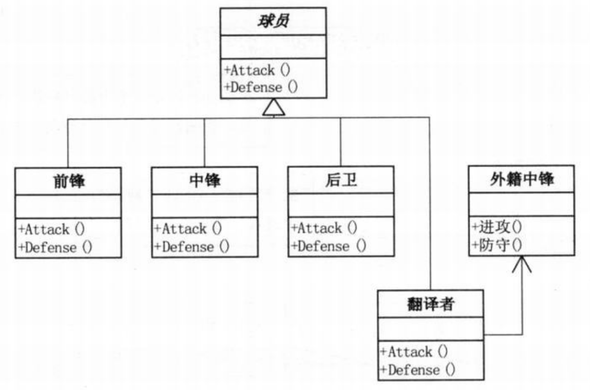

问题：看NBA需要翻译  

# 适配器模式
>Note:  
>$\quad\quad$`适配器模式(Adapter)`，将一个类的接口转换成客户希望的另外一个接口。Adapter模式使得原本由于接口不兼容而不能一起工作的那些类可以一起工作。

- 系统的数据和行为都正确，但接口不符时，我们应该考虑用适配器，目的是使控制范围之外的一个原有对象与某个接口匹配。
- 适配器模式主要应用于希望复用一些现存的类，但是接口又与复用环境要求不一致的情况
- 适配器模式又分为类适配器模式（需要支持多重继承，如c++）和对象适配器模式（此例为c#）

  
```c#
// Target（这是客户所期待的接口。目标可以是具体的或抽象的类，也可以是接口）
class Target
{
    public virtual void Request()
    {
        Console.WriteLine("普通请求！");
    }
}
// Adaptee（需要适配的类）
class Adaptee
{
    public void SpecificRequest()
    {
        Console.WriteLine("特殊请求！");
    }
}
// Adapter（通过在内部包装一个Adaptee对象，把源接口转换成目标接口）
class Adapter : Target
{
    private Adaptee adaptee = new Adaptee();    // 建立一个私有的Adaptee对象

    public override void Request()
    {
        adaptee.SpecificRequest();  // 这样就可以把表面上调用Request()方法变成实际调用SpecificRequest()
    }
}
// 客户端代码
static void Main(string[] args)
{
    Target target = new Adapter();
    target.Request();   // 对客户端来说，调用的就是Target的Request()

    Console.Read();
}
```
适配器模式的使用：  
- 使用一个已经存在的类，但如果它的接口，也就是它的方法和你的要求不相同时，就应该考虑用适配器模式
- 两个类所做的事情相同或相似，但是具有不同的接口时要使用它
- 客户代码可以统一调用同一接口，可以更简单、更直接、更紧凑
- 在双方都不太容易修改的时候再使用适配器模式适配
# 
要求：火箭队的比赛（加入不会英语的姚明），教练叫暂停时给后卫、中锋、前锋分配进攻和防守任务的代码
```c#
// 小菜的代码 --- version1.01
// 球员类
abstract class Player
{
    protected string name;
    public Player(string name)
    {
        this.name = name;
    }
    // 进攻和防守方法
    public abstract void Attack();
    public abstract void Defense();
}
// 前锋
class Forwards : Player
{
    public Forwards(string name) : base(name)
    { }
    public override void Attack()
    {
        Console.WriteLine("前锋 {0} 进攻",name);
    }
    public override void Defense()
    {
        Console.WriteLine("前锋 {0} 防守",name);
    }
}
// 中锋
class Center : Player
{
    // 与前锋代码类似，略
}
// 后卫
class Guards : Player
{
    // 与前锋代码类似，略
}
// 客户端代码
static void Main(string[] args)
{
    Player b = new Forwards("巴蒂尔");
    b.Attack();
    Player m = new Guards("麦克格雷迪");
    m.Attack();

    Player ym = new Center("姚明");
    ym.Attack();
    ym.Defense();       // 姚明问："Attack和Defense是什么意思呢？"

    Console.Read();
}
/*
- 有问题的是，没有按描述中的体现姚明那时不懂英语的解决办法
- 姚明是外籍中锋，需要有翻译者类来“适配”
*/
```
代码结构图（加入适配器）：  
  
```c#
// 小菜的代码 --- version1.02
// 在版本一的基础上  
// 外籍中锋
class ForeignCenter
{
    private string name;
    public string Name  // 外籍中锋类球员的姓名故意用属性而不是构造方法来区别与前三个球员类的不同
    {
        get { return name; }
        set { name = value; }
    }
    public void 进攻()  // 表明‘外籍中锋‘只懂得中文’进攻’
    {
        Console.WriteLine("外籍中锋 {0} 进攻",name);
    }
    public void 防守()  // 表明‘外籍中锋’只懂得中文‘防守’
    {
        Console.WriteLine("外籍中锋 {0} 防守",name);
    }
}
// 翻译者类
class Translator : Player
{
    private ForeignCenter wjzf = new ForeignCenter();   // 声明并实例化一个内部‘外籍中锋’对象，表明翻译者与外籍球员有关联
    public Translator(string name) : base(name)
    {
        wjzf.Name = name;
    }
    public override void Attack()   // 翻译者将‘Attack’翻译为‘进攻’告诉外籍中锋
    {
        wjzf.进攻();
    }
    public override void Defense()  // 翻译者将‘Denfense’翻译为‘防守’告诉外籍中锋
    {
        wjzf.防守();
    }
}
// 客户端代码
static void Main(string[] args)
{
    Player b = new Forwards("巴蒂尔");
    b.Attack();
    Player m = new Guards("麦克格雷迪");
    m.Attack();

    Player ym = new Translator("姚明");
    ym.Attack();
    ym.Defense();       // 翻译者告诉姚明，教练要求你既要‘进攻’又要‘防守’

    Console.Read();
}
```
- `适配器模式在.NET中的应用`DataAdapter用作DataSet和数据源之间的适配器以便检索和保存数据。DataAdapter通过映射Fill（这更改了DataSet中的数据以便与数据源中的数据相匹配）和Update（这更改了数据源中的数据以便与DataSet中的数据相匹配）来提供这一适配器