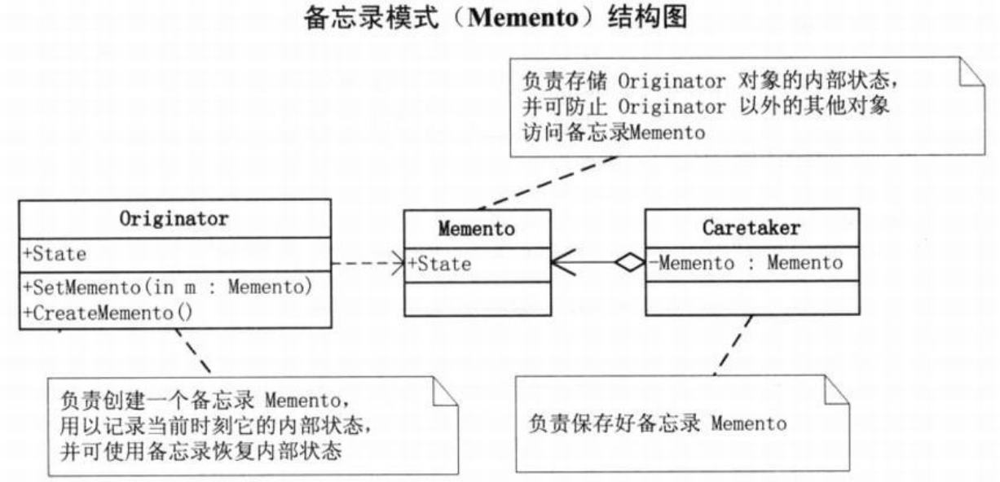
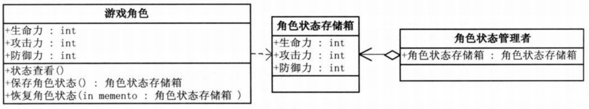

问题：时间不能倒流，游戏可以存当
要求游戏的某个场景，一游戏角色有生命力、攻击力、防御力等等数据，在打Boss前和后一定会不一样的，我们允许玩家如果感觉与Boss决斗的效果不理想可以让游戏恢复到决斗前。  
```c#
// 小菜的代码 --- version1.01
// 游戏角色类，用来存储角色的生命力、攻击力、防御力的数据
class GameRole
{
    // 生命力
    private int vit;
    public int Vitality
    {
        get { return vit; }
        set { vit = value; }
    }
    // 攻击力
    private int atk;
    public int Attack
    {
        get { return atk; }
        set { atk = value; }
    }
    // 防御力
    private int def;
    public int Defense
    {
        get { return def; }
        set { sef = value; }
    }
    // 状态显示
    public void StateDisplay()
    {
        Console.WriteLine("角色当前状态： ");
        Console.WriteLine("体力：{0}",this.vit);
        Console.WriteLine("攻击力：{0}",this.atk);
        Console.WriteLine("防御力：{0}",this.def);
        Console.WriteLine("");
    }
    // 获得初始状态
    public void GetInitState()
    {
        // 数据通常来自本机磁盘或远程数据库
        this.vit = 100;
        this.atk = 100;
        this.def = 100;
    }
    // 战斗
    public void Fight()
    {
        // 在与Boss大战后游戏数据损耗为零
        this.vit = 0;
        this.atk = 0;
        this.def = 0;

    }
}
// 客户端
static void Main(string[] args)
{
    // 大战Boss前
    GameRole lixiaoyao = new GameRole();
    lixiaoyao.GetInitState();   // 大战Boss前，获得初始角色状态
    lixiaoyao.StateDisplay();
    // 保存进度
    GameRole backup = new GameRole();   // 通过‘游戏角色’的新实例，来保存进度
    backup.Vitality = lixiaoyao.Vitality;
    backup.Attack = lixiaoyao.Attack;
    backup.Defense = lixiaoyao.Defense;
    // 大战Boss时，损耗严重
    lixiaoyao.Fight();  // 大战Boss时，损耗严重所有数据全部损耗为零
    lixiaoyao.StateDisplay();
    // 恢复之前状态
    lixiaoyao.Vitality = backup.Vitality;   // GameOver不甘心，恢复之前进度，重新来玩
    lixiaoyao.Attack = backup.Attack;
    lixiaoyao.Defense = backup.Defense;

    lixiaoyao.StateDisplay();

    Console.Read();
}
/*
- 代码无错未必优
- 备份数据等都在客户端实现，暴露了很多实现细节
*/
```
# 备忘录模式
>Note:  
>$\quad\quad$`备忘录(Memento)`，在不破坏封装性的前提下，捕获一个对象的内部状态，并在该对象之外保存这个状态。这样以后就可将该对象恢复到原先保存的状态。

  
- Originator(发起人)：负责创建一个备忘录Memento，用以记录当前时刻它的内部状态，并可使用备忘录恢复内部状态。Originator可根据需要决定Memento存储Originator的哪些内部状态
- Memento(备忘录)：负责存储Originator对象的内部状态，并可防止Originator以外的其他对象访问备忘录Memento。备忘录有两个接口，Caretaker只能看到备忘录的窄接口，它只能将备忘录传递给其他对象。Originator能够看到一个宽接口，允许它访问返回到先前状态所需的所有数据
- Caretaker(管理者)：负责保存好备忘录Memento，不能对备忘录的内容进行操作或检查
```c#
// 发起人（Originator）类
class Originator
{
    private string state;
    public string State // 需要保存的属性，可能有多个
    {
        get { return state; }
        set { state = value; }
    }
    public Memento CreateMemento()  // 创建备忘录，将当前需要保存的信息导入并实例化出一个Memento对象
    {
        return (new Memento(state));
    }
    public void SetMemento(Memento memento) // 恢复备忘录，将Memento导入并将相关数据恢复
    {
        state = memento.State;
    }
    public void Show()  // 显示数据
    {
        Console.WriteLine("State=" + state);
    }
}
// 备忘录（Memento）类
class Memento
{
    private string state;
    public Memento(string state)    // 构造方法，将相关数据导入
    {
        this.state = state;
    }
    public string State     // 需要保存的数据属性，可以是多个
    {
        get { return state; }
    }
}
// 管理者（Caretaker）类
class Caretaker
{
    private Memento memento;
    public Memento Memento  // 得到或设置备忘录
    {
        get { return memento; }
        set { memento = value; }
    }
}
// 客户端程序
static void ,ain(string[] args)
{
    Originator o = new Originator();
    o.State = "On";         // Originator初始状态，状态属性为“On”
    o.Show();

    Caretaker c = new Caretaker();
    c.Memento = o.CreateMemento();  // 保存状态时，由于有了很好的封装，可以隐藏Originator的实现细节

    o.State = "off";        // Originator改变了状态属性为“Off”
    o.Show();

    o.SetMemento(c.Memento);    // 恢复原初始状态
    o.Show();

    Console.Read();
}
```
- 要保存的细节封装在了Memento中，哪一天要更改保存的细节也不用影响客户端了。
- Memento模式比较适用于功能比较复杂的，但需要维护或记录属性历史的类，或需要保存的属性只是众多属性中的一小部分时，Originator可以根据保存的Memento信息还原到前一状态。
- 如果在某个系统中使用命令模式时，需要实现命令的撤销功能，那么命令模式可以使用备忘录模式来存储可撤销操作的状态。
- 使用备忘录可以把复杂的对象内部信息对其他的对象屏蔽起来。
- 当角色的状态改变的时候，有可能这个状态无效，这时候就可以使用暂时存储起来的备忘录将状态复原。
# 
代码结构图(使用备忘录模式)：  
  
```c#
// 小菜的代码 --- version1.01
// 游戏角色类
class GameRole
{
    // ...
    // 保存角色状态 --- 将游戏角色的三个状态值通过实例化“角色状态备忘录”返回
    public RoleStateMemento SaveState()
    {
        return (new RoleStateMemento(vit,atk,def));
    }

    // 恢复角色状态 --- 可将外部的“角色状态备忘录”中状态值恢复给游戏角色
    public void RecoveryState(RoleStateMemento memento)
    {
        this.vit = memento.Vitality;
        this.atk = memento.Attack;
        this.def = memento.Defense;
    }
    // ...
}
// 角色状态备忘录
class RoleStateMemento
{
    private int vit;
    private int atk;
    private int def;
    public RoleStateMemento(int vit,int atk,int def)
    {
        // 将生命力、攻击力、防御力存入状态备忘录对象中
        this.vit = vit;
        this.atk = atk;
        this.def = def;
    }
    // 生命力
    public int Vitality
    {
        get { return vit; }
        set { vit = value; }
    }
    // 攻击力
    public int Attack
    {
        get { return atk; }
        set { atk = value; }
    }
    // 防御力
    public int Defense
    {
        get { return def; }
        set { def = value; }
    }
}
// 角色状态管理者类
class RoleStateCaretaker
{
    private RoleStateMemento memento;
    public RoleStateMemento Memento
    {
        get { return memento; }
        set { memento = value; }
    }
}
// 客户端代码
static void Main(string[] args)
{
    // 大战Boss前
    GameRole lixiaoyao = new GameRole();
    lixiaoyao.GetInitState();   // 游戏角色初始状态，三项指标数据都是100
    lixiaoyao.StateDisplay();

    // 保存进度
    RoleStateCaretaker stateAdmin = new RoleStateCaretaker();   // 保存进度时，由于封装在Memento中，因此我们并不知道保存了哪些具体的角色数据
    stateAdmin.Memento = lixiaoyao.SaveState();

    // 大战Boss时，损耗严重
    lixiaoyao.Fight();      // 开始打Boss，三项指标数据都下降很多，非常糟糕，GameOver了
    lixiaoyao.StateDisplay();

    // 恢复之前状态
    lixiaoyao.RecoveryState(stateAdmin.Memento);    // 不行，恢复保存的状态，重新来过
    lixiaoyao.StateDisplay();

    Console.Read();
}
/*
- 备忘录模式的缺点：角色状态需要完整存储到备忘录对象中，如果状态数据很大很多，那么备忘录对象会非常耗内存
*/
```