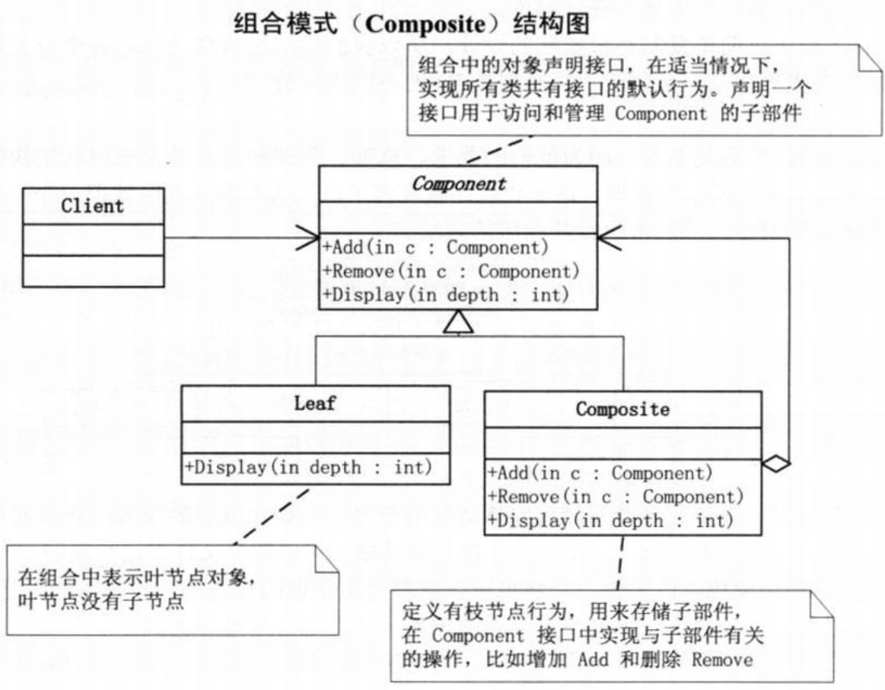
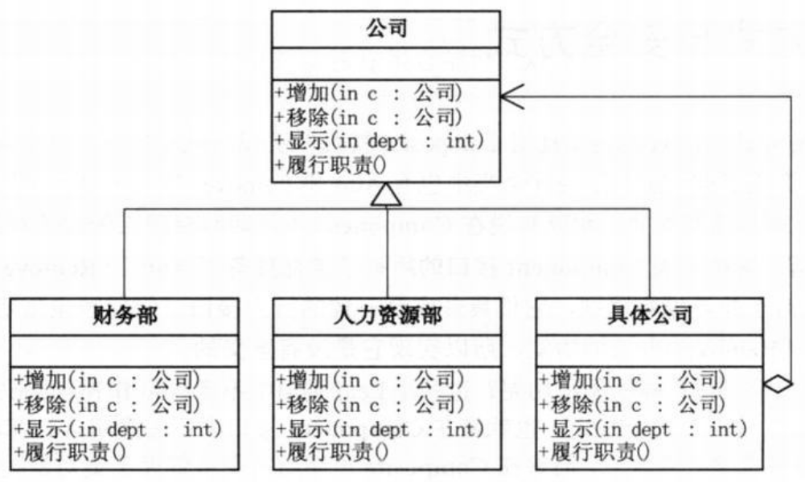

问题：分公司=一部门  
整体与部分可以被一致对待

# 组合模式
>Note:  
>$\quad\quad$`组合模式(Composite)`，将对象组合成树形结构以表示‘部分-整体’的层次结构。组合模式使得用户对单个对象和组合对象的使用具有一致性。  

  
```c#
// Component为组合中的对象声明接口，在适当情况下，实现所有类共有接口的默认行为。声明一个接口用于访问和管理Component的子部件。
abstract class Component
{
    protected string name;

    public Component(string name)
    {
        this.name = name;
    }

    // 通常都用Add和Remove方法来提供增加或移除树叶或树枝的功能
    public abstract void Add(Component c);
    public abstract void Remove(Component c);
    public abstract void Display(int depth);
}
// Leaf在组合中表示叶节点对象，叶节点没有子节点。
class Leaf : Component
{
    public Leaf(string name) : base(name)
    { }

    public override void Add(Component c)
    {
        Console.WriteLine("Cannot add to a leaf");  // 由于叶子没有再增加分枝和树叶，所以Add和Remove方法实现它没有意义，但这样做可以消除叶节点和枝节点对象在抽象层次的区别，它们具备完全一致的接口
    }

    public override void Remove(Component c)
    {
        Console.WriteLine("Cannot remove from a leaf");
    }

    public override void Display(int depth)
    {
        Console.WriteLine(new String('-',depth) + name);    // 叶节点的具体方法，此处是显示其名称和级别
    }
}
// Composite定义有枝节点行为，用来存储子部件，在Component接口中实现与子部件有关的操作，比如增加Add和删除Remove。
class Composite : Component
{
    private List<Component>children = new List<Component>();    // 一个子对象集合用来存储其下属的枝节点和叶节点

    public Composite(string name) : base(name)
    { }

    public override void Add(Component c)
    {
        children.Add(c);
    }

    public override void Remove(Component c)
    {
        children.Remove(c);
    }

    public override void Display(int depth)
    {
        Console.WriteLine(new String('-',depth) + name);    // 显示其枝节点名称，并对其下级进行遍历
        foreach(Component component in children)
        {
            component.Display(depth + 2);
        }
    }
}
// 客户端代码，能通过Component接口操作组合部件的对象
static void Main(string[] args)
{
    Component root = new Composite("root"); // 生成树根root，根上长出两叶LeafA和LeafB
    root.Add(new Leaf("Leaf A"));
    root.Add(new Leaf("Leaf B"));

    Composite comp = new Composite("Composite X");
    comp.Add(new Leaf("Leaf XA"));
    comp.Add(new Leaf("Leaf XB"));  // 根上长出分枝Composite X，分枝上也有两叶 LeafXA 和LeafXB

    root.Add(comp);

    Composite comp2 = new Composite("Composite XY");    // 在Composite X 上再长出分枝Composite XY，分枝上也有两叶LeafXYA 和LeafXYB
    comp2.Add(new Leaf("Leaf XYA"));
    comp2.Add(new Leaf("Leaf XYB"));

    comp.Add(comp2);

    root.Add(new Leaf("Leaf C"));

    // 根部又长出两叶LeafC 和LeafD，可惜LeafD没长牢，被风吹走了
    Leaf leaf = new Leaf("Leaf D");
    root.Add(leaf);
    root.Remove(leaf);

    root.Display(1);    // 显示大树的样子

    Console.Read();
}
```
- `透明方式`：在Component中声明所有用来管理子对象的方法，其中包括Add、Remove等。这样实现Component接口的所有子类都具备了Add和Remove。这样做的好处就是叶节点和枝节点对于外界没有区别，它们具备完全一致的行为接口。但问题也很明显，因为Leaf类本身不具备Add()、Remove()方法的功能，所以实现它是没有意义的。
- `安全方式`：在Component接口中不去声明Add和Remove方法，那么子类的Leaf也就不需要去实现它，而是在Composite声明所有用来管理子类对象的方法。不过由于不够透明，所以树叶和树枝类将不具有相同的接口，客户端的调用需要做相应的判断，带来了不便。  

## 何时使用组合模式
- 需求中是体现部分与整体层次的结构时，希望用户可以忽略组合对象与单个对象的不同，统一地使用组合结构中的所有对象时，就应该考虑用组合模式了。

#
公司管理系统 --- 代码结构图：  
  
```c#
// 小菜的代码 --- version1.01
// 公司类 --- 抽象类或接口
abstract class Company
{
    protected string name;

    public Company(string name)
    {
        this.name = name;
    }

    public abstract void Add(Company c);    // 增加
    public abstract void Remove(Compan c);  // 移除
    public abstract void Display(int depth);    // 显示
    public abstract void LineOfDuty();  // 履行职责
    // 增加一“履行职责”方法，不同的部门需履行不同的职责
}
// 具体公司类 --- 实现接口，树枝节点
class ConcreteCompany : Company
{
    private List<Company>children = new List<Company>();

    public ConcreteCompany(string name) : base(name)
    { }

    public override void Add(Company c)
    {
        children.Add(c);
    }

    public override void Remove(Company c)
    {
        children.Remove(c);
    }

    public override void Display(int depth)
    {
        Console.WriteLine(new String('-',depth) + name);

        foreach(Company component in children)
        {
            component.Display(depth + 2);
        }
    }
    // 履行职责
    public override void LineOfDuty()
    {
        foreach(Company component in children)
        {
            component.LineOfDuty();
        }
    }
}
// 人力资源部与财务部类 --- 树叶节点
// 人力资源部
class HRDepartment : Company
{
    public HRDepartment(string name) : base(name)
    { }

    public override void Add(Company c)
    { }

    public override void Remove(Company c)
    { }

    public override void Display(int depth)
    {
        Console.WriteLine(new String('-',depth) + name);
    }

    public override void LineOfDuty()
    {
        Console.WriteLine("{0} 员工招聘培训管理",name);
    }
}

// 财务部
class FinanceDepartment : Company
{
    public FinanceDepartment(string name) : base(name)
    { }

    public override void Add(Company c)
    { }

    public override void Remove(Company c)
    { }

    public override void Display(int depth)
    {
        Console.WriteLine(new string('-',depth) + name);
    }

    public override void LineOfDuty()
    {
        Console.WriteLine("{0} 公司财务收支管理",name);
    }
}
// 客户端调用
static void Main(string[] args)
{
    ConcreteCompany root = new ConcreteCompany("北京总公司");
    root.Add(new HRDepartment("总公司人才资源部"));
    root.Add(new FinanceDepartment("总公司财务部"));

    ConcreteCompany comp = new ConcreteCompany("上海华东分公司");
    comp.Add(new HRDepartment("华东分公司人力资源部"));
    comp.Add(new FinanceDepartment("华东分公司财务部"));
    root.Add(comp);

    ConcreteCompany comp1 = new ConcreteCompany("南京办事处");
    comp1.Add(new HRDepartment("南京办事处人力资源部"));
    comp1.Add(new FinanceDepartment("南京办事处财务部"));
    comp.Add(comp1);

    ConcreteCompany comp2 = new ConcreteCompany("杭州办事处");
    comp2.Add(new HRDepartment("杭州办事处人力资源部"));
    comp2.Add(new FinanceDepartment("杭州办事处财务部"));
    comp.Add(comp2);

    Console.WriteLine("\n结构图： ");
    root.Display(1);

    Console.WriteLine("\n职责： ");
    root.LineOfDuty();

    Console.Read();
}
```
`组合模式的好处`：
- `组合模式定义了包含基本对象和层次结构。`基本对象可以被组合成更复杂的组合对象而这个组合对象又可以被组合，这样不断地递归下去，客户代码中，任何用到基本对象的地方都可以使用组合对象了。  
- 用户是不关心到底是处理一个叶节点还是处理一个组合组件，也就用不着未定义组合而写一些选择判断语句了。即`组合模式让客户可以一致地使用组合结构和单个对象。`