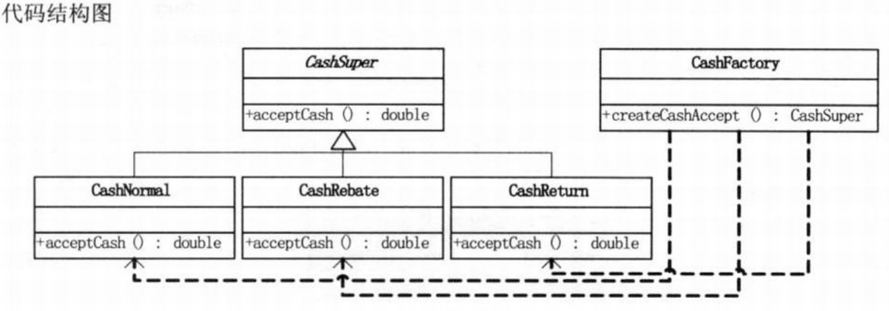
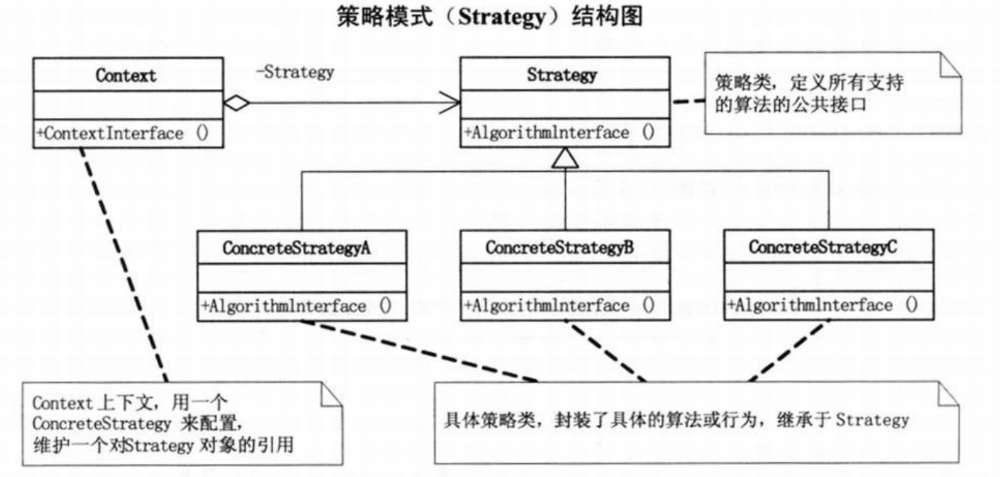
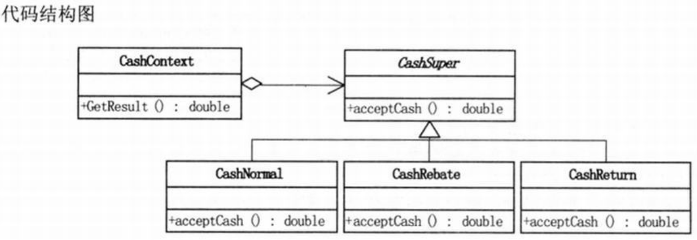

问题：做一个商场收银软件，营业员根据客户所购买商品的单价和数量，向客户收费。
```c#
// 小菜的代码 --- version1.01
double total = 0.0d;    // 计算总计

private void btnOk_Client(object sender,EventArgs e)
{
    double totalPrices = Convert.ToDouble(txtPrice.Text) * Convert.ToDouble(txtNum.Text);
    // 计算每个商品的单价(txtPrice) * 数量(txtNum)后的合计

    total = total + totalPrices;    // 每个商品合计计入总计

    lbxList.Items.Add("单价： "+txtPrice.Text+"数量： "+
    txtNum.Text+"合计： "+totalPrices.ToString());  // 在列表框中显示信息
    lblResult.Text = total.ToString();  // 在lblResult标签上显示总计数
}
/*
- 思路：用两个文本框来输入单价和数量，一个确定按钮来算出每种商品的费用，用个列表框来记录商品的清单，一个标签来记录总计，还需要一个重置按钮来重新开始。
- 问题：当需要活动打折时，需要改动已有的业务逻辑代码
*/
```
```c#
// 小菜的代码 --- version1.02
double total = 0.0d;

privvate void Forml_Load(object sender,EventArgs e)
{
    cbxType.Items.AddRange(new object[] {"正常收费","打八折","打七折","打五折"})；
    // 在ComboBox中加下拉选项
    cbxType.SelectedIndex = 0;
}

private void btnOk_Click(object sender,EventArgs e)
{
    double totalPrices = 0d;
    switch(cbxType.SelectedIndex)   // 根据选项决定打折额度
    {
        case 0:
            totalPrices = Convert.ToDouble(txtPrice.Text) * Convert.ToDouble(txtNum.Text);
            break;
        case 1:
            totalPrices = Convert.ToDouble(txtPrice.Text) * Convert.ToDouble(txtNum.Text) * 0.8;
            break;
        case 2:
            totalPrices = Convert.ToDouble(txtPrice.Text) * Convert.ToDouble(txtNum.Text) * 0.7;
            break;
        case 3:
            totalPrices = Convert.ToDouble(txtPrice.Text) * Convert.ToDouble(txtNum.Text) * 0.5;
            break;
    }
    total = total + totalPrices;
    lbxList.Items.Add("单价： " + txtPrice.Text + "数量： " + txtNum.Text + " " + cbxType.SelectedItem + "合计： " + totalPrices.ToString());
    lblResult.Text = total.ToString();
}
/*
问题：
- 重复代码多，没什么变动的代码考虑重构
- 新的需求：满300返100的促销算法
*/
```
>Note:  
>$\quad\quad$面向对象的编程，并不是类越多越好，类的划分是为了封装，但分类的基础是抽象，具有相同的属性和功能的对象的抽象集合才是类。

  
```c#
// 小菜的代码 --- version1.03
// 现金收费抽象类
abstract class CashSuper
{
    public abstract double acceptCash(double money);
    // 现金收取超类的抽象方法，收取现金，参数为原价，返回为当前价
}
// 正常收费子类
class CashNormal : CashSuper
{
    public override double acceptCash(double money)
    {
        return money;   // 正常收费，原价返回
    }
}
// 打折收费子类
class CashRebate : CashSuper
{
    private double moneyRebate = 1d;
    public CashRebate(string moneyRebate)
    {
        this.moneyRebate = double.Parse(moneyRebate);   // 打折收费，初始化时必须输入折扣率，如八折就是0.8
    }

    public override double acceptCash(double money)
    {
        return money * moneyRebate;
    }
}
// 返利收费子类
class CashReturn : CashSuper
{
    private double moneyCondition = 0.0d;
    private double moneyReturn = 0.0d;
    public CashReturn(string moneyCondition,string moneyReturn)
    {
        // 返利收费，初始化时必须要输入返利条件和返利值，比如满300返100，则moneyCondition为300，moneyReturn为100
        this.moneyCondition = double.Parse(moneyCondition);
        this.moneyReturn = double.Parse(moneyReturn);
    }
    public override double acceptCash(double money)
    {
        double result = money;
        if (money >= moneyCondition)
            result = money - Math.Floor(money / moneyCondition) * moneyReturn;

        return result;
    }
}
// 现金收费工厂类 --- 负责收费对象生成的工厂
class CashFactory
{
    public static CashSuper createCashAccept(string type)
    {
        CashSuper cs = null;
        switch(type)
        {
            case "正常收费":
                cs = new CashNormal();
                break;
            case "满300返100":
                CashReturn cr1 = new CashReturn("300","100");
                cs = cr1;
                break;
            case "打8折":
                CashRebate cr2 = new CashRebate("0.8");
                cs = cr2;
                break;
        }
        return cs;
    }
}
// 客户端窗体程序（主要部分）
double total = 0.0d;
private void btnOk_Click(object sender,EventArgs e)
{
    CashSuper csuper = CashFactory.createCashAccept(cbxType.SelectedItem.ToString());   // 利用简单工厂模式根据下拉选择框，生成相应的对象
    double totalPrices = 0d;
    totalPrices = csuper.acceptCash(Convert.ToDouble(txtPrice.Text) * Convert.ToDouble(txtNum.Text));
    total = total + totalPrices;
    lbxList.Items.Add("单价： " + txtPrice.Text + "数量： " + txtNum.Text + " " + cbxType.SelectedItem + "合计: " + totalPrices.ToString(); // 通过多态，可以得到收取费用的结果
    lblResult.Text = total.ToString();
}

/*
- 通过参数去调整打折力度和返利额度
- 新的需求：需要增加一种商场促销手段，满100积分10点，以后积分到一定时候可以领取奖品 -> 虽然简单工厂模式也可以解决问题（工厂模式主要解决对象的创建问题），但经常性地维护或扩展新的收费方式都要改动工厂，以致代码需要重新编译部署，这样非常糟糕
*/
```
# 策略模式 --- 封装变化点
>Note:  
>$\quad\quad$`策略模式`（strategy）定义了算法家族，分别封装起来，让它们之间可以互相替换，此模式让算法的变化不会影响到使用算法的客户。

  
```c#
// Strategy类，定义所有支持的算法的公共接口
// 抽象算法类
abstract class Strategy
{
    //算法方法
    public abstract void AlgorithmInterface();
}

// ConcreteStrategy,封装了具体的算法或行为，继承于Strategy
// 具体算法A
class ConcreteStrategyA : Strategy
{
    // 算法A实现方法
    public override void AlgorithmInterface()
    {
        Console.WriteLine("算法A实现");
    }
}
// 具体算法B
class ConcreteStrategyB : Strategy
{
    // 算法B实现方法
    public override void AlgorithmInterface()
    {
        Console.WriteLine("算法B实现");
    }
}
// 具体算法C
class ConcreteStrategyC : Strategy
{
    // 算法C实现方法
    public override void AlgorithmInterface()
    {
        Console.WriteLine("算法C实现");
    }
}

// Context,用一个ConcreteStrategy来配置，维护一个对Strategy对象的引用
// 上下文
class Context
{
    Strategy strategy;
    public Context(Strategy strategy)
    {
        this.strategy = strategy;   // 初始化时，传入具体的策略对象
    }
    // 上下文接口
    public void ContextInterface()
    {
        strategy.AlgorithmInterface();  // 根据具体的策略对象，调用其算法的方法
    }
}

// 客户端代码
static void Main(string[] args)
{
    Context context;
    context = new Context(new ConcreteStrategyA());
    context.ContextInterface();

    context = new Context(new ConcreteStrategyB());
    context.ContextInterface();

    context = new Context(new ConcreteStrategyC());
    context.ContextInterface();

    Console.Read();
    // 由于实例化不同的策略，所以最终在调用context.ContextInterface();时，所获得的结果就不尽相同
}
```

# 
使用策略模式构建的代码结构图：  
  
```c#
// 小菜的代码 --- version1.04
class CashContext
{
    private CashSuper cs;       // 声明一个CashSuper对象

    public CashContext(CashSuper csuper)
    {
        this.cs = csuper;       // 通过构造方法，传入具体的收费策略
    }
    public double GetResult(double money)
    {
        return cs.acceptCash(money);    // 根据收费策略的不同，获得计算结果
    }
}
// 客户端主要代码
double total = 0.0d;    // 用于总计
private void btnOk_Click(object sender,EventArgs e)
{
    CashContext cc = null;
    switch(cbxType.SelectedItem.ToString()) 
    {
        // 根据下拉选择框，将相应的策略对象作为参数传入CashContext的对象中
        case "正常收费":
            cc = new CashContext(new CashNormal());
            break;
        case "满300返100":
            cc = new CashContext(new CashReturn("300","100"));
            break;
        case "打8折":
            cc = new CashContext(new CashRebate("0.8"));
            break;
    }

    double totalPrices = 0d;
    totalPrices = cc.GetResult(Convert.ToDouble(txtPrice.Text) * Convert.ToDouble(txtNum.Text));
    // 通过对Context的GetResult方法的调用，可以得到收取费用的结果，让具体算法与客户进行了隔离
    total = total + totalPrices;
    lbxList.Items.Add("单价： " + txtPrice.Text + "数量： " + txtNum.Text + " " + cbxType.SelectedItem + "合计： " + totalPrices.ToString());
    lblResult.Text = total.ToString();
}
/*
CashSuper就是抽象策略，而正常收费CashNormal、打折收费CashRebate和返利收费CashReturn就是三个具体策略。因此只需要在version1.03的基础上，添加CashContext类，并改写一下客户端即可。
*/
```
```c#
// 小菜的代码 --- version1.05
class CashContext
{
    CashSuper cs = null;    // 声明一个CashSuper对象

    public CashContext(string type)
    {
        
        switch(type)
        {
            // 注意：参数不是具体的收费策略对象，而是一个字符串，表示收费类型
            // 将实例化具体策略的过程有客户端转移到Context类中。简单工厂的应用
            case "正常收费":
                CashNormal cs0 = new CashNormal();
                cs = cs0;
                break;
            case "满300返100":
                CashReturn cr1 = new CashReturn("300","100");
                cs = cr1;
                break;
            case "打8折":
                CashRebate cr2 = new CashRebate("0.8");
                cs = cr2;
                break;
        }
    }

    public double GetResult(double money)
    {
        return cs.acceptCash(money);
    }
}

// 客户端窗体程序（主要部分）
double total = 0.0d;
private void btnOk_Click(object sender,EventArgs e)
{
    // 根据下拉选择框，将相应的算法类型字符串传入CashContext的对象中
    CashContext csuper = new CashContext(cbxType.SelectedItem.ToString());
    double totalPrices = 0d;
    totalPrices = csuper.GetResult(Convert.ToDouble(txtPrice.Text) * Convert.ToDouble(txtNum.Text));
    total = total + totalPrices;
    lbxList.Items.Add("单价： " + txtPrice.Text + "数量： " + txtNum.Text + " " + cbxType.SelectedItem + "合计： " + totalPrices.ToString());
    lblResult.Text = total.ToString();
}
/*
- 在version1.04的基础上稍作修改
- 策略与简单工厂结合
- 相比version1.03的版本（只使用简单工厂模式），该版本客户端程序需要认识的类更少，耦合度进一步降低
*/
```

# 策略模式解析
- 策略模式是一种定义一系列算法的方法，从概念上来看，所有这些算法完成的都是相同的工作，只是实现不同，它可以以相同的方式调用所有的算法，减少了各种算法类与使用算法类之间的耦合。
- 策略模式的Strategy类层次为Context定义了一系列的可供重用的算法和行为。继承有助于析取出这些算法中的公共功能，如获得计算费用的结果GetResult。
- 策略模式的优点是简化了单元测试，因为每个算法都有自己的类，可以通过自己的接口单独测试。
- 当不同的行为堆砌在一个类中时，就很难避免使用条件语句来选择合适的行为。将这些行为封装在一个个独立的Strategy类中，可以在使用这些行为的类中消除条件语句。
- 策略模式就是用来封装算法的，但在实践中，我们发现可以用它来封装几乎任何类型的规则，只要在分析过程中听到需要在不同时间应用不同的业务规则，就可以考虑使用策略模式处理这种变化的可能性。
- 在基本的策略模式中，选择所用具体实现的职责由客户端对象承担，并转给策略模式的Context对象。（但客户端职责压力大，结合工厂模式减轻）
- 任何需求的变更都是需要成本的。改动越小越好。（埋个小彩蛋，抽象工厂模式会讲到）