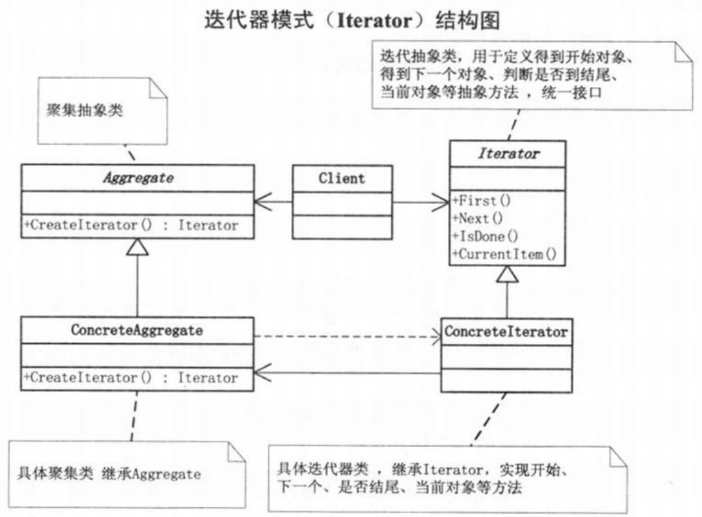

问题：乘车买票
# 迭代器模式
>Note:  
>$\quad\quad$`迭代器模式(Iterator)`，提供一种方法顺序访问一个聚合对象中各个元素，而又不暴露该对象的内部表示。

- 当需要访问一个聚集对象，而且不管这些对象是什么都需要遍历的时候，你就应该考虑用迭代器模式。
- 需要对聚集有多种方式遍历时，可以考虑用迭代器模式。
- 为遍历不同的聚集结构提供如开始、下一个、是否结束、当前哪一项等统一的接口。
- 现在流行的很多语言都把这个模式融入进去了。（for...in...）  
- 迭代器模式就是分离了集合对象的遍历行为，抽象出一个迭代器类来负责，这样既可以做到不暴露集合的内部结构，又可让外部代码透明地访问集合内部的数据。

  
```c#
// 小菜的代码 --- version1.01
// Iterator --- 迭代器抽象类
abstract class Iterator
{
    // 用于定义得到开始对象、得到下一个对象、判断是否到结尾、当前对象等抽象方法，统一接口
    public abstract object First();
    public abstract object Next();
    public abstract bool IsDone();
    public abstract object CurrentItem();
}
// Aggregate --- 聚集抽象类
abstract class Aggregate
{
    public abstract Iterator CreateIterator();  // 创建迭代器
}
// ConcreteIterator --- 具体迭代器类，继承Iterator
class ConcreteIterator : Iterator
{
    private ConcreteAggregate aggregate;    // 定义了一个具体聚集对象
    private int current = 0;

    public ConcreteIterator(ConcreteAggregate aggregate)
    {
        this.aggregate = aggregate; // 初始化时将具体的聚集对象传入
    }

    public override object First()
    {
        return aggregate[0];    // 得到聚集的第一个对象
    }

    public override object Next()
    {
        object ret = null;
        current++;
        if(current < aggregate.Count)
        {
            ret = aggregate[current];
        }
        return ret;             // 得到聚集的下一个对象
    }

    public override bool IsDone()
    {
        return current >= aggregate.Count ? true : false;
    }

    public override object CurrentItem()
    {
        return aggregate[current];  // 返回当前的聚集对象
    }
}
// ConcreteAggregate --- 具体聚集类，继承Aggregate
class ConcreteAggregate : Aggregate
{
    private IList<object> items = new List<object>();   // 声明一个IList泛型变量，用于存放聚合对象，用ArrayList同样可以实现
    public override Iterator CreateIterator()
    {
        return new ConcreteIterator(this);
    }

    public int Count
    {
        get { return items.Count; } //返回聚集总个数
    }

    public object this[int index]
    {
        // 声明一个索引器
        get { return items[index]; }
        set { items.Insert(index,value); }
    }
}
// 客户端代码
static void Main(string[] args)
{
    ConcreteAggregate a = new ConcreteAggregate();  // 公交车，即聚集对象

    // 新上来的乘客，即对象数组
    a[0] = "大鸟";
    a[1] = "小菜";
    a[2] = "行李";
    a[3] = "老外";
    a[4] = "公交内部员工";
    a[5] = "小偷";

    Iterator i = new ConcreteIterator(a);   // 售票员出场，先看好了上车的是哪些人，即声明了迭代器对象
    object item = i.First();
    while (!i.IsDone())
    {
        // 从第一个乘客开始
        Console.WriteLine("{0} 请买车票！",i.CurrentItem());    // 对面前的乘客告知请买票
        i.Next();   // 下一乘客
    }
    Console.Read();
}
```
```c#
// 小菜的代码 --- version1.02
// 实现从后往前的具体迭代器类
class ConcreteIteratorDesc : Iterator
{
    private ConcreteAggregate aggregate;    // 定义了一个具体聚集对象
    private int current = 0;

    public ConcreteIteratorDesc(ConcreteAggregate aggregate)
    {
        // 初始化时将具体的聚集对象传入
        this.aggregate = aggregate;
        current = aggregate.Count - 1;
    }
    public override object First()
    {
        return aggregate[aggregate.Count - 1];  // 得到聚集的第一个对象
    }
    public override object Next()
    {
        object ret = null;
        current--;
        if(current >= 0)
        {
            ret = aggregate[current];   // 得到聚集的下一个对象
        }
        return ret;
    }
    public override object CurrentItem()
    {
        return aggregate[current];  // 判断当前是否遍历到结尾，到结尾返回true
    }
    public override bool IsDone()
    {
        return current < 0 ? true : false;  // 返回当前的聚集对象
    }
}
// 客户端程序
static void Main(string[] args)
{
    // ...
    // Iterator i = new ConcreteIterator(a);
    Iterator i = new ConcreteIteratorDesc(a);
    // ...
}
```
```c#
// 小菜的代码 --- version1.03
// 利用.NET的迭代器实现
// IEumerator --- 支持对非泛型集合的简单迭代接口
public interface IEumerator
{
    object Current
    {
        get;    // 获取集合中的当前元素
    }
    bool MoveNext();    // 将枚举数推进到集合的下一个元素。方法返回值true表示迭代器成功前进到集合中的下一个元素，返回值false表示已经位于集合的末尾
    void Reset();   // 恢复初始化指向的位置，该位置位于集合中第一个元素之前
}
// IEnumerable --- 公开枚举数，该枚举数支持在非泛型集合上进行简单迭代
public interface IEnumerable
{
    IEumerator GetEnumerator(); // 返回一个循环访问集合的枚举数
}
// 客户端程序
static void Main(string[] args)
{
    IList<string> a = new List<string>();   // 也可以是ArrayList集合
    a.Add("大鸟");
    a.Add("小菜");
    a.Add("行李");
    a.Add("老外");
    a.Add("公交内部员工");
    a.Add("小偷");

    foreach(string item in a)
    {
        Console.WriteLine("{0} 请买车票！",item);
    }
    /*
        // 编译器内部
        IEnumerator<string> e = a.GetEnumerator();
        while(e.MoveNext())
        {
            Console.WriteLine("{0} 请买车票！",e.Current);
        }
    */
    Console.Read();
}
```

>Note:  
>$\quad\quad$研究历史是为了更好地迎接未来。