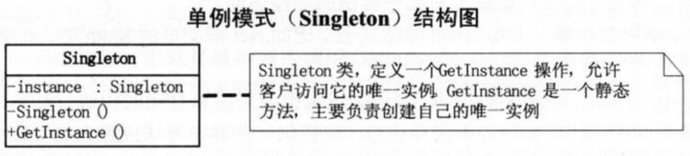

问题：类也需要计划生育 --- 仅可生成零个或一个工具箱
```c#
// 小菜的代码 --- version1.01
private void Form1_Load(object sender,EventArgs e)
{
    this.IsMdiContainer = true; // 也可以直接设置Form1窗体的IsMdiContainer属性为true
}

private void ToolStripMenuItemToolbox_Click(object sender,EventArgs e)
{
    FormToolbox ftb = new FormToolbox();    // “工具箱”启动的代码，实例化FormToolbox，并设置其 Mdi父窗口为 Form1
    ftb.MdiParent = this;
    ftb.Show();
}
/*
- 如何判断“工具箱”只生成一个
*/
```
```c#
// 小菜的代码 --- version1.02
private FormToolbox ftb;    // 类变量声明
private void ToolStripMenuItemToolbox_Click(object sender,EventArgs e)
{
    if(ftb == null)
    {
        // 判断是否实例化过，如果为null说明没有实例化过
        ftb = new FormToolbox();
        ftb.MdiParent = this;
        ftb.Show();
    }
}
/*
- 在不同的控件中启动“工具箱”，如何满足要求
*/
private void toolStripButton1_Click(object sender,EventArgs e)
{
    if(ftb == null)
    {
        ftb = new FormToolbox();
        ftb.MdiParent = this;
        ftb.Show();
    }
}
/*
- 复制粘贴代码bug多多
- 在关闭“工具箱”时，实例并没有变为null，因此下次无法再正常实例化
*/
private void toolStripButton1_Click(object sender,EventArgs e)
{
    if(ftb == null || ftb.IsDisposed)
    {
        ftb = new FormToolbox();
        ftb.MdiParent = this;
        ftb.Show();
    }
}
/*
- 在条件中改动而不是添加新方法可能会引起更多问题
*/
private FormToolbox ftb;
private void ToolStripMenuItemToolbox_Click(object sender,EventArgs e)
{
    openToolbox();
}

private void toolStripButton1_Click(object sender,EventArgs e)
{
    openToolbox();
}

private void openToolbox()
{
    // 提炼出“打开工具箱”的方法
    if(ftb == null || ftb.IsDisposed)
    {
        ftb = new FormToolbox();
        ftb.MdiParent = this;
        ftb.Show();
    }
}
/*
- 最大的问题是：该谁决定是不是要实例化一个类
*/
```
>Note:  
>$\quad\quad$所有类都有构造方法，不编码则系统默认生成空的构造方法，若有显示定义的构造方法，默认的构造方法就会失效。
```c#
// 大鸟的代码 --- version1.01
public partial class FormToolbox : Form
{
    private static FormToolbox ftb = null;  // 声明一个静态的类变量

    private FormToolbox()
    {
        // 构造方法私有，外部代码不能直接new来实例化它
        InitializeComponent();
    }
    public static FormToolbox GetInstance()
    {
        // 得到类实例的方法，返回值就是本类对象，注意也是静态的
        if(ftb == null || ftb.IsDisposed)
        {
            ftb = new FormToolbox();
            ftb.MdiParent = Form1.ActiveForm;
            // 当内部的ftb是 null或者被 Dispose过，则 new它。并且设计其 MdiParent为 Form1，此时将实例化的对象存在静态的变量ftb中，以后就可以不用实例而得到它了
        }
        return ftb;
    }
}
// 客户端代码
private void ToolStripMenuItemToolbox_Click(object sender,EventArgs e)
{
    FormToolbox.GetInstance().Show();
}

private void toolStripButton1_Click(object sender,EventArgs e)
{
    FormToolbox.GetInstance().Show();
}
/*
- 客户端不再考虑是否需要去实例化的问题，而把责任都给了应该负责的类去处理
*/
```
# 单例模式
>Note:  
>$\quad\quad$`单例模式(Singleton)`，保证一个类仅有一个实例，并提供一个访问它的全局访问点。
- 通常我们可以让一个全局变量使得一个对象被访问，但它不能防止你实例化多个对象。一个最好的办法就是，让类自身负责保存它的唯一实例。这个类可以保证没有其他实例可以被创建，并且它可以提供一个访问该实例的方法。  

  
```c#
// Singleton类 --- 定义一个GetInstance操作，允许客户访问它的唯一实例。GetInstance是一个静态方法，主要负责创建自己的唯一实例
class Singleton
{
    private static Singleton instance;

    private Singleton()
    { } // 构造方法让其private，这就堵死了外界利用new创建此类实例的可能

    public static Singleton GetInstance()
    {
        // 此方法是获得本类实例的唯一全局访问点
        if(instance == null)
        {
            // 若实例不存在，则new一个新实例，否则返回已有的实例
            instance = new Singleton();
        }
        return instance;
    }
}
// 客户端代码
static void Main(string[] args)
{
    Singleton s1 = Singleton.GetInstance();
    Singleton s2 = Singleton.GetInstance();

    if(s1 == s2)
    {
        // 比较两次实例化后对象的结果是实例相同
        Console.WriteLine("两个对象是相同的实例。");
    }
    Console.Read();
}
```
- 单例模式因为Singleton类封装它的唯一实例，这样它可以严格地控制客户怎样访问及何时访问它。简单地说就是对唯一实例的受控访问。
- `单例模式试图解决的两个基本问题：全局访问和实例化控制`
- 单例模式vs实用类  
  |单例|实用类|
  |:---:|:---:|
  |有状态|不保存状态，仅提供一些静态方法或静态属性|
  |实例唯一，但可以有子类继承|不能用于继承多态|
  |有唯一的对象实例|一些方法属性的集合|
- 多线程时的单例  
  lock是确保当一个线程位于代码的临界区时，另一个线程不进入临界区。如果其他线程试图进入锁定的代码，则它将一直等待（即被阻止），直到该对象被释放。
  ```c#
  class Singleton
  {
      private static Singleton instance;
      private static readonly object syncRoot = new object();   // 程序运行时创建一个静态只读的进程辅助对象
      private Singleton()
      { }
      public static Singleton GetInstance()
      {
          lock(syncRoot)
          {
              // 在同一个时刻加了锁的那部分程序只有一个线程可以进入
              if(instance == null)
              {
                  instance = new Singleton();
              }
          }
          return instance;
      }
  }
  /*
  - 每次调用 GetInstance方法都需要 lock，影响性能
  */
  ```
- 双重锁定（Double-Check Locking）
  ```c#
  class Singleton
  {
      private static Singleton instance;
      private static readonly object syncRoot = new object();
      private Singleton()
      { }
      public static Singleton GetInstance()
      {
          if(instance == null)
          {
              // 先判断实例是否存在，不存在再加锁处理
              lock(syncRoot)
              {
                  // 在同一个时刻加了锁的那部分程序只有一个线程可以进入
                  if(instance == null)
                  {
                      instance = new Singleton();
                  }
              }
          }
          return instance;
      }
  }
  ```
- 静态初始化  
  C#与公共语言运行库也提供了一种‘静态初始化’方法，这种方法不需要开发人员显示地编写线程安全代码，即可解决多线程环境下它是不安全的问题。
  ```c#
  public sealed class Singleton
  {
      // 阻止发生派生，而派生可能会增加实例
      private static readonly Singleton instance = new Singleton(); // 在第一次引用类的任何成员时创建实例。公共语言运行库负责处理变量初始化
      private Singleton() { }
      public static Singleton GetInstance()
      {
          return instance;
      }
  }
  ```
  - 饿汉式单例类：静态初始化的方式是在自己被加载时就将自己实例化（提前占用系统资源）
  - 懒汉式单例类：要在第一次被引用时，才会将自己实例化（会面临着多线程访问的安全性问题，需要做双重锁定才能保证安全）