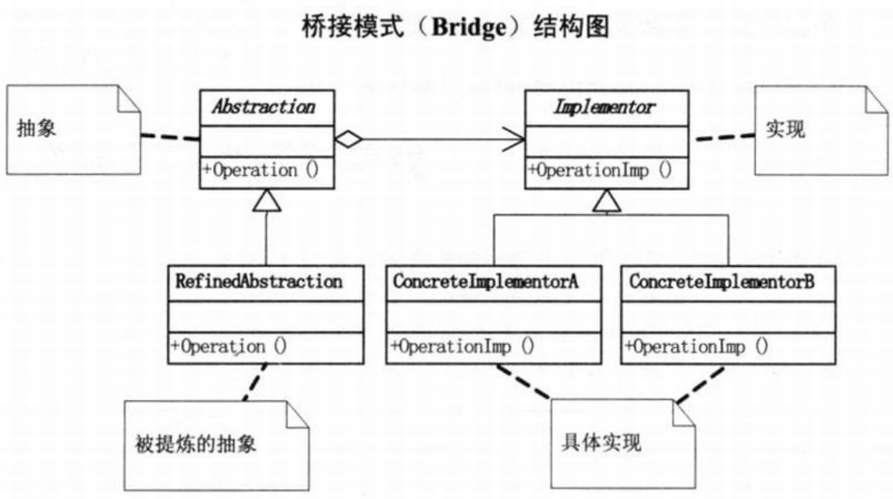

问题：手机软件不兼容  
要求：有一个N品牌的手机，有一个小游戏，如何写玩游戏的程序
```c#
// 小菜的代码 --- version1.01
// N品牌的手机中的游戏
class HandsetNGame
{
    public void Run()
    {
        Console.WriteLine("运行N品牌手机游戏");
    }
}
// 客户端代码
HandsetNGame game = new HandsetNGame();
ame.Run();
```
又有一个M品牌的手机，也有小游戏，客户端也可以调用
```c#
// 小菜的代码 --- version1.02
// 手机游戏类
class HandsetGame
{
    public virtual void Run()
    {

    }
}
// M品牌手机游戏和 N品牌手机游戏
class HandsetMGame : HandsetGame
{
    public override void Run()
    {
        Console.WriteLine("运行M品牌手机游戏");
    }
}
class HandsetNGame : HandsetGame
{
    public override void Run()
    {
        Console.WriteLine("运行N品牌手机游戏");
    }
}
/*
- 从面向对象的思想来说，应该有一个父类‘手机品牌游戏’，可以实现手机游戏类的通用运行方法
*/
```
由于手机都需要通讯录功能，于是N品牌和M品牌都增加了通讯录的增删改查功能。  
  
```c#
// 小菜的代码 --- version1.03
// 手机类
// 手机品牌
class HandsetBrand
{
    public virtual void Run()
    {
    }
}
// 手机品牌N和 手机品牌M类
class HandsetBrandM : HandsetBrand
{ }
class HandsetBrandN : HandsetBrand
{ }
// 下属的各自通讯录类和游戏类
class HandBrandMGame : HandsetBrandM
{
    public override void Run()
    {
        Console.WriteLine("运行M品牌手机游戏");
    }
}
class HandBrandNGame : HandsetBrandN
{
    public override void Run()
    {
        Console.WriteLine("运行N品牌手机游戏");
    }
}
class HandBrandMAddressList : HandsetBrandM
{
    public override void Run()
    {
        Console.WriteLine("运行M品牌手机通讯录");
    }
}
class HandBrandNAddressList : HandsetBrandN
{
    public override void Run()
    {
        Console.WriteLine("运行N品牌手机通讯录");
    }
}
// 客户端调用代码
static void Main(string[] args)
{
    HandsetBrand ab;
    ab = new HandsetBrandMAddressList();
    ab.Run();

    ab = new HandsetBrandMGame();
    ab.Run();

    ab = new HandsetBrandNAddressList();
    ab.Run();

    ab = new HandsetBrandNGame();
    ab.Run();

    Console.Read();
}
/*
- 父类应该是‘手机品牌’，在不同子类下都包含‘通讯录’和‘游戏’子类
*/
```
要增加更多的品牌和更多的功能  
  
新的问题：‘有了新锤子，所有的东西看上去都成了钉子’。  
- 对象的继承关系是在编译时就定义好了，所以无法在运行时改变从父类继承的实现。子类的实现与它的父类有非常紧密的依赖关系，以至于父类实现中的任何变化必然会导致子类发生变化。当你需要复用子类时，如果继承下来的实现不适合解决新的问题，则父类必须重写或被其他更适合的类替换。这种依赖关系限制了灵活性并最终限制了复用性。  

# 合成/聚合复用原则
>Note:  
>$\quad\quad$`合成/聚合复用原则(CARP)`,尽量使用合成/聚合，尽量不要使用类继承。

- 合成(或称‘组合’),Composition)：关联的特殊种类，是一种强的‘拥有’关系，体现了严格的部分和整体的关系，部分和整体的生命周期一样。
- 聚合(Aggregation)：关联的特殊种类，是一种弱的‘拥有’关系，体现的是A对象可以包含B对象，但B对象不是A对象的一部分。  
  

合成/聚合复用原则的好处：  
- 优先使用对象的合成/聚合将有助于你保持每个类被封装，并被集中在单个任务上。这样类和类继承层次会保持较小规模，并且不太可能增长为不可控制的庞然大物。  
#
  
```c#
// 小菜的代码 --- version1.04
// 手机软件抽象类
abstract class HandsetSoft
{
    public abstract void Run();
}
// 游戏、通讯录等具体类
class HandsetGame : HandsetSoft
{
    public override void Run()
    {
        Console.WriteLine("运行手机游戏");
    }
}

class HandsetAddressList : HandsetSoft
{
    public override void Run()
    {
        Console.WriteLine("运行手机通讯录");
    }
}
// 手机MP3播放器
class HandsetMP3 : HandSoft
{
    public override void Run()
    {
        Console.WriteLine("运行手机MP3播放");
    }
}
// 手机品牌类
abstract class HandsetBrand
{
    protected HandsetSoft soft;

    // 设置手机软件
    public void SetHandsetSoft(HandsetSoft soft)
    {
        // 品牌需要关注软件，所以可在机器中安装软件（设置手机软件），以备运行
        this.soft = soft;
    }
    // 运行
    public abstract void Run();
}
// 品牌N 品牌M具体类
class HandsetBrandN : HandsetBrand
{
    public override void Run()
    {
        soft.Run();
    }
}
class HandsetBrandM : HandsetBrand
{
    public override void Run()
    {
        soft.Run();
    }
}
// 品牌S
class HandsetBrandS : HandsetBrand
{
    public override void Run()
    {
        soft.Run();
    }
}
// 客户端调用代码
static void Main(string[] args)
{
    HandsetBrand ab;
    ab = new HandsetBrandN();

    ab.SetHandsetSoft(new HandsetGame());
    ab.Run();

    ab.SetHandsetSoft(new HandsetAddressList());
    ab.Run();

    ab = new HandsetBrandM();

    ab.SetHandsetSoft(new HandsetGame());
    ab.Run();

    ab.SetHandsetSoft(new HandsetAddressList());
    ab.Run();

    Console.Read();
}
```

# 桥接模式
>Note:  
>$\quad\quad$`桥接模式(Bridge)`，将抽象部分与它的实现部分离，是它们都可以独立地变化。

- 什么叫抽象与它的实现分离，并不是说让抽象类与其派生类分离，而是指抽象类和它的派生类用来实现自己的对象分离。即实现系统可能有多角度分类，每一种分类都有可能变化，那么就把这种多角度分离出来让它们独立变化，减少它们之间的耦合。

 
```c#
// Implementor类
abstract class Implementor
{
    public abstract void Operation();
}
// ConcreteImplementorA和 ConcreteImplementorB等派生类
class ConcreteImplementorA : Implementor
{
    public override void Operation()
    {
        Console.WriteLine("具体实现A的方法执行");
    }
}
class ConcreteImplementorB : Implementor
{
    public override void Operation()
    {
        Console.WriteLine("具体实现B的方法执行");
    }
}
// Abstraction类
class Abstraction
{
    protected Implementor implementor;

    public void SetImplementor(Implementor implementor)
    {
        this.implementor = implementor;
    }

    public virtual void Operation()
    {
        implementor.Operation();
    }
}
// RefinedAbstraction类
class RefinedAbstraction : Abstraction
{
    public override void Operation()
    {
        implementor.Operation();
    }
}
// 客户端实现
static void Main(string[] args)
{
    Abstraction ab = new RefinedAbstraction();

    ab.SetImplementor(new ConcreteImplementorA());
    ab.Operation();

    ab.SetImplementor(new ConcreteImplementorB());
    ab.Operation();

    Console.Read();
}
```

>Note:  
>$\quad\quad$只要真正深入地理解了设计原则，很多设计模式其实就是原则的应用而已，或许在不知不觉中就在使用设计模式了。