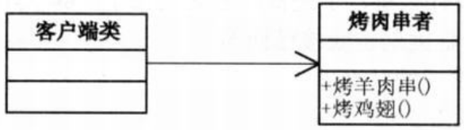
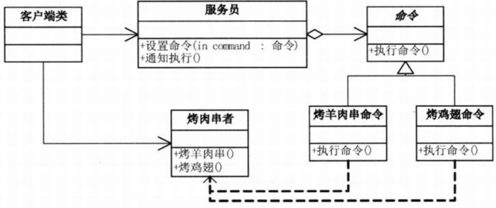
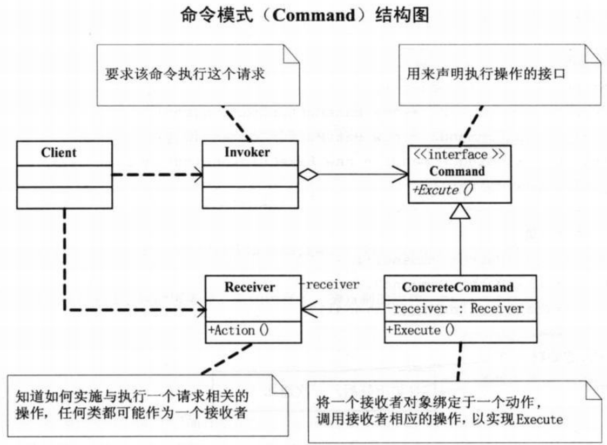

问题：烤羊肉串，烧烤摊vs烧烤店
- 客户与烤羊肉串老板之间‘紧耦合’，容易出错，容易混乱，也容易挑剔（‘行为请求者’与‘行为实现者’的紧耦合）
- 需要记录哪个人要几串羊肉串有没有特殊要求，付没付过钱，谁先谁后（做日志），有人需要退钱或者要求烤肉重烤（撤销和重做）（对请求排队或记录请求日志，以及支持可撤销的操作等行为，’紧耦合‘不合适）
- 利用服务员来解耦客户和烤肉师傅的关系

紧耦合设计代码结构图：  
  
```c#
// 小菜的代码 --- version1.01
// 烤肉串者
public class Barbecuer
{
    // 烤羊肉
    public void BakeMutton()
    {
        Console.WriteLine("烤羊肉串！");
    }
    // 烤鸡翅
    public void BakeChickenWing()
    {
        Console.WriteLine("烤鸡翅！");
    }
}
// 客户端调用
static void Main(string[] args)
{
    Barbecuer boy = new Barbecuer();

    // 客户端程序与‘烤肉串者’紧耦合，尽管简单，但却极为僵化，有许许多多的隐患
    boy.BakeMutton();
    boy.BakeMutton();
    boy.BakeMutton();
    boy.BakeChickenWing();
    boy.BakeMutton();
    boy.BakeMutton();
    boy.BakeChickenWing();

    Console.Read();
}
```
松耦合设计代码结构图：  
  
```c#
// 小菜的代码 --- version1.02
// 抽象命令类 --- 只需要确定‘烤肉者’是谁
public abstract class Command
{
    protected Barbecuer receiver;

    public Command(Barbecuer receiver)
    {
        this.receiver = receiver;
    }

    // 执行命令
    abstract public void ExcuteCommand();
}
// 具体命令类 --- 执行命令时，执行具体的行为
// 烤羊肉串命令
class BakeMuttonCommand : Command
{
    public BakeMuttonCommand(Barbecuer receiver) : base(receiver)
    { }

    public override void ExcuteCommand()
    {
        receiver.BakeMutton();
    }
}
// 烤鸡翅命令
class BakeChickenWingCommand : Command
{
    public BakeChickenWingCommand(Barbecuer receiver) : base(receiver)
    { }

    public override void ExcuteCommand()
    {
        receiver.BakeChickenWing();
    }
}
// 服务员类 --- 不用管用户想要什么烤肉，反正都是‘命令’，只管记录订单，然后通知‘烤肉串者’执行即可
public class Waiter
{
    private Command command;

    // 设置订单
    public void SetOrder(Command command)
    {
        this.command = command;
    }
    // 通知执行
    public void Notify()
    {
        command.ExcuteCommand();
    }
}
// 烤肉串者
public class Barbecuer
{
    // 烤羊肉
    public void BakeMutton()
    {
        Console.WriteLine("烤羊肉串！");
    }
    // 烤鸡翅
    public void BakeChickenWing()
    {
        Console.WriteLine("烤鸡翅！");
    }
}
// 客户端实现
static void Main(string[] args)
{
    // 开店前的准备 --- 烧烤店事先就找好了烤肉厨师、服务员和烤肉菜单就等客户上门
    Barbecuer boy = new Barbecuer();
    Command bakeMuttonCommand1 = new BakeMuttonCommand(boy);
    Command bakeMuttonCommand2 = new BakeMuttonCommand(boy);
    Command bakeChickenWingCommand1 = new BakeChickenWingCommand(boy);
    Waiter girl = new Waiter();

    // 开门营业 --- 服务员根据用户要求，通知厨房开始制作
    girl.SetOrder(bakeMuttonCommand1);
    girl.Notify();
    girl.SetOrder(bakeMuttonCommand2);
    girl.Notify();
    girl.SetOrder(bakeChickenWingCommand1);
    girl.Notify();

    Console.Read();
}
/*
- 不是点一个菜做一个，而是点完一起通知制作
- 如果哪道菜没有，不应该是客户来判断而是服务员或烤肉串者来否决这个请求
- 客户到底点了哪些东西需要记录日志，以备收费以及后期统计
- 客户可以在烤串点多的情况下取消一部分还没制作的肉串
*/
```
```c#
// 小菜的代码 --- version1.03
// 服务员类
public class Waiter
{
    private IList<Command> orders = new List<Command>();    // 增加存放具体命令的容器

    // 设置订单
    public void SetOrder(Command command)
    {
        // 在客户提出请求时，对没货的烧烤进行回绝
        if(command.ToString() == "命令模式.BakeChickenWingCommand")
        {
            Console.WriteLine("服务员：鸡翅没有了，请点别的烧烤。");
        }
        else
        {
            orders.Add(command);
            // 记录客户所点的烧烤的日志，以备算帐收钱
            Console.WriteLine("增加订单： " + command.ToString() + " 时间： " + DateTime.Now.ToString());
        }
    }

    // 取消订单
    public void CancelOrder(Command command)
    {
        orders.Remove(command);
        Console.WriteLine("取消订单： " + command.ToString() + " 时间： " + DateTime.Now.ToString());
    }

    // 通知全部执行
    public void Notify()
    {
        // 根据用户点好的烧烤订单通知厨房制作
        foreach(Command cmd in orders)
        {
            cmd.ExcuteCommand();
        }
    }
}
// 客户端代码实现
static void Main(string[] args)
{
    // 开店前的准备
    Barbecuer boy = new Barbecuer();
    Command bakeMuttonCommand1 = new BakeMuttonCommand(boy);
    Command bakeMuttonCommand2 = new BakeMuttonCommand(boy);
    Command bakeChickenWingCommand1 = new BakeChickenWingCommand(boy);
    Waiter girl = new Waiter();

    // 开门营业，顾客点菜
    girl.SetOrder(bakeMuttonCommand1);
    girl.SetOrder(bakeMuttonCommand2);
    girl.SetOrder(bakeChickenWingCommand1);

    // 点菜完毕，通知厨房
    girl.Notify();

    Console.Read();
}
```

# 命令模式
>Note:  
>$\quad\quad$`命令模式(Command)`，将一个请求封装为一个对象，从而使你可用不同的请求对客户进行参数化；对请求排队或记录请求日志，以及支持可撤销的操作。

  
```c#
// Command类，用来声明执行操作的接口
abstract class Command
{
    protected Receiver receiver;

    public Command(Receiver receiver)
    {
        this.receiver = receiver;
    }

    abstract public void Execute();
}
// ConcreteCommand类，将一个接受者对象绑定于一个动作，调用接收者相应的操作，以实现Execute。
class ConcreteCommand : Command
{
    public ConcreteCommand(Receiver receiver) : base(receiver)
    { }
    public override void Execute()
    {
        receiver.Action();
    }
}
// Invoker类，要求该命令执行这个请求。
class Invoker
{
    private Command command;

    public void SetCommand(Command command)
    {
        this.command = command;
    }
    public void ExecuteCommand()
    {
        command.Execute();
    }
}
// Receive类，知道如何实施与执行一个与请求相关的操作，任何类都可能作为一个接收者。
class Receiver
{
    public void Action()
    {
        Console.WriteLine("执行请求！");
    }
}
// 客户端代码，创建一个具体命令对象并设定它的接收者。
static void Main(string[] args)
{
    Receiver r = new Receiver();
    Command c = new ConcreteCommand(r);
    Invoker i = new Invoker();

    i.SetCommand(c);
    i.ExecuteCommand();

    Console.Read();
}
```
命令模式的优点： 
- 第一，它能较容易地设计一个命令队列
- 第二，在需要的情况下，可以较容易地将命令记入日志
- 第三，允许接收请求的一方决定是否要否决请求
- 第四，可以容易地实现对请求的撤销和重做
- 第五，由于加进新的具体命令类不影响其他的类，因此增加新的具体命令类很容易
- 命令模式把请求一个操作的对象与知道怎么执行一个操作的对象分隔开

>Note:  
>$\quad\quad$敏捷开发原则告诉我们，不要为代码添加基于猜测的、实际不需要的功能。如果不清楚一个系统是否需要命令模式，一般就不要着急去实现它，事实上，在需要的时候通过重构实现这个模式并不困难，只有在真正需要如撤销/恢复操作等功能时，把原来的代码重构为命令模式才有意义。