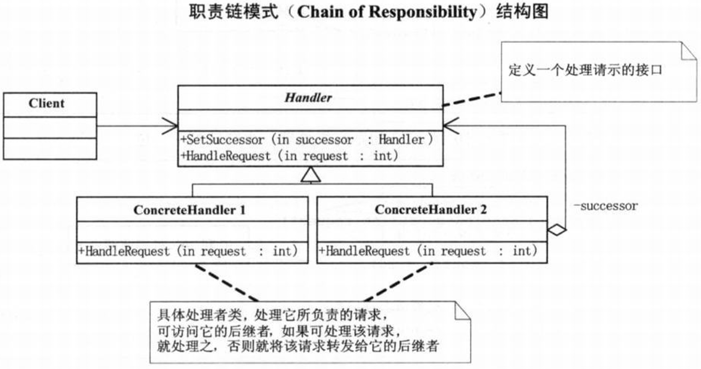
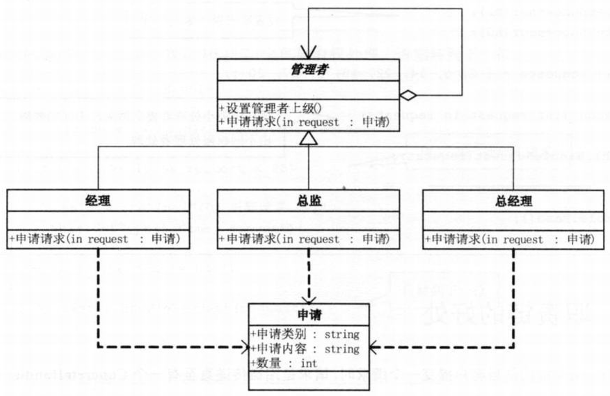

问题：加薪
```c#
// 小菜的代码 --- version1.01
// 申请,例如加薪、请假等
class Request
{
    // 申请类别
    private string requestType;
    public string RequestType
    {
        get { return requestType; }
        set { requestType = value; }
    }
    // 申请内容
    private string requestContent;
    public string RequestContent
    {
        get { return requestContent; }
        set { requestContent = value; }
    }
    // 数量
    private int number;
    public int Number
    {
        get { return number; }
        set { number = value; }
    }
}
// 管理者，如经理、总监、总经理等
class Manager
{
    protected string name;
    public Manager(string name)
    { this.name = name; }
    // 得到结果
    public void GetResult(string managerLevel,Request request)
    {
        // 比较长的方法，多条分支，这些都是坏味道代码
        if(managerLevel == '经理')
        {
            if(request.RequstType == '请假' && request.Number <= 2)
            {
                Console.WriteLine("{0}：{1} 数量 {2}被批准",name,request.RequestContent,request.Number);
            }
            else
            {
                Console.WriteLine("{0}：{1} 数量 {2} 我无权处理",name,request.RequestContent,request.Number);
            }
        }
        else if(managerLevel == '总监')
        {
            if(request.RequstType == '请假' && request.Number <= 5)
            {
                Console.WriteLine("{0}：{1} 数量 {2}被批准",name,request.RequestContent,request.Number);
            }
            else
            {
                Console.WriteLine("{0}：{1} 数量 {2} 我无权处理",name,request.RequestContent,request.Number);
            }
        }
        else if(managerLevel == '总经理')
        {
            if(request.RequstType == '请假')
            {
                Console.WriteLine("{0}：{1} 数量 {2}被批准",name,request.RequestContent,request.Number);
            }
            else if(request.RequestContent == '加薪' && request.Number <= 500)
            {
                Console.WriteLine("{0}：{1} 数量 {2} 被批准",name,request.RequestContent,request.Number);
            }
            else if(request.RequestContent == '加薪' && request.Number > 500)
            {
                Console.WriteLine("{0}：{1} 数量 {2} 再说吧",name,request.RequestContent,request.Number);
            }
        }
    }
}
// 客户端代码如下
static void Main(string[] args)
{
    // 三个管理者
    Manager jinli = new Manager("金利");
    Manager zongjian = new Manager("宗剑");
    Manager zhongjingli = new Manager("钟精励");

    // 小菜请求加薪1000
    Requset request = new Requset();
    request.RequestType = "加薪";
    request.RequestContent = "小菜请求加薪";
    request.Number = 1000;

    // 不同的级别对此请求做判断和处理
    jinli.GetResult("经理",request);
    zongjian.GetResult("总监",request);
    zhongjingli.GetResult("总经理",request);

    // 小菜请假3天
    Requset request2 = new Requset();
    request2.RequestType = "请假";
    request2.RequestContent = "小菜请假";
    request.Number = 3;

    jinli.GetResult("经理",request);
    zongjian.GetResult("总监",request);
    zhongjingli.GetResult("总经理",request);

    Console.Read();
}
```
# 职责链模式
>Note:  
>$\quad\quad$`职责链模式(Chain of Responsibility)`，使多个对象都有机会处理请求，从而避免请求的发送者和接收者之间的耦合关系。将这个对象连成一条链，并沿着这条链传递该请求，直到有一个对象处理它为止。

  
```c#
// Handler类，定义一个处理请示的接口
abstract class Handler
{
    protected Handler successor;

    public void SetSuccessor(Handler successor)
    {
        // 设置继任者
        this.successor = successor;
    }
    public abstract void HandleRequest(int request);   // 处理请求的抽象方法
}
// ConcreteHandler类，具体处理者类，处理它所负责的请求，可访问它的后继者，如果可处理该请求，就处理之，否则就将该请求转发给它的后继者。
// ConcreteHandler1,当请求数在0到10之间则有权处理，否则转到下一位
class ConcreteHandler1 : Handler
{
    public override void HandleRequest(int request)
    {
        if (request >=0 && request < 10)
        {
            // 0到10，处理此请求
            Console.WriteLine("{0} 处理请求 {1}",this.GetType().Name,request);
        }
        else if(successor != null)
        {
            // 转移到下一位
            successor.HandleRequest(request);
        }
    }
}
// ConcreteHandler2,当请求数在10到20之间则有权处理，否则转到下一位
class ConcreteHandler2 : Handler
{
    public override void HandleRequest(int request)
    {
        if (request >=10 && request < 20)
        {
            // 10到20，处理此请求
            Console.WriteLine("{0} 处理请求 {1}",this.GetType().Name,request);
        }
        else if(successor != null)
        {
            // 转移到下一位
            successor.HandleRequest(request);
        }
    }
}
// ConcreteHandler3,当请求数在20到30之间则有权处理，否则转到下一位
class ConcreteHandler3 : Handler
{
    public override void HandleRequest(int request)
    {
        if (request >=20 && request < 30)
        {
            // 20到30，处理此请求
            Console.WriteLine("{0} 处理请求 {1}",this.GetType().Name,request);
        }
        else if(successor != null)
        {
            // 转移到下一位
            successor.HandleRequest(request);
        }
    }
}
// 客户端代码，向链上的具体处理者对象提交请求
static void Main(string[] args)
{
    // 设置职责链上家与下家
    Handler h1 = new ConcreteHandler1();
    Handler h2 = new ConcreteHandler2();
    Handler h3 = new ConcreteHandler3();
    h1.SetSuccessor(h2);
    h2.SetSuccessor(h3);

    int[] requests = {2,5,14,22,18,3,27,20};

    foreach(int request in requests)
    {
        // 循环给最小处理者提交请求，不同的数额，由不同权限处理者处理
        h1.HandleRequest(request);
    }

    Console.Read();
}
```
职责链的好处：  
- 当客户提交一个请求时，请求是沿链传递直至有一个ConcreteHandler对象负责处理它。
- 接收者和发送者都没有双方的明确信息，且链中的对象自己也并不知道链的结构。结果是职责链可简化对象的相互连接，它们仅需保持一个指向其后继者的引用，而不需保持它所有的候选接收者的引用。
- 随时地增加或修改处理一个请求的结构。增强了给对象指派职责的灵活性。
- 缺点：一个请求极有可能到了链的末端都得不到处理，或者因为没有正确配置而得不到处理
- 最重要的两点：一是事先设置后继者，二是根据处理权限判断是处理还是转移问题

# 
加薪代码重构的代码结构图：  
  
```c#
// 小菜的代码 --- version1.02
// 管理者
abstract class Manager
{
    protected string name;
    // 管理者的上级
    protected Manager superior;

    public Manager(string name)
    {
        this.name = name;
    }

    // 设置管理者的上级
    public void SetSuperior(Manager superior)
    {
        // 关键的方法，设置管理者的上级
        this.superior = superior;
    }
    // 申请请求
    abstract public void RequestApplications(Request request);
}
// 经理
class CommonManager : Manager
{
    public CommonManager(string name) : base(name)
    { }
    public override void RequestApplications(Request request)
    {
        // 经理所能有的权限就是可准许下属两天内的假期
        if(request.RequestType == "请假" && request.Number <= 2)
        {
            Console.WriteLine("{0} ：{1} 数量 {2} 被批准",name,request.RequestContent,request.Number);
        }
        else
        {
            // 其余的申请都需转到上级
            if(superior != null)
                superior.RequestApplications(request);
        }
    }
}
// 总监
class Majordomo : Manager
{
    public Majordomo(string name) : base(name)
    { }
    public override void RequestApplications(Request request)
    {
        // 总监所能有的权限就是可准许下属一周内的假期
        if(request.RequestType == "请假" && request.Number <= 5)
        {
            Console.WriteLine("{0} ：{1} 数量 {2} 被批准",name,request.RequestContent,request.Number);
        }
        else
        {
            // 其余的申请都需转到上级
            if(superior != null)
                superior.RequestApplications(request);
        }
    }
}
// 总经理
class GeneralManager : Manager
{
    public GeneralManager(string name) : base(name)
    { }
    public override void RequestApplications(Request request)
    {
        // 总监可准许下属任意天的假期
        if(request.RequestType == "请假")
        {
            Console.WriteLine("{0} ：{1} 数量 {2} 被批准",name,request.RequestContent,request.Number);
        }
        // 加薪在500以内，没有问题
        else if(request.RequestType == "加薪" && request.Number <= 500)
        {
            Console.WriteLine("{0} ：{1} 数量 {2} 被批准",name,request.RequestContent,request.Number);
        }
        // 超过500，就要考虑一下了
        else if(request.RequestType == "加薪" && request.Number > 500)
        {
            Console.WriteLine("{0} ：{1} 数量 {2} 再说吧",name,request.RequestContent,request.Number);
        }
    }
}
// 客户端程序
static void Main(string[] args)
{
    CommonManager jinli = new CommonManager("金利");
    Majordomo zongjian = new Majordomo("宗剑");
    GeneralManager zhongjingli = new GeneralManager("钟精励");
    // 设置上级，完全可以根据实际需求来更改设置
    jinli.SetSuperior(zongjian);
    zongjian.SetSuperior(zhongjingli);

    Requset request = new Requset();
    request.RequestType = "请假";
    request.RequestContent = "小菜请假";
    request.Number = 1;
    jinli.RequestApplications(request);

    Requset request2 = new Requset();
    request2.RequestType = "请假";
    request2.RequestContent = "小菜请假";
    request2.Number = 4;
    jinli.RequestApplications(request2);

    Requset request3 = new Requset();
    request3.RequestType = "加薪";
    request3.RequestContent = "小菜请求加薪";
    request3.Number = 500;
    jinli.RequestApplications(request3);

    Requset request4 = new Requset();
    request4.RequestType = "加薪";
    request4.RequestContent = "小菜请求加薪";
    request4.Number = 1000;
    jinli.RequestApplications(request4);

    Console.Read();
}
```