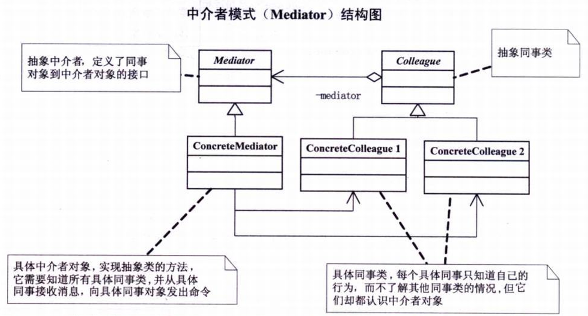

问题：世界需要和平，伊拉克战争，联合国
- 尽管将一个系统分割成许多对象通常可以增加其可复用性，但是对象间相互连接的激增又会降低其可复用性。
- 大量的连接使得一个对象不可能在没有其他对象的支持下工作，系统表现为一个不可分割的整体，所以，对系统的行为进行任何较大的改动就十分困难了。
- 该模式对应于‘迪米特法则’

# 中介者模式
>Note:  
>$\quad\quad$`中介者模式(又叫调停者模式,Mediator)`，用一个中介对象来封装一系列的对象交互。

  
```c#
// Mediator类 --- 抽象中介者，定义了同事对象到中介者对象的接口
abstract class Mediator
{
    public abstract void Send(string message,Colleague colleague); // 定义一个抽象的发送消息方法，得到同事对象和发送信息
}
// Colleague类 --- 抽象同事类
abstract class Colleague
{
    protected Mediator mediator;
    public Colleague(Mediator mediator)
    {
        this.mediator = mediator;   // 构造方法，得到中介者对象
    }
}
// ConcreteMediator类 --- 具体中介者类，实现抽象类的方法，需要知道所有具体同事类，并从具体同事接收消息，向具体同事对象发出命令
class ConcreteMediator : Mediator
{
    private ConcreteColleague1 colleague1;
    private ConcreteColleague2 colleague2;

    // 需要了解所有的具体同事对象
    public ConcreteColleague1 Colleague1
    {
        set { colleague1 = value; }
    }
    public ConcreteColleague2 Colleague2
    {
        set { colleague2 = value; }
    }

    // 重写发送信息的方法，根据对象做出选择判断，通知对象
    public override void Send(string message,Colleague colleague)
    {
        if(colleague == colleague1)
        {
            colleague2.Notify(message);
        }
        else
        {
            colleague1.Notify(message);
        }
    }
}
// ConcreteColleague类 --- 具体同事类，每个具体同事类只知道自己的行为，而不了解其他同事类的情况，但它们却都认识中介者对象
class ConcreteColleague1 : Colleague
{
    public ConcreteColleague1(Mediator mediator) : base(mediator)
    { }
    public void Send(string message)
    {
        // 发送信息时通常是中介者发送出去的
        mediator.Send(message,this);
    }
    public void Notify(string message)
    {
        Console.WriteLine("同事1得到信息："+message);
    }
}
class ConcreteColleague2 : Colleague
{
    public ConcreteColleague2(Mediator mediator) : base(mediator)
    { }
    public void Send(string message)
    {
        mediator.Send(message,this);
    }
    public void Notify(string message)
    {
        Console.WriteLine("同事2得到信息："+message);
    }
}
// 客户端调用
static void Main(string[] args)
{
    ConcreteMediator m = new ConcreteMediator();

    // 让两个具体同事类认识中介者对象
    ConcreteColleague1 c1 = new ConcreteColleague1(m);
    ConcreteColleague2 c2 = new ConcreteColleague2(m);

    // 让中介者认识各个具体同事类对象
    m.Colleague1 = c1;
    m.Colleague2 = c2;

    // 具体同事类对象的发送信息都是通过中介者转发
    c1.Send("吃过饭了吗？");
    c2.Send("没有呢，你打算请客？");

    Console.Read();
}
```
#
要求：美国和伊拉克之间的对话都是通过联合国安理会作为中介来完成。  
代码结构图：  
  
```c#
// 联合国机构类，相当于Mediator类
abstract class UnitedNations
{
    // 声明
    public abstract void Declare(string message,Country colleague);
}
// 国家类，相当于Colleague类
abstract class Country
{
    protected UnitedNations mediator;
    public Country(UnitedNations mediator)
    {
        this.mediator = mediator;
    }
}
// 美国类、伊拉克类，相当于ConcreteColleague1、ConcreteColleague2
class USA : Country
{
    public USA(UnitedNations mediator) : base(mediator)
    { }
    // 声明
    public void Declare(string message)
    {
        mediator.Declare(message,this);
    }
    // 获得消息
    public void GetMessage(string message)
    {
        Console.WriteLine("美国获得对方信息：" + message);
    }
}
class Iraq : Country
{
    public Iraq(UnitedNations mediator) : base(mediator)
    { }
    // 声明
    public void Declare(string message)
    {
        mediator.Declare(message,this);
    }
    // 获得消息
    public void GetMessage(string message)
    {
        Console.WriteLine("伊拉克获得对方信息：" + message);
    }
}
// 联合国安理会，相当于ConcreteMediator类
class UnitedNationsSecurityCouncil : UnitedNations
{
    private USA colleague1;
    private Iraq colleague2;
    // 联合国安理会了解所有的国家，所以拥有美国和伊拉克的对象属性
    // 美国
    public USA Colleague1
    { set { colleague1 = value; } }
    // 伊拉克
    public Iraq Colleague2
    { set { colleague2 = value; } }

    // 声明，重写了"声明"方法，实现了两个对象间的通信
    public override void Declare(string message,Country colleague)
    {
        if (colleague == colleague1)
        {
            colleague2.GetMessage(message);
        }
        else
        {
            colleague1.GetMessage(message);
        }
    }
}
// 客户端调用
static void Main(string[] args)
{
    UnitedNationsSecurityCouncil UNSC = new UnitedNationsSecurityCouncil();

    USA c1 = new USA(UNSC);
    Iraq c2 = new Iraq(UNSC);

    UNSC.Colleague1 = c1;
    UNSC.Colleague2 = c2;
    
    c1.Declare("不准研制核武器，否则要发动战争！");
    c2.Declare("我们没有核武器，也不怕侵略。");

    Console.Read();
}
```

中介者模式优缺点：  
- 中介者模式很容易在系统中应用，也很容易在系统中误用。当系统出现了‘多对多’交互复杂的对象群时，不要急于使用中介者模式，而要先反思你的系统在设计上是不是合理。
- 优点一：Mediator的出现减少了各个Colleague之间的耦合，使得可以独立地改变和复用各个Colleague类和Mediator。
- 优点二：由于把对象如何协作进行了抽象，将中介作为一个独立的概念并将其封装在一个对象中，这样关注的对象就从对象各自本身的行为转移到它们之间的交互上来，也就是站在一个更宏观的角度去看待系统。
- 缺点：由于ConcreteMediator控制了集中化，于是就把交互复杂性变为了中介者的复杂性，这就使得中介者变得比任何一个ConcreteColleague都复杂（`成也集中控制，败也集中控制`）
- 中介者模式一般应用于一组对象以定义良好但是复杂的方式进行通信的场合，以及想制定一个分布在多个类中的行为，而又不想生成太多的子类的场合