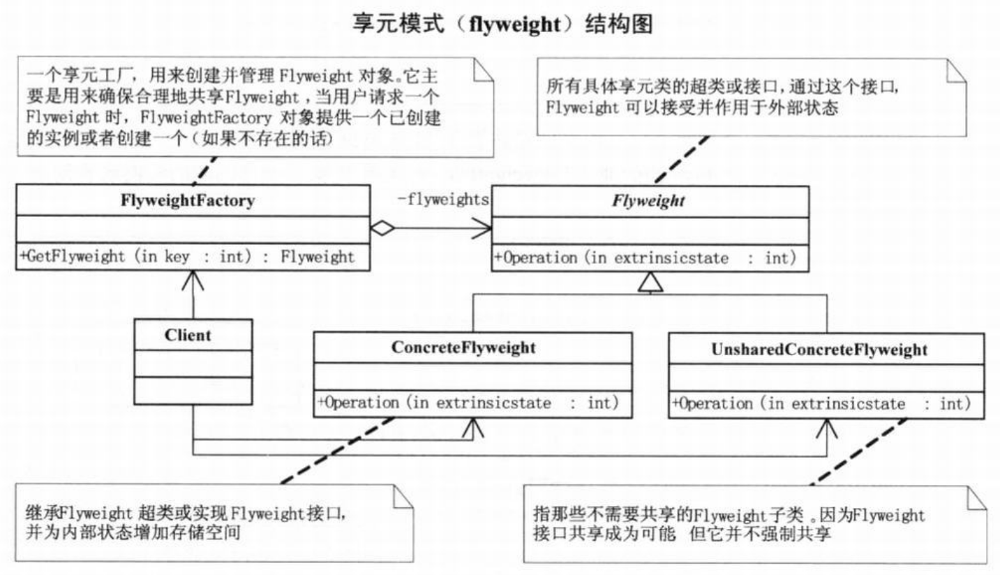
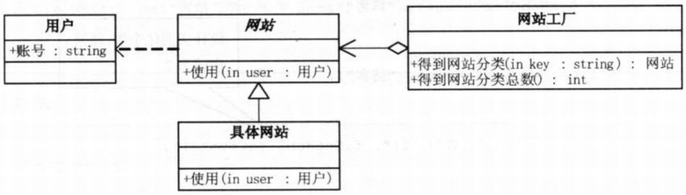

问题：项目多
要求:如果每个网站一个实例
```c#
// 小菜的代码 --- version1.01
// 网站类
class WebSite
{
    private string name = "";
    public WebSite(string name)
    {
        this.name = name;
    }
    public void Use()
    {
        Console.WriteLine("网站分类： " + name);
    }
}
// 客户端代码
static void Main(string[] args)
{
    WebSite fx = new WebSite("产品展示");
    fx.Use();

    WebSite fy = new WebSite("产品展示");
    fy.Use();

    WebSite fz = new WebSite("产品展示");
    fz.Use();

    WebSite fl = new WebSite("博客");
    fl.Use();

    WebSite fm = new WebSite("博客");
    fm.Use();

    WebSite fn = new WebSite("博客");
    fn.Use();

    Console.Read();
}
```
# 享元模式
>Note:  
>$\quad\quad$`享元模式(Flyweight)`，运用共享技术有效地支持大量细粒度的对象

  
```c#
// Flyweight类，它是所有具体享元类的超类或接口，通过这个接口，Flyweight可以接受并作用于外部状态。
abstract class Flyweight
{
    public abstract void Operation(int extrinsicstate);
}
// ConcreteFlyweight 是继承Flyweight超类或 实现Flyweight接口，并为内部状态增加存储空间。
class ConcreteFlyweight : Flyweight
{
    public override void Operation(int extrinsicstate)
    {
        Console.WriteLine("具体Flyweight："+extrinsicstate);
    }
}
// UnsharedConcreteFlyweight是指那些不需要共享的Flyweight子类。因为Flyweight接口共享成为可能，但它并不强制共享。
class UnsharedConcreteFlyweight : Flyweight
{
    public override void Operation(int extrinsicstate)
    {
        Console.WriteLine("不共享的具体Flyweight：" + extrinsicstate);
    }
}
// Flyweightactory，是一个享元工厂，用来创建并管理Flyweight对象。它主要是用来确保合理地共享Flyweight，当用户请求一个Flyweight时，FlyweightFactory对象提供一个已创建的实例或者创建一个（如果不存在的话）。
class FlyweightFactory
{
    private Hashtable flyweights = new Hashtable();

    public FlyweightFactory()
    {
        // 初始化工厂时，先生成三个实例
        flyweights.Add("X",new ConcreteFlyweight());
        flyweights.Add("Y",new ConcreteFlyweight());
        flyweights.Add("Z",new ConcreteFlyweight());
        // 或者初始化什么也不做，等需要时再去判断对象是否为null来决定是否实例化
    }
    public Flyweight GetFlyweight(string key)
    {
        // 根据客户端请求，获得已生成的实例
        return ((Flyweight)flyweights[key]);
    }
}
// 客户端代码
static void Main(string[] args)
{
    int extrinsicstate = 22;    // 代码外部状态
    FlyweightFactory f = new FlyweightFactory();

    Flyweight fx = f.GetFlyweight("X");
    fx.Operation(--extrinsicstate);

    Flyweight fy = f.GetFlyweight("Y");
    fy.Operation(--extrinsicstate);

    Flyweight fz = f.GetFlyweight("Z");
    fz.Operation(--extrinsicstate);

    UnsharedConcreteFlyweight uf = new UnsharedConcreteFlyweight();

    uf.Operation(--extrinsicstate);

    Console.Read();
}
```

#
网站共享代码
```c#
// 小菜的代码 --- version1.02
// 网站抽象类
abstract class WebSite
{
    public abstract void Use();
}
// 具体网站类
class ConcreteWebSite : WebSite
{
    private string name = "";
    public ConcreteWebSite(string name)
    {
        this.name = name;
    }
    public override void Use()
    {
        Console.WriteLine("网站分类： " + name);
    }
}
// 网站工厂类
class WebSiteFactory
{
    private Hashtable flyweights = new Hashtable();

    // 获得网站分类
    public WebSite GetWebSiteCategory(string key)
    {
        // 判断是否存在这个对象，如果存在，则直接返回，若不存在，则实例化它再返回
        if(!flyweights.ContainsKey(key))
            flyweights.Add(key,new ConcreteWebSite(key));
        return ((WebSite)flyweights[key]);
    }
    // 获得网站分类总数,得到实例的个数
    public int GetWebSiteCount()
    {
        return flyweights.Count;
    }
}
// 客户端代码
static void Main(string[] args)
{
    WebSiteFactory f = new WebSiteFactory();

    // 实例化“产品展示”的“网站”对象，而后则共享已生成的对象，不再实例化
    WebSite fx = f.GetWebSIteCategory("产品展示");
    fx.Use();

    WebSite fy = f.GetWebSIteCategory("产品展示");
    fy.Use();

    WebSite fz = f.GetWebSIteCategory("产品展示");
    fz.Use();

    WebSite fl = f.GetWebSIteCategory("博客");
    fl.Use();

    WebSite fm = f.GetWebSIteCategory("博客");
    fm.Use();

    WebSite fn = f.GetWebSIteCategory("博客");
    fn.Use();

    Console.WriteLine("网站分类总数为 {0}",f.GetWebSiteCount());    // 统计实例化个数，结果应该为2

    Console.Read();
}
```

- 内部状态：在享元对象内部并且不会随环境改变而改变的共享部分
- 外部状态：随环境改变而改变的、不可以共享的状态
- 享元模式可以避免大量非常相似类的开销。在程序设计中，有时需要生成大量细粒度的类实例来表示数据。如果能发现这些实例除了几个参数外基本上都是相同的，有时就能够受大幅度地减少需要实例化的类的数量。如果能把那些参数移到类实例的外面，在方法调用时将它们传递进来，就可以通过共享大幅度地减少单个实例的数目。

代码结构图：  
  
```c#
// 小菜的代码 --- version1.03
// 用户类，用于网站的客户帐号，是“网站”类的外部状态
public class User
{
    private string name;
    public User(string name)
    {
        this.name = name;
    }
    public string Name
    {
        get { return name; }
    }
}
// 网站抽象类
abstract class WebSite
{
    public abstract void Use(User user);    // “使用”方法需要传递“用户”对象
}
// 具体网站类
class ConcreteWebSite : WebSite
{
    private string name = "";
    public ConcreteWebSite(string name)
    {
        this.name = name;
    }
    public override void Use(User user)
    {
        // 实现“Use”方法
        Console.WriteLine("网站分类： " + name + "用户： "+ user.Name);
    }
}
// 网站工厂类
class WebSiteFactory
{
    private Hashtable flyweights = new Hashtable();

    // 获得网站分类
    public WebSite GetWebSiteCategory(string key)
    {
        if(!flyweights.ContainsKey(key))
            flyweights.Add(key,new ConcreteWebSite(key));
        return ((WebSite)flyweights[key]);
    }
    // 获得网站分类总数
    public int GetWebSiteCount()
    {
        return flyweights.Count;
    }
}
// 客户端代码
static void Main(string[] args)
{
    WebSiteFactory f = new WebSiteFactory();

    WebSite fx = f.GetWebSIteCategory("产品展示");
    fx.Use(new User("小菜"));

    WebSite fy = f.GetWebSIteCategory("产品展示");
    fy.Use(new User("大鸟"));

    WebSite fz = f.GetWebSIteCategory("产品展示");
    fz.Use(new User("娇娇"));

    WebSite fl = f.GetWebSIteCategory("博客");
    fl.Use(new User("老顽童"));

    WebSite fm = f.GetWebSIteCategory("博客");
    fm.Use(new User("桃谷六仙"));

    WebSite fn = f.GetWebSIteCategory("博客");
    fn.Use(new User("南海鳄神"));

    Console.WriteLine("网站分类总数为 {0}",f.GetWebSiteCount());    // 统计实例化个数，结果应该为2

    Console.Read();
}
```

什么时候考虑使用享元模式：  
- 如果一个应用程序使用了大量的对象，而大量的这些对象造成了很大的存储开销时就应该考虑使用
- 还有就是对象的大多数状态可以外部状态，如果删除对象的外部状态，那么可以用相对较少的共享对象取代很多组对象，此时可以考虑使用享元模式  

问题
- 使用享元模式需要维护一个记录了系统已有的所有享元的列表，也占用很多资源
