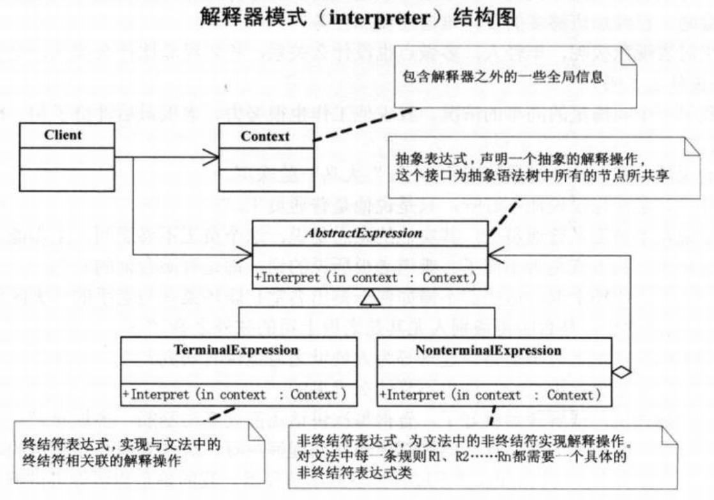
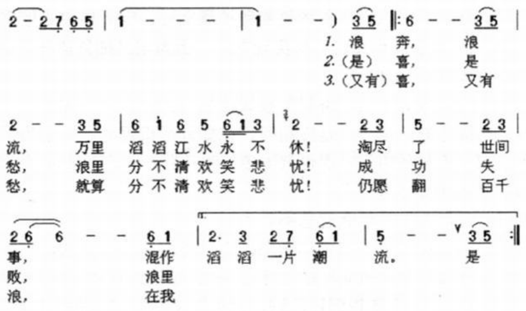
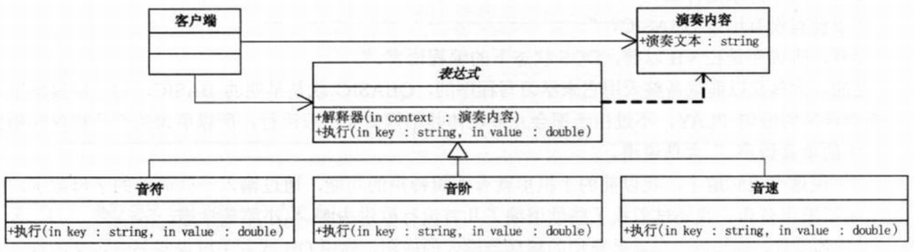

问题：老板找谈话，句句都有潜台词  
正则表达式：解释器为正则表达式定义了一个文法，如何表示一个特定的正则表达式，以及如何解释这个正则表达式

# 解释器模式
>Note:  
>$\quad\quad$`解释器模式(interpreter)`，给定一个语言，定义它的文法的一种表示，并定义一个解释器，这个解释器使用该表示来解释语言中的句子。

- 如果一种特定类型的问题发生的频率足够高，那么可能就值得将该问题的各个实例表述为一个简单语言中的句子。这样就可以构建一个解释器，该解释器通过解释这些句子来解决该问题

  
```c#
// AbstractExpression(抽象表达式)，声明一个抽象的解释操作，这个接口为抽象语法树中所有的节点所共享。
abstract class AbstractExpression
{
    public abstract void Interpret(Context context);
}
// TerminalExpression(终结符表达式)，实现与文法中的终结符相关联的解释操作。实现抽象表达式中所要求的接口，主要是一个interpret()方法。文法中每一个终结符都有一个具体终结表达式与之相对应。
class TerminalExpression : AbstractExpression
{
    public override void Interpret(Context context)
    {
        Console.WriteLine("终端解释器");
    }
}
// NonterminalExpression(非终结符表达式)，为文法中的非终结符实现解释操作。对文法中每一条规则R1、R2......Rn都需要一个具体的非终结符表达式类。通过实现抽象表达式的interpret()方法实现解释操作。解释操作以递归方式调用上面所提到的代表R1、R2......Rn中各个符号的实例变量
class NonterminalExpression : AbstractExpression
{
    public override void Interpret(Context context)
    {
        Console.WriteLine("非终端解释器");
    }
}
// Context，包含解释器之外的一些全局信息
class Context
{
    private string input;
    public string Input
    {
        get { return input; }
        set { input = value; }
    }

    private string output;
    public string Output
    {
        get { return output; }
        set { output = value; }
    }
}
// 客户端代码，构建表示该文法定义的语言中一个特定的句子的抽象语法树。调用解释作用
static void Main(string[] args)
{
    Context context = new Context();
    IList<AbstractExpression> list = new List<AbstractExpression>();
    list.Add(new TerminalExpression());
    list.Add(new NonterminalExpression());
    list.Add(new TerminalExpression());
    list.Add(new TerminalExpression());

    foreach(AbstractExpression exp in list)
    {
        exp.Interpret(context);
    }

    Console.Read();
}
```
解释器模式的好处：  
- 通常当有一个语言需要解释执行，并且你可将该语言中的句子表示为一个抽象语法树时，可使用解释器模式。
- 很容易改变和扩展文法，因为该模式使用类来表示文法规则，你可使用继承来改变或扩展该文法。
- 也比较容易实现文法，因为定义抽象语法树中各个节点的类的实现大体类似，这些类都易于直接编写。
- 不足：解释器模式为文法中的每一条规则至少定义了一个类，因此包含许多规则的文法可能难以管理和维护。建议当文法非常复杂时，使用其他的技术如语法分析程序或编译器生成器来处理。
  
#
要求：做一个小型的音乐解释器  
规则：'O'表示音阶，'O1'表示低音阶，'O2'表示中音阶，'O3'表示高音阶；'P'表示休止符，'C D E F G A B'表示 'Do-Re-Mi-Fa-So-La-Ti'；音符长度1表示一拍，2表示二拍，0.5表示半拍，0.25表示四分之一拍，以此类推；注意：所有的字母和数字都要用半角空格分开。  
例子：上海滩的歌曲第一句，‘浪奔’，可以写成'O2 E 0.5 G 0.5 A 3'表示中音开始，演奏的是mi so la。  
  
代码结构图：  
  
```c#
// 小菜的代码 --- version1.01
// 演奏内容类（context）
class PlayContext
{
    //演奏内容
    private string text;
    public string PlayText
    {
        get{ return text; }
        set{ text = value; }
    }
}
// 表达式类(AbstractExpression)
abstract class Expression
{
    // 解释器
    public void Interpret(PlayContext context)
    {
        if(context.PlayText.Length == 0)
        {
            return;
        }
        else
        {
            // 此方法用于将当前的演奏文本第一条命令获得命令字母和其参数值，例如“O 3 E 0.5 G 0.5 A 3”则playKey为O，而playValue为3
            string playKey = context.PlayText.Substring(0,1);
            context.PlayText = context.PLayText.Substring(2);
            double playValue = Convert.ToDouble(contextPlay.Substring(0,context.PlayText.IndexOf(" ")));
            context.PlayText = context.PlayText.Substring(context.PlayText.IndexOf(" ") + 1);

            // 获得playKey和 playValue后将其从演奏文本中移除。例如“O 3 E 0.5 G 0.5 A 3”变成了"E 0.5 G 0.5 A 3"
            Excute(playKey,playValue);
        }
    }
    // 执行 --- 抽象方法，不同的文法子类，有不同的执行处理
    public abstract void Excute(string key,double value);
}
// 音符类(TerminalExpression)
class Note : Expression
{
    public override void Excute(string key,double value)
    {
        string note = "";
        // 根据获得的key决定演奏音符
        switch(key)
        {
            case "C":
                note = "1";
                break;
            case "D":
                note = "2";
                break;
            case "E":
                note = "3";
                break;
            case "F":
                note = "4";
                break;
            case "G":
                note = "5";
                break;
            case "A":
                note = "6";
                break;
            case "B":
                note = "7";
                break;
        }
        Console.Write("{0} ",note);
    }
}
// 音阶类(TerminalExpression)
class Scale : Expression
{
    public override void Excute(string key,double value)
    {
        string scale = "";
        // 根据key和 value决定演奏哪个音阶
        switch(Convert.ToInt32(value))
        {
            case 1:
                scale = "低音";
                break;
            case 2:
                scale = "中音";
                break;
            case 3:
                scale = "高音";
                break;
        }
        Console.Write("{0} ",scale);
    }
}
// 再扩展新功能，要求T代表速度，以毫秒为单位，‘T 1000’表示每节拍1秒，‘T 500’表示每节拍半秒
// 音速类
class Speed : Expression
{
    public override void Excute(string key,double value)
    {
        string speed;
        if (value < 500)
            speed = "快速";
        else if (value >= 1000)
            speed = "慢速";
        else
            speed = "中速";
        Console.Write("{0} ",speed);
    }
}
// 客户端代码
static void Main(string[] args)
{
    PlayContext context = new PlayContext();
    // 音乐-上海滩
    Console.WriteLine("上海滩： ");
    context.PlayText = "T 500 O 2 E 0.5 G 0.5 A 3 E 0.5 G 0.5 D 3 E 0.5 G 0.5 A 0.5 O 3 C 1 O 2 A 0.5 G 1 C 0.5 E 0.5 D 3 ";
    Expression expression = null;
    try
    {
        while(context.PlayText.Length > 0)
        {
            string str = context.PlayText.Substring(0,1);
            // 当首字母是T时，则表达式实例化为音速；当首字段是O时，则表达式实例化为音阶；当首字母是 CDEFGAB，以及休止符P时，则实例化音符
            switch(str)
            {
                case "O":
                    expression = new Scale();
                    break;
                case "T":
                    expression = new Speed();
                    break;
                case "C":
                case "D":
                case "E":
                case "F":
                case "G":
                case "A":
                case "B":
                case "P":
                    expression = new Note();
                    break;
            }
            expression.Interpret(context);
        }
    }
    catch(Exception ex)
    {
        Console.WriteLine(ex.Message);
    }
    Console.Read();
}
/*
- 可重构该样例，使其在添加新功能时尽量不修改客户端代码
- 在此基础上可以模拟钢琴所有的演奏
*/
```
