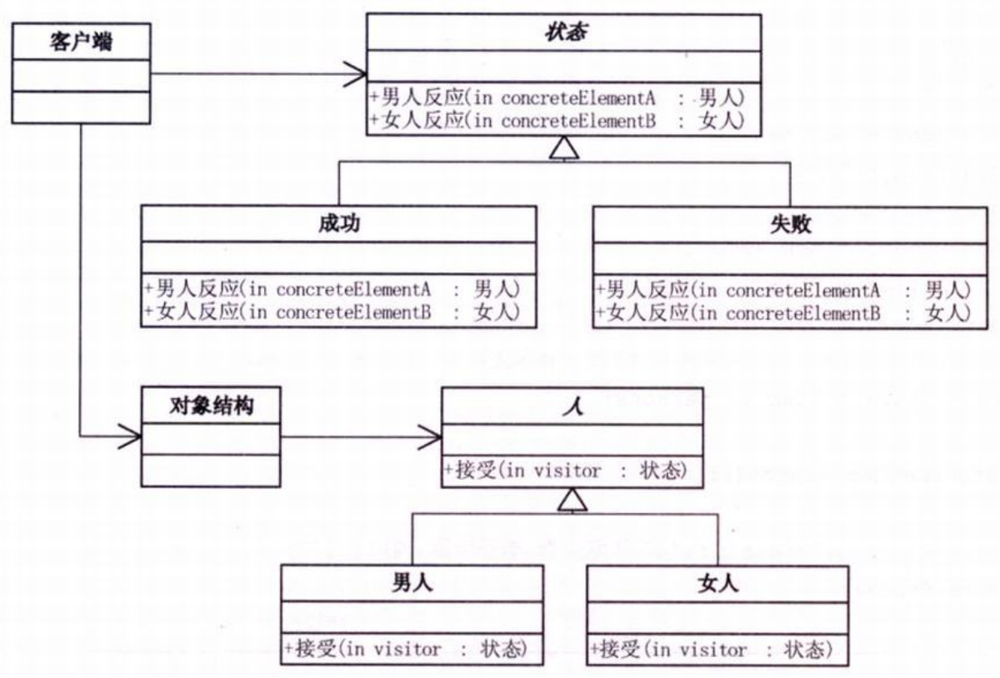
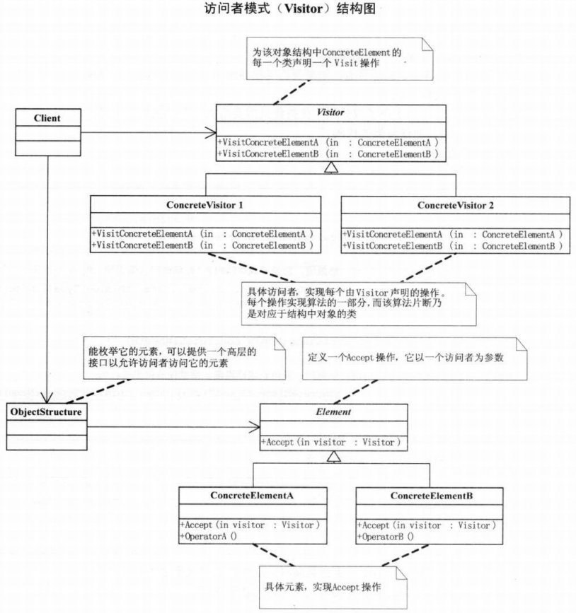

问题：男人与女人  

```c#
// 小菜的代码 --- version1.01
static void Main(string[] args)
{
    Console.WriteLine("男人成功时，背后多半有一个伟大的女人。");
    Console.WriteLine("女人成功时，背后大多有一个不成功的男人。");
    Console.WriteLine("男人失败时，闷头喝酒，谁也不用劝。");
    Console.WriteLine("女人失败时，眼泪汪汪，谁也劝不了。");
    Console.WriteLine("男人恋爱时，凡事不懂也要装懂。");
    Console.WriteLine("女人恋爱时，遇事懂也装作不懂。");

    console.Read();
}
/*
- 简单print，不具复用意义
*/
```
```c#
// 小菜的代码 --- version1.02
abstract class Person
{
    protected string action;
    public string Action
    {
        get { return action; }
        set { action = value; }
    }
    // 得到结论或反应
    public abstract void GetConclusion();
}
// 男人类
class Man : Person
{
    // 得到结论或反应
    public override void GetConclusion()
    {
        if (action == "成功")
        {
            Console.WriteLine("{0}{1}时，背后多半有一个伟大的女人。",this.GetType().Name,action);   // this.GetType().Name是获得当前类的名称，比如这里就是'男人'
        }
        else if (action == "失败")
        {
            Console.WriteLine("{0}{1}时，闷头喝酒，谁也不用劝。",this.GetType().Name,action);
        }
        else if (action == "恋爱")
        {
            Console.WriteLine("{0}{1}时，凡事不懂也要装懂。",this.GetType().Name,action);
        }
    }
}
// 女人类
class Woman : Person
{
    // 得到结论或反应
    public override void GetConclusion()
    {
        if (action == "成功")
        {
            Console.WriteLine("{0}{1}时，背后大多有一个不成功的男人。",this.GetType().Name,action);
        }
        else if (action == "失败")
        {
            Console.WriteLine("{0}{1}时，眼泪汪汪，谁也劝不了。",this.GetType().Name,action);
        }
        else if (action == "恋爱")
        {
            Console.WriteLine("{0}{1}时，遇事懂也装作不懂。",this.GetType().Name,action);
        }
    }
}
// 客户端代码
static void Main(string[] args)
{
    IList<Person> persons = new List<Person>();

    Person man1 = new Man();
    man1.Action = "成功";
    persons.Add(man1);
    Person woman1 = new Woman();
    woman1.Action = "成功";
    persons.Add(woman1);

    Person man2 = new Man();
    man2.Action = "失败";
    persons.Add(man2);
    Person woman2 = new Woman();
    woman2.Action = "失败";
    persons.Add(woman2);

    Person man3 = new Man();
    man3.Action = "恋爱";
    persons.Add(man3);
    Person woman3 = new Woman();
    woman3.Action = "恋爱";
    persons.Add(woman3);

    foreach(Person item in persons)
    {
        item.GetConclusion();
    }

    Console.Read();
}
/*
- 简单的面向对象实现
*/
```
引入模式的代码结构图：  
  
```c#
// 大鸟的代码 --- version1.01
// ‘状态’抽象类和‘人’抽象类
abstract class Action
{
    // 得到男人结论或反应
    public abstract void GetManConclusion(Man concreteElementA);
    // 得到女人结论或反应
    public abstract void GetWomanConclusion(Woman concreteElementB);
}
abstract class Person
{
    // 接受
    public abstract void Accept(Action visitor);    // visitor用来获得‘状态’对象
}
// 具体‘状态’类
// 成功
class Success : Action
{
    public override void GetManConclusion(Man concreteElementA)
    {
        Console.WriteLine("{0}{1}时，背后多半有一个伟大的女人。",concreteElementA.GetType().Name,this.GetType().Name);
    }

    public override void GetWomanConclusion(Woman concreteElementB)
    {
        Console.WriteLine("{0}{1}时，背后大多有一个不成功的男人。",concreteElementB.GetType().Name,this.GetType().Name);
    }
}
// 失败
class Failing : Action
{
    public override void GetManConclusion(Man concreteElementA)
    {
        Console.WriteLine("{0}{1}时，闷头喝酒，谁也不用劝。",concreteElementA.GetType().Name,this.GetType().Name);
    }

    public override void GetWomanConclusion(Woman concreteElementB)
    {
        Console.WriteLine("{0}{1}时，眼泪汪汪，谁也劝不了。",concreteElementB.GetType().Name,this.GetType().Name);
    }
}
// 恋爱
class Amativeness : Action
{
    public override void GetManConclusion(Man concreteElementA)
    {
        Console.WriteLine("{0}{1}时，凡事不懂也要装懂。",concreteElementA.GetType().Name,this.GetType().Name);
    }

    public override void GetWomanConclusion(Woman concreteElementB)
    {
        Console.WriteLine("{0}{1}时，遇事懂也装作不懂。",concreteElementB.GetType().Name,this.GetType().Name);
    }
}
// 结婚
class Marriage : Action
{
    public override void GetManConclusion(Man concreteElementA)
    {
        Console.WriteLine("{0}{1}时，感慨道：恋爱游戏终结时，‘有妻徒刑’遥无期。",concreteElementA.GetType().Name,this.GetType().Name);
    }

    public override void GetWomanConclusion(Woman concreteElementB)
    {
        Console.WriteLine("{0}{1}时，欣慰曰：爱情长跑路漫漫，婚姻保险保平安。",concreteElementB.GetType().Name,this.GetType().Name);
    }
}
// ‘男人’类和‘女人’类
// 男人
class Man : Person
{
    public override void Action(Action visitor)
    {
        // 首先在客户程序中将具体状态作为参数传递给“男人”类完成了一次分派，然后“男人”类调用作为参数的“具体状态”中的方法“男人反应”，同时将自己(this)作为参数传递进去。这便完成了第二次分派 --- 双分派意味着得到执行的操作决定于请求的种类和两个接收者的类型。‘接受’方法就是一个双分派的操作，它得到执行的操作不仅取决于‘状态’类的具体状态，还取决于它访问的‘人’的类别
        visitor.GetManConclusion(this);
    }
}
// 女人
class Woman : Person
{
    public override void Accept(Action visitor)
    {
        visitor.GetWomanConclusion(this);
    }
}
// 对象结构类 --- 由于总是需要‘男人’和‘女人’在不同状态的对比，所以我们需要一个‘对象结构’类来针对不同的‘状态’遍历‘男人’和‘女人’，得到不同的反应。
class ObjectStructure
{
    private IList<Person> elements = new List<Person>();
    // 增加
    public void Attach(Person element)
    {
        elements.Add(element);
    }
    // 移除
    public void Detch(Person element)
    {
        elements.Remove(element);
    }
    // 查看显示
    public void Display(Action visitor)
    {
        // 遍历方法
        foreach(Person e in elements)
        {
            e.Accept(visitor);
        }
    }
}
// 客户端代码
static void Main(string[] args)
{
    ObjectStructure o = new ObjectStructure();
    // 在对象结构中加入要对比的“男人”和“女人”
    o.Attach(new Man());
    o.Attach(new Woman());

    // 成功时的反应
    Success v1 = new Success();
    // 查看在各种状态下，“男人”和“女人”的反应
    o.Display(v1);

    // 失败时的反应
    Failing v2 = new Failing();
    o.Display(v2);

    // 恋爱时的反应
    Amativeness v3 = new Amativeness();
    o.Display(v3);

    // 结婚时的反应
    Marriage v4 = new Marriage();
    o.Display(v4);

    Console.Read();
}
/*
- 使用双分派，只需添加具体状态子类即可，不需要改动其他代码
*/
```
# 访问者模式
>Note:  
>$\quad\quad$`访问者模式(Visitor)`，表示一个作用于某对象结构中的各元素的操作。它使你可以在不改变各元素的类的前提下定义作用于这些元素的新操作。  

  
```c#
// Visitor类，为该对象结构中ConcreteElement 的每一个类声明一个Visit操作
abstract class Visitor
{
    public abstract void VisitConcreteElementA(ConcreteElementA concreteElementA);
    public abstract void VisitConcreteElementB(ConcreteElementB concreteElementB);
}
// ConcreteVisitor1和 ConcreteVisitor2类，具体访问者，实现每个由Visitor声明的操作。每个操作实现算法的一部分，而该算法片段乃是对应于结构中对象的类。
class ConcreteVisitor1 : Visitor
{
    public override void VisitorConcreteElementA(ConcreteElementA concreteElementA)
    {
        Console.WriteLine("{0}被{1}访问",concreteElementA.GetType().Name,this.GetType().Name);
    }

    public override void VisitorConcreteElementB(ConcreteElementB concreteElementB)
    {
        Console.WriteLine("{0}被{1}访问",concreteElementB.GetType().Name,this.GetType().Name);
    }
}
class ConcreteVisitor2 : Visitor
{
    public override void VisitorConcreteElementA(ConcreteElementA concreteElementA)
    {
        Console.WriteLine("{0}被{1}访问",concreteElementA.GetType().Name,this.GetType().Name);
    }

    public override void VisitorConcreteElementB(ConcreteElementB concreteElementB)
    {
        Console.WriteLine("{0}被{1}访问",concreteElementB.GetType().Name,this.GetType().Name);
    }
}
// Element类，定义一个Accept操作，它以一个访问者为参数
abstract class Element
{
    public abstract void Accept(Visitor visitor);
}
// ConcreteElementA和 ConcreteElementB类，具体元素，实现Accept操作
class ConcreteElementA : Element
{
    // 充分利用双分派技术，实现处理与数据结构的分离
    public override void Accept(Visitor visitor)
    {
        visitor.VisitConcreteElementA(this);
    }
    // 其他相关方法
    public void OperationA()
    { }
}
class ConcreteElementB : Element
{
    public override void Accept(Visitor visitor)
    {
        visitor.VisitConcreteElementB(this);
    }

    public void OperationB()
    { }
}
// ObjectStructure类，能枚举它的元素，可以提供一个高层的接口以允许访问者访问它的元素
class ObjectStructure
{
    private IList<Element> elements = new List<Element>();

    public void Attach(Element element)
    {
        elements.Add(element);
    }
    public void Detach(Element element)
    {
        elements.Remove(element);
    }
    public void Accept(Visitor visitor)
    {
        foreach (Element e in elements)
        {
            e.Accept(visitor);
        }
    }
}
// 客户端代码
static void Main(string[] args)
{
    ObjectStructure o = new ObjectStructure();
    o.Attach(new ConcreteElementA());
    o.Attach(new ConcreteElementB());

    ConcreteVisitor1 v1 = new ConcreteVisitor1();
    ConcreteVisitor1 v1 = new ConcreteVisitor1();

    o.Attach(v1);
    o.Attach(v2);

    Console.Read();
}
```
- 访问者模式适用于数据结构相对稳定的系统  
- 它把数据结构和作用于结构上的操作之间的耦合解脱开，使得操作集合可以相对自由地演化  
- 访问者模式的目的是要把处理从数据结构分离出来  
- 有比较稳定的数据结构，又有易于变化的算法时，使用访问者模式就是比较合适的，因为访问者模式使得算法操作的增加变得容易  
- 访问者模式的优点就是增加新的操作很容易，因为增加新的操作就意味着增加一个新的访问者。  
- 访问者模式将有关的行为集中到一个访问者对象中
- 访问者的缺点是使增加新的数据结构变得困难了