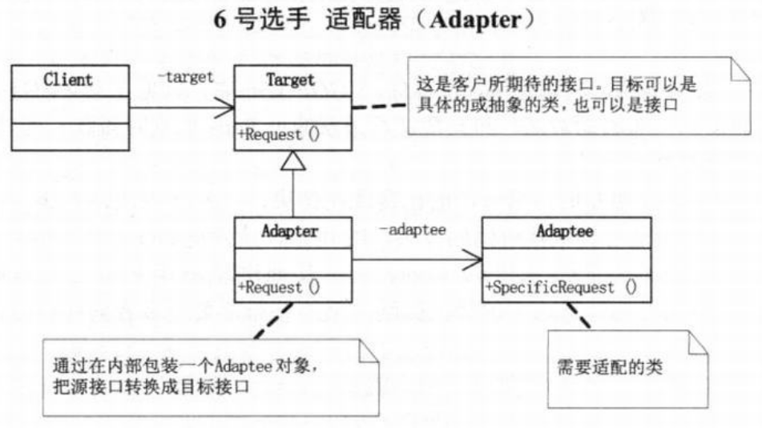
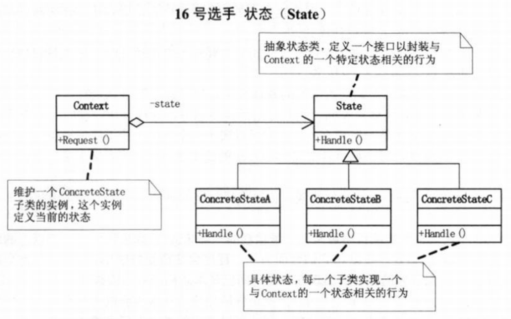

工厂三姐妹：简单工厂 --- 不符合开放-封闭原则、工厂方法、抽象工厂
面向对象OO，封装变化区域 --- 可维护、可扩展、可复用、灵活性好
结构化编程，即面向过程式的编程，业务流程易变性
抽象、封装、继承、多态
设计模式六大原则：单一职责、开放封闭、依赖倒转、里氏代换、合成聚合复用、迪米特法则

# 创建型模式
- 抽象工厂：提供一个创建一系列或相关依赖对象的接口，而无需指定它们具体的类  
  
- 建造者：将一个复杂对象的构建与它的表示分离，使得同样的构建过程可以创建不同的表示  
  
- 工厂方法：定义一个用于创建对象的接口，让子类决定实例化哪一个类，工厂模式使一个类的实例化延迟到其子类  
  
- 原型：用原型实例指定创建对象的种类，并且通过拷贝这些原型创建新的对象  
  
- 单例：保证一个类仅有一个实例，并提供一个访问它的全局访问点  
  
- `创建型模式`隐藏了这些类的实例是如何被创建和放在一起，这个系统关于这些对象所知道的是由抽象类所定义的接口。这样，创建型模式在创建了什么、谁创建它、它是怎么被创建的，以及何时创建这些方面提供了很大的灵活性  
- 建立相应数目的原型并克隆它们通常比每次用合适的状态手工实例化该类要方便一些
- `内聚性`描述的是一个例程内部组成部分之间相互联系的紧密程度
- `耦合性`描述的是一个例程与其他例程之间联系的紧密程度
- 软件开发的目标应该是创建这样的例程：内部完整，也就是高内聚，而与其他例程之间的联系则是小巧、直接、可见、灵活的，这就是松耦合
- 将一个复杂对象的构建与它的表示分离，用同样的构建过程创建不同的产品给客户，这是建造者模式在松耦合上的策略
- 对一些类来说，一个实例是很重要的。让类自身负责保存它的唯一实例。这个类可以保证没有其他实例可以被创建，并且提供了一个访问该实例的方法。对唯一的实例可以严格地控制客户怎样以及何时访问它，这是单例模式的优势
- 创建型模式抽象了实例化的过程。它们帮助一个系统独立于如何创建、组合和表示它的那些对象。创建型模式都会将关于该系统使用哪些具体的类的信息封装起来。允许客户用结构和功能差别很大的‘产品’对象配置一个系统。配置可以是静态的，即在编译时指定，也可以是动态的，就是运行时再指定
- 在创建对象时，使用抽象工厂、原型、建造者的设计比使用工厂方法要更灵活，通常设计模式从工厂方法开始，当设计者发现需要`更大的灵活性`时，设计便会`向其他创建型模式演化`。当设计者在设计标准之间进行权衡的时候，了解多个创建型模式可以给设计者更多的选择余地
# 结构型模式
- 适配器：将一个类的接口转换成客户希望的另外一个接口。适配器模式使得原本由于接口不兼容而不能一起工作的那些类可以一起工作  
  
- 桥接：将抽象部分与它的实现部分分离，使它们都可以独立地变化  
  
- 组合：将对象组合成树形结构以表示‘部分-整体’的层次结构，组合模式使得用户对单个对象和组合对象的使用具有一致性  
  
- 装饰：动态地给一个对象添加一些额外的职责，就添加功能来说，装饰模式相比生成子类更加灵活  
  
- 外观：为子系统中的一组接口提供一个一致的界面，外观模式定义了一个高层接口，这个接口使得这一子系统更加容易使用  
  
- 享元：为运用共享技术有效地支持大量细粒度的对象  
  
- 代理：为其他对象提供一种代理以控制对这个对象的访问  
  
- 想使用于各已经存在的类，而它的接口不符合要求，或者希望创建一个可以复用的类，该类可以与其他不相关的类或不可预见的类协同工作。适配器模式让这些借口不通的类通过适配后，协同工作
- 桥接模式解偶不同方向的变化，通过对象组合的方式，把两个角色之间的继承关系改为了组合的关系，从而使这两者可以应对各自独立的变化，‘找出变化并封装之’
- 装饰模式以动态、透明的方式给单个对象添加职责
- 组合模式使客户可以一致地使用组合结构和单个对象。任何用到基本对象的地方都可以使用组合对象
- 信息的隐藏促进了软件的复用 --- 如果两个类不必彼此直接通信，那么就不要让这两个类发生直接的相互作用
- 外观模式让一个软件中的子系统间的通信和相互依赖关系达到最小，而具体办法就是引用一个外观对象，它为子系统间提供了一个单一而简单的屏障
- 对象使得内存占用过多，而且如果都是大量重复的对象，那就是资源的极大浪费。享元模式旨在解决这种情况
- 代理与外观的主要区别在于，代理对象代表一个单一对象而外观对象代表一个子系统；代理的客户对象无法直接访问目标对象，由代理提供对单独的目标对象的访问控制，而外观的客户对象可以直接访问子系统中的各个对象，但通常由外观对象提供对子系统各元件功能的简化的共同层次的调用接口
- 代理是一种原来对象的代表，其他需要与这个对象打交道的操作都是和这个代表交涉。而适配器则不需要虚构出一个代表者，只需要为应对特定使用目的，将原来的类进行一些组合
- 适配器模式主要是为了解决两个已有接口之间不匹配的问题，不需要考虑这些接口是怎样实现的，也不考虑它们各自可能会如何演化。这种方式不需要对两个独立设计的类中任一个进行重新设计，就能够使它们协同工作
# 行为型模式组一
- 观察者：定义对象间的一种一对多的依赖关系，当一个对象的状态发生改变时，所有依赖于它的对象都得到通知并被自动更新  
  
- 模板方法：定义一个操作的算法骨架，而将一些步骤延迟到子类中，模板方法使得子类可以不改变一个算法的结构即可重定义该算法的某些特定步骤  
  
- 命令：将一个请求封装为一个对象，从而使你可用不同的请求对客户进行参数化；可以对请求排队或记录请求日志，以及支持可撤销的操作  
  
- 状态：允许一个对象在其内部状态改变时改变它的行为，让对象看起来似乎修改了它的类  
  
- 职责链：使多个对象都有机会处理请求，从而避免请求的发送者和接收者之间的耦合关系。将这些对象连成一条链，并沿着这条链传递该请求，直到有一个对象处理它为止  
  
- 代码重复是编程中最最常见、最糟糕的’坏味道‘，如果我们在一个以上的地方看到相同的程序结构，那么可以肯定，设法将它们合二为一，程序会变得更好。完全相同的代码当然存在明显的重复，而微妙的重复会出现在表面不同但是本质相同的结构或处理步骤中。模板方法模式由一个抽象类组成，这个抽象类定义了需要覆盖的可能有不同实现的模板方法，每个从这个抽象类派生的具体类将为此模板实现新方法
- 命名模式将调用操作的对象与知道如何实现该操作的对象解耦，可以在不同的时刻指定、排列和执行请求，支持取消/重做的操作，记录整个操作的日志，支持事务
- 当有多个对象可以处理一个请求，哪个处理对象该请求实现并不知道，要在运行时刻自动确定时，职责链模式让客户在不明确指定接收者的情况下，提交一个请求，然后由所有能处理这请求的对象连成一条链，并沿着这条链传递该请求，直到有一个对象处理它为止
- 状态模式提供了一个更好的办法来组织与特定状态相关的代码，决定状态转移的逻辑不在单块的if或switch中，而是分布在各个状态子类之间，由于所有与状态相关的代码都存在于某个状态子类中，所以通过定义新的子类可以很容易地增加新的状态和转换
- MVC是包括三类对象，Model是应用对象，View是它在屏幕上的表示，Controller定义用户界面对用户输入的响应方式。如果不使用MVC，则用户界面设计往往将这些对象混在一起，而MVC则将它们分离以提高灵活性和复用性（集观察者、组合、策略三大模式优点于一身）。MVC是多种模式的综合应用，应该算是一种架构模式

# 行为型模式组二
- 解释器：给定一个语言，定义它的文法的一种表示，并定义一个解释器，这个解释器使用该表示来解释语言中的句子  
  
- 中介者：用一个中介对象来封装一系列的对象交互。中介者使各对象不需要显式地相互引用，从而使其耦合松散，而且可以独立地改变它们之间的交互  
  
- 访问者：表示一个作用于某对象结构中的各元素的操作。它使你可以在不改变各元素的类的前提下定义作用于这些元素的新操作  
  
- 策略：定义一系列的算法，把它们一个个封装起来，并且使它们可相互替换。本模式使得算法可独立于使用它的客户而变化  
  
- 备忘录：在不破坏封装性的前提下，捕获一个对象的内部状态，并在该对象之外保存这个状态。这样以后就可将该对象恢复到原先保存的状态  
  
- 迭代器：提供一种方法顺序访问一个聚合对象中各个元素，而又不需要暴露该对象的内部表示  
  
- 如果一种特定类型的问题发生的频率足够高，那么就可以考虑将该问题的各个实例表述为一个简单语言中的句子。也就是说，通过构建一个解释器，该解释器解释这些句子来解决该问题。
- 面向对象设计鼓励将行为分布到各个对象中，这种分布可能会导致对象间有许多连接。也就是说，有可能每一个对象都需要知道其他许多对象。对象间的大量相互连接使得一个对象似乎不太可能在没有其他对象的支持下工作，这对于应对变化是不利的，任何较大的改动都很困难。中介者模式提倡将集体行为封装一个单独的中介者对象来避免这个问题，中介者负责控制和协调一组对象间的交互。中介者充当一个中介以使组中的对象不再相互显式引用。这些对象仅知道中介者，从而减少了相互连接的数目
- 最少知识原则，也就是如何减少耦合的问题，类之间的耦合越弱，越有利于复用
- 访问者增加具体的Element是困难的，但增加依赖于复杂对象结构的构件的操作就变得容易。仅需添加一个新的访问者即可在一个对象结构上定义一个新的操作
- 继承提供了一种支持多种算法或行为的方法，我们可以直接生成一个类A的子类B、C、D，从而给它以不同的行为。但这样会将行为硬性编制到父类A当中，而将算法的实现与类A的实现混合起来，从而使得类A难以理解、难以维护和难以扩展，而且还不能动态地改变算法。仔细分析会发现，它们之间的唯一差别是它们所使用的算法或行为，将算法封装在独立的策略Strategy类中使得你可以独立于其类A改变它，使它易于切换、易于理解、易于扩展
- 使用备忘录可以避免暴露一些只应由对象A管理却又必须存储在对象A之外的信息。备忘录模式把可能很复杂的对象A的内部信息对其他对象屏蔽起来，从而保持了封装边界
- 迭代器模式的关键思想是将对列表的访问和遍历从列表对象中分离出来并放入一个迭代器对象中，迭代器类定义了一个访问该列表元素的接口。迭代器对象负责跟踪当前的元素，并且知道哪些元素已经遍历过了
# 决赛
  
- 只要是在做面向对象的开发，创建对象的工作不可避免。创建对象时，负责创建的实体通常需要了解要创建的是哪个具体的对象，以及何时创建这个而非那个对象的规则。而我们如果希望遵循开放-封闭原则、依赖倒转原则和里氏代换原则，那使用对象时，就不应该知道所用的是哪一个特选的对象。此时就需要‘对象管理者’工厂来负责此事
- 工厂方法的实现并不能减少工作量，但是它能够在必须处理新情况时，避免使已经很复杂的代码更加复杂
- 面向对象设计模式体现的就是抽象的思想，类是对对象的抽象，抽象类是对类的抽象，接口是对行为的抽象