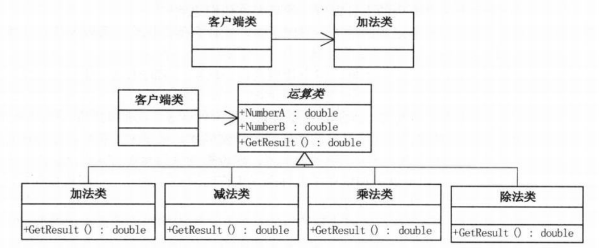

问题：考研求职两不误（类比一国两制）  
>Note:  
>$\quad\quad$`开放-封闭原则（OCP）`，是说软件实体（类、模块、函数等等）应该可以扩展，但是不可修改。对于扩展是开放的（Open for extension），对于更改是封闭的（Closed for modification）

- 指望待开发的系统一开始时就需求确定是不现实也不科学的，怎样的设计才能面对需求的改变却可以保持相对稳定，从而使得系统可以在第一个版本以后不断推出新的版本，才是要考虑的重点  

# 工作时间的设定
- 不能迟到，又要考虑到家的远近、交通是否拥堵等客观因素。
- 设定时间制度的最终目标是业绩目标的完成或超额完成。
- 弹性上班工作制（早到早下班，晚到晚下班），或者每人每月限制最大迟到次数，迟到者当天下班补时间等等。
- 体现了对工作时间或业绩成效的修改关闭，而对时间制度扩展的开放。

问题：无论模块是多么的‘封闭’，都会存在一些无法对之封闭的变化。既然不可能完全封闭，设计人员必须对于他设计的模块`应该对哪种变化封闭做出选择`。
- 他必须先猜测出最有可能发生的变化种类，然后构造抽象来隔离那些变化。
- 等到变化发生时立即采取行动。
- 在我们最初编写代码时，假设变化不会发生。当变化发生时，我们就创建抽象来隔离以后发生的同类变化。
- `面对需求，对程序的改动是通过增加新代码进行的，而不是更改现有的代码！！`--->第一章计算器的例子
  
- 我们希望的是在开发工作展开不久就知道可能发生的变化。`查明可能发生的变化所等待的时间越长，要创建正确的抽象就越困难。`
>Note:  
>$\quad\quad$`开放-封闭原则`是面向对象设计的核心所在。遵循这个原则可以带来面向对象技术所声称的巨大好处，也就是`可维护、可扩展、可复用、灵活性好`。开发人员应该仅对程序中呈现出频繁变化的那些部分做出抽象，然而，对于应用程序中的每个部分都刻意地进行抽象同样不是一个好主意。`拒绝不成熟的抽象和抽象本身一样重要。`