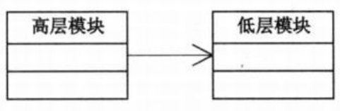
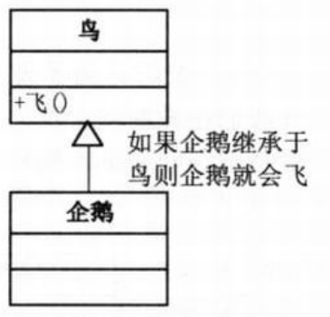
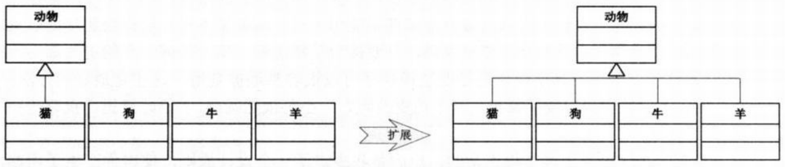
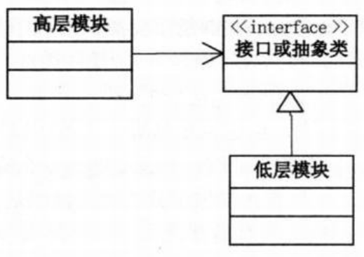

问题：会修电脑不会修收音机？  
- PC机可以理解成一个巨大的系统，由各个部件如CPU、内存、硬盘、显卡等组成。
- PC易插拔，不管哪个出问题，都可以在不影响别的部件的前提下进行修改或替换<-->面向对象高内聚、低耦合。
- 接口的好处：CPU的对外都是针脚式或触点式等标准的接口。只要把接口定义好，内部再复杂也不需要让外界知道，而主板只需要预留与CPU针脚的插槽就可以了。
- 面向对象的设计原则：
  - 单一职责原则：内存坏了，无须更换CPU，因为各自的职责是明确的。
  - 开放-封闭原则：内存不够只要插槽足够就可以添加了，硬盘不够可以用移动硬盘等。
  - 依赖倒转原则：无论主板、CPU、内存、硬盘都是在针对接口设计的。
>Note:  
>$\quad\quad$`依赖倒转原则`：  
>$\quad\quad\quad\quad$A.高层模块不应该依赖低层模块。  
>$\quad\quad\quad\quad$B.抽象不应该依赖细节。细节应该依赖抽象。/针对接口编程，不要对实现编程。  

面向过程的开发时，为了使得常用代码可以复用，一般都会把这些常用代码写成许许多多函数的程序库。高层模块依赖低层模块。  
  
但是这些高层模块的可复用性因调用低层模块而受到限制，希望的是高层模块和低层模块都依赖于抽象（接口或抽象类）。  
一个软件实体如果使用的是一个父类的话，那么一定适用于其子类，而且它察觉不出父类对象和子类对象的区别。也就是说，在软件里面，把父类都替换成它的子类，程序的行为没有变化。
>Note:  
>$\quad\quad$`里氏代换原则(LSP)`：子类型必须能够替换掉它们的父类型。  

按照里氏代换原则，会有以下内容成立：  
  
因此企鹅不能继承自鸟类（和直觉认知不同，直觉会将鸵鸟、企鹅等不会飞的动物也归为鸟类）  
--->只有当子类可以替换掉父类，软件单位的功能不受到影响时，父类才能真正被复用，而子类也能够在父类的基础上增加新的行为。  
  
```c#
// 需求的变化，使得需要将“猫”更换成“狗”、“牛”、“羊”等别的动物，程序其他地方不需要改变
动物 animal = new 猫();
animal.吃();
animal.喝();
animal.跑();
animal.叫();
```
由于子类型的可替换性才使得使用父类类型的模块在无需修改的情况下就可以扩展。  
  
依赖倒转其实可以说是面向对象设计的标志，用哪种语言来编写程序不重要，如果编写时考虑的都是如何针对抽象编程而不是针对细节编程，即`程序中所有的依赖关系都是终止于抽象类或者接口`，那就是面向对象的设计，反之那就是过程化的设计了。