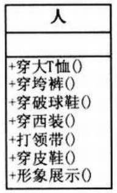
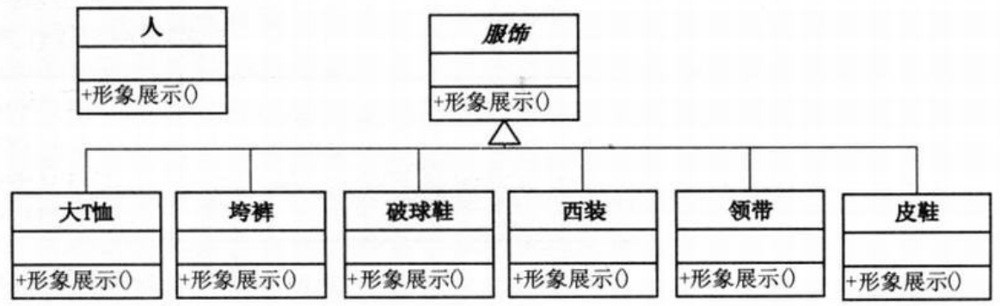
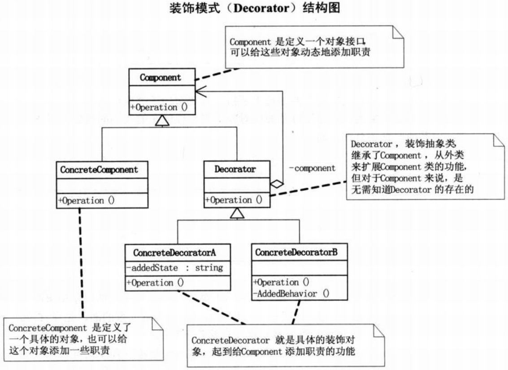
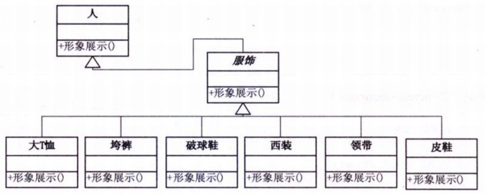

问题：约会穿什么。要求写一个可以给人搭配不同服饰的系统，比如类似QQ、网络游戏或者论坛都有的Avatar系统（个人形象系统）。
第一版结构图：  
  
```c#
// 小菜的代码 --- version1.01
// "Person"类
class Person
{
    private string name;
    public Person(string name)
    {
        this.name = name;
    }

    public void WearTShirts()
    {
        Console.Write("大T恤");
    }

    public void WearBigTrouser()
    {
        Console.Write("垮裤");
    }

    public void WearSneakers()
    {
        Console.Write("破球鞋");
    }

    public void WearSuit()
    {
        Console.Write("西装");
    }

    public void WearTie()
    {
        Console.Write("领带");
    }

    public void WearLeatherShoes()
    {
        Console.Write("皮鞋");
    }

    public void Show()
    {
        Console.WriteLine("装扮的{0}",name);
    }
}

// 客户端代码
static void Main(string[] args)
{
    Person xc = new Person("小菜");

    Console.WriteLine("\n第一种装扮： ");

    xc.WearTShirts();
    xc.WearBigTrouser();
    xc.WearSneakers();
    xc.Show();

    Console.WriteLine("\n第二种装扮： ");
    xc.WearSuit();
    xc.WearTie();
    xc.WearLeatherShoes();
    xc.Show();

    Console.Read();
}
/*
- 完成了基本功能
- 当需要添加新的装扮时，需要修改Person类，违背了开放-封闭原则
*/
```
第二版结构图：  
  
```c#
// 小菜的代码 --- version1.02
// Person类
class Person
{
    private string name;
    public Person(string name)
    {
        this.name = name;
    }

    public void show()
    {
        Console.WriteLine("装扮的{0}",name);
    }
}
// 服饰抽象类
abstract class Finery
{
    public abstract void Show();
}
// 各种服饰子类
// 大T恤
class TShirts : Finery
{
    public override void Show()
    {
        Console.Write("大T恤");
    }
}
// 垮裤
class BigTrouser : Finery
{
    public override void Show()
    {
        Console.Write("垮裤");
    }
}
// 其余类类似，省略
// ......
// 客户端代码
static void Main(string[] args)
{
    Person xc = new Person("小菜");
    Console.WriteLine("\n第一种装饰： ");
    Finery dtx = new TShirts();
    Finery kk = new BigTrouser();
    Finery pqx = new Sneakers();

    dtx.Show();
    kk.Show();
    pqx.Show();
    xc.Show();

    Console.WriteLine("\n第二种装饰： ");
    Finery xz = new Suit();
    Finery ld = new Tie();
    Finery px = new LeatherShoes();

    xz.Show();
    ls.Show();
    px.Show();
    xc.Show();

    Console.Read();
}
/*
- 使用了抽象类和继承
- 先后顺序很重要（先穿内裤后穿外裤叫凡人，内裤外穿就是超人了），需要把所需的功能按正确的顺序串联起来进行控制
*/
```
# 装饰模式
>Note:  
>$\quad\quad$`装饰模式（Decorator）`,动态地给一个对象添加一些额外的职责，就增加功能来说，装饰模式比生成子类更为灵活。

装饰模式结构图：  
  
- Component是定义一个对象接口，可以给这些对象动态地添加职责。
- ConcreteComponent是定义了一个具体的对象，也可以给这个对象添加一些职责。
- Decorator,装饰抽象类，继承了Component,从外类来扩展Component类的功能，但对于Component来说，是无须知道Decorator的存在的。
- ConcreteDecorator是具体的装饰对象，起到给Component添加职责的功能。
```c#
// Component类
abstract class Component
{
    public abstract void Operation();
}
// ConcreteComponent类
class ConsreteComponent : Component
{
    public override void Operation()
    {
        Console.WriteLine("具体对象的操作");
    }
}
// Decorator类
abstract class Decorator : Component
{
    protected Component component;

    public void SetComponent(Component component)
    {
        this.component = component; // 设置Component
    }

    public override void Operation()
    {
        if(component != null)
        {
            component.Operation();  // 重写Operation()，实际执行的是Component的Operation()
        }
    }
}
// ConcreteDecoratorA类
class ConcreteDecoratorA : Decorator
{
    private string addedState;  // 本类的独有功能，以区别于ConcreteDecoratorB

    public override void Operation()
    {
        // 首先运行原Component的Operation(),再执行本类的功能，如addedState,相当于对原Component进行了装饰。
        base.Operation();
        addedState = "New State";
        Console.WriteLine("具体装饰对象A的操作");
    }
}
// ConcreteDecoratorB类
class ConcreteDecoratorB : Decorator
{
    public override void Operation()
    {
        // 首先运行原Component的Operation(),再执行本类的功能，如AddedBehavior(),相当于对原Component进行了装饰。
        base.Operation();
        AddedBehavior();
        Console.WriteLine("具体装饰对象B的操作");
    }

    private void AddedBehavior()
    {
        // 本类独有的方法，以区别于ConcreteDecoratorA
    }
}
// 客户端代码
static void Main(string[] args)
{
    ConcreteComponent c = new ConcreteComponent();
    ConcreteDecoratorA d1 = new ConcreteDecoratorA();
    ConcreteDecoratorB d2 = new ConcreteDecoratorB();

    // 装饰的方法是：首先用ConcreteComponent实例化对象c，然后用ConcreteDecoratorA的实例化对象d1来包装c，再用ConcreteDecoratorB的对象d2包装d1，最终执行d2的Operation()
    d1.SetComponent(c);
    d2.SetComponent(d1);
    d2.Operation();

    Console.Read();
}
/*
- 装饰模式是利用SetComponent来对对象进行包装。每个装饰对象的实现就和如何使用这个对象分离开了，每个装饰对象只关心自己的功能，不需要关心如何被添加到对象链当中。
- 如果只有一个ConcreteComponent类而没有抽象的Component类，那么Decorator类可以是ConreteComponent的一个子类。同样道理，如果只有一个ConcreteDecorator类，那么就没有必要建立一个单独的Decrator类，而可以把Decorator和ConcreteDecorator的责任合并成一个类。
*/
```
#
第三版结构图：  
  
```c#
// “Person”类（ConcreteComponent）
class Person
{
    public Person()
    { }

    private string name;
    public Person(string name)
    {
        this.name = name;
    }

    public virtual void Show()
    {
        Console.WriteLine("装饰的{0}",name);
    }
}
// 服饰类（Decorator）
class Finery : Person
{
    protected Person component;

    // 打扮
    public void Decorator(Person component)
    {
        this.component = component;
    }

    public override void Show()
    {
        if(component != null)
        {
            component.Show();
        }
    }
}
// 具体服饰类（ConcreteDecorator）
class TShirts : Finery
{
    public override void Show()
    {
        Console.Write("大T恤");
        base.Show();
    }
}
class BigTrouser : Finery
{
    public override void Show()
    {
        Console.Write("垮裤");
        base.Show();
    }
}
// 其余类类似，省略
// ......
// 客户端代码
static void Main(string[] args)
{
    Person xc = new Person("小菜");

    Console.WriteLine("\n第一种装扮： ");

    Sneakers pqx = new Sneakers();
    BigTrousers kk = new BigTrousers();
    TShirts dtx = new TShirts();

    // 装饰过程
    pqx.Decorate(xc);
    kk.Decorate(pqx);
    dtx.Decorate(kk);
    dtx.Show();

    Console.WriteLine("\n第二种装扮： ");

    LeatherShoes px = new LeatherShoes();
    Tie ld = new Tie();
    Suit xz = new Suit();

    // 装饰过程
    px.Decorate(xc);
    ld.Decorate(px);
    xz.Decorate(ld);
    xz.Show();

    Console.Read();
}
/*
可以任意组合和添加新的装饰
*/
```
- 装饰模式是为已有功能动态地添加更多功能的一种方式。
- 当系统需要新功能的时候，是向旧的类中添加新的代码。这些新加的代码通常装饰了原有类的核心职责或主要行为。在主类中加入了新的字段，新的方法和新的逻辑，从而增加了主类的复杂度，而这些新加入的东西仅仅是为了满足一些只在某种特定情况下才会执行的特殊行为的需要。
- 装饰模式提供了一个非常好的解决方案，它把每个要装饰的功能放在单独的类中，并让这个类包装它所要装饰的对象，因此，当需要执行特殊行为时，客户代码就可以在运行时根据需要有选择地、按顺序地使用装饰功能包装对象了。
- 装饰模式的优点是把类中的装饰功能从类中搬移去除，这样可以简化原有的类。更大的好处是有效地把类的核心职责和装饰功能区分开了。而且可以去除相关类中重复的装饰逻辑。
- 装饰模式的装饰顺序很重要。（先加密数据还是先过滤词汇？）
- 最理想的情况是保证装饰类之间彼此独立，这样它们就可以以任意的顺序进行组合了。