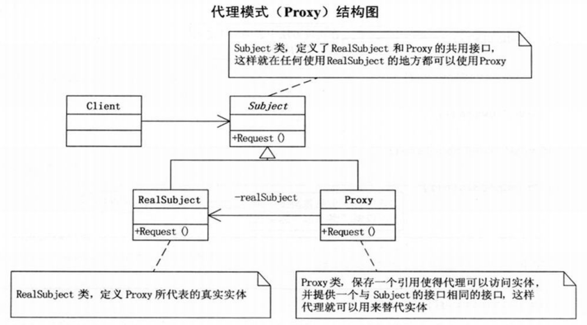

问题：代理谈恋爱  
第一版（无代理）结构图：  
  
```c#
// 小菜的代码 --- version1.01
// 追求者类
class Pursuit
{
    SchoolGirl mm;
    public Pursuit(SchoolGirl mm)
    {
        this.mm = mm;
    }
    public void GiveDolls()
    {
        Console.WriteLine(mm.Name + "送你洋娃娃");
    }
    public void GiveFlowers()
    {
        Console.WriteLine(mm.Name + "送你鲜花");
    }
    public void GiveChocolate()
    {
        Console.WriteLine(mm.Name + "送你巧克力");
    }
}
// 被追求者类
class SchoolGirl
{
    private string name;
    public string Name
    {
        get { return name; }
        set { name = value; }
    }
}
// 客户端调用代码如下
static void Main(string[] args)
{
    SchoolGirl jiaojiao = new SchoolGirl();
    jiaojiao.Name = "李娇娇";

    Pursuit zhuojiayi = new Pursuit(jiaojiao);  // 娇娇并不认识卓贾易，此处有问题

    zhuojiayi.GiveDolls();
    zhuojiayi.GiveFlowers();
    zhuojiayi.GiveChocolate();

    Console.Read();
}
/*
- 无代理
*/
```
第二版（只有代理）结构图：  
  
```c#
// 小菜的代码 --- version1.02
// 代理
class Proxy
{
    SchoolGirl mm;
    public Proxy(SchoolGirl mm)
    {
        this.mm = mm;
    }
    public void GiveDolls()
    {
        Console.WriteLine(mm.Name + "送你洋娃娃");
    }
    public void GiveFlowers()
    {
        Console.WriteLine(mm.Name + "送你鲜花");
    }
    public void GiveChocolate()
    {
        Console.WriteLine(mm.Name + "送你巧克力");
    }
}
// 客户端调用代码如下
static void Main(string[] args)
{
    SchoolGirl jiaojiao = new SchoolGirl();
    jiaojiao.Name = "李娇娇";

    Proxy daili = new Proxy(jiaojiao);  // 此时，“追求者”类的实例“卓贾易”又不在了
    daili.GiveDolls();
    daili.GiveFlowers();
    daili.GiveChocolate();

    Console.Read();
}
/*
- 只有代理
*/
```
第三版（符合实际）结构图：  
  
```c#
// 小菜的代码 --- version1.03
// 代理接口如下
interface GiveGift
{
    void GiveDolls();
    void GiveFlowers();
    void GiveChocolate();
}
// 追求者类如下
class Pursuit : GiveGift    // 唯一变化就是让“追求者”去实现“送礼物“接口
{
    SchoolGirl mm;
    public Pursuit(SchoolGirl mm)
    {
        this.mm = mm;
    }
    public void GiveDolls()
    {
        Console.WriteLine(mm.Name + "送你洋娃娃");
    }
    public void GiveFlowers()
    {
        Console.WriteLine(mm.Name + "送你鲜花");
    }
    public void GiveChocolate()
    {
        Console.WriteLine(mm.Name + "送你巧克力");
    }
}
// 代理类如下
class Proxy : GiveGift  // 让“代理”也去实现“送礼物”接口
{
    Pursuit gg;
    public Proxy(SchoolGirl mm)
    {
        gg = new Pursuit(mm);
    }
    public void GiveDolls()
    {
        gg.GiveDolls();
    }
    public void GiveFlowers()
    {
        gg.GiveFlowers();
    }
    public void GiveChocolate()
    {
        gg.GiveChocolate();
    }
}
// 客户端如下
static void Main(string[] args)
{
    SchoolGirl jiaojiao = new SchoolGirl();
    jiaojiao.Name = "李娇娇";

    Proxy daili = new Proxy(jiaojiao);

    daili.GiveDolls();
    daili.GiveFlowers();
    daili.GiveChocolate();

    Console.Read();
}
/*
- 娇娇不认识追求她的人，但却可以通过代理人得到礼物
*/
```
# 代理模式
>Note:  
>$\quad\quad$`代理模式(Proxy)`,为其他对象提供一种代理以控制对这个对象的访问。

代理模式结构图  
  
```c#
// Subject类，定义了RealSubject和Proxy的共用接口，这样就在任何使用RealSubject的地方都可以使用Proxy。
abstract class Subject
{
    public abstract void Request();
}
// RealSubject类，定义Proxy所代表的真实实体。
class RealSubject : Subject
{
    public override void Request()
    {
        Console.WriteLine("真实的请求");
    }
}
// Proxy类，保存一个引用使得代理可以访问实体，并提供一个与Subject的接口相同的接口，这样代理就可以用来替代实体。
class Proxy : Subject
{
    RealSubject realSubject;
    public override void Request()
    {
        if(realSubject == null)
        {
            realSubject = new RealSubject();
        }
        realSubject.Request();
    }
}
// 客户端代码
static void Main(string[] args)
{
    Proxy proxy = new Proxy();
    proxy.Request();

    Console.Read();
}
```
代理模式的应用场合：  
- `远程代理`，也就是为一个对象在不同的地址空间提供局部代表。这样可以隐藏一个对象存在于不同地址空间的事实。（例如，在应用程序的项目中一个Web引用，使用远程代理解决远程访问的问题）
- `虚拟代理`，是根据需要创建开销很大的对象。通过它来存放实例化需要很长时间的真实对象。（例如，HTML网页使用虚拟代理代替真实的照片，等待其加载出来）
- `安全代理`，用来控制真实对象访问时的权限。
- `智能指引`，是指当调用真实的对象时，代理处理另外一些事。