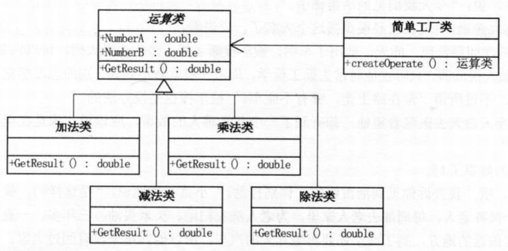
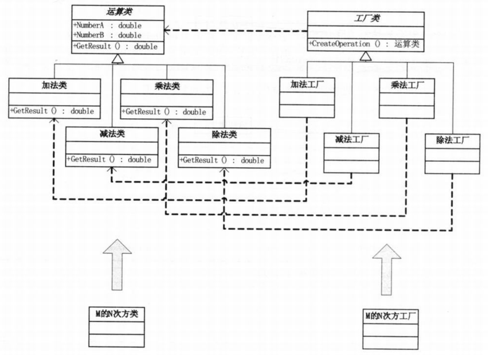
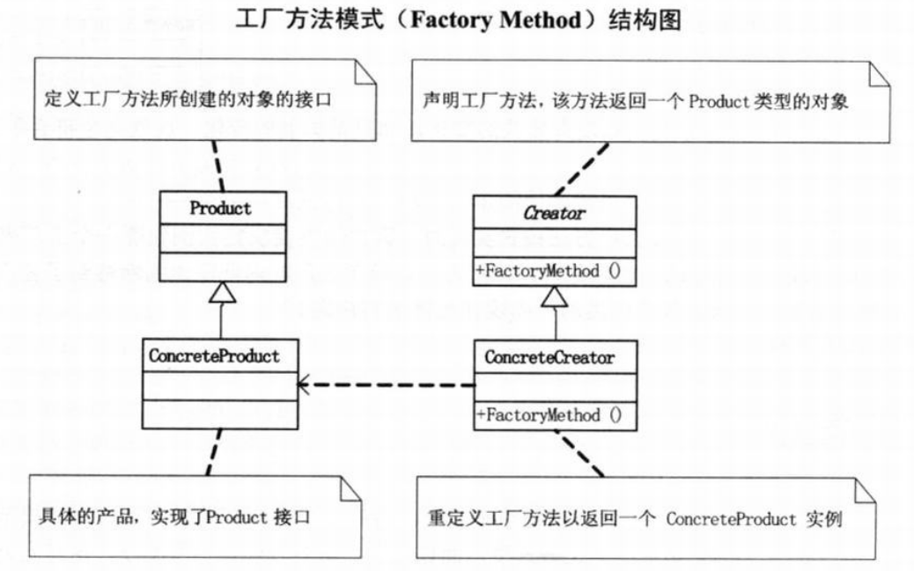
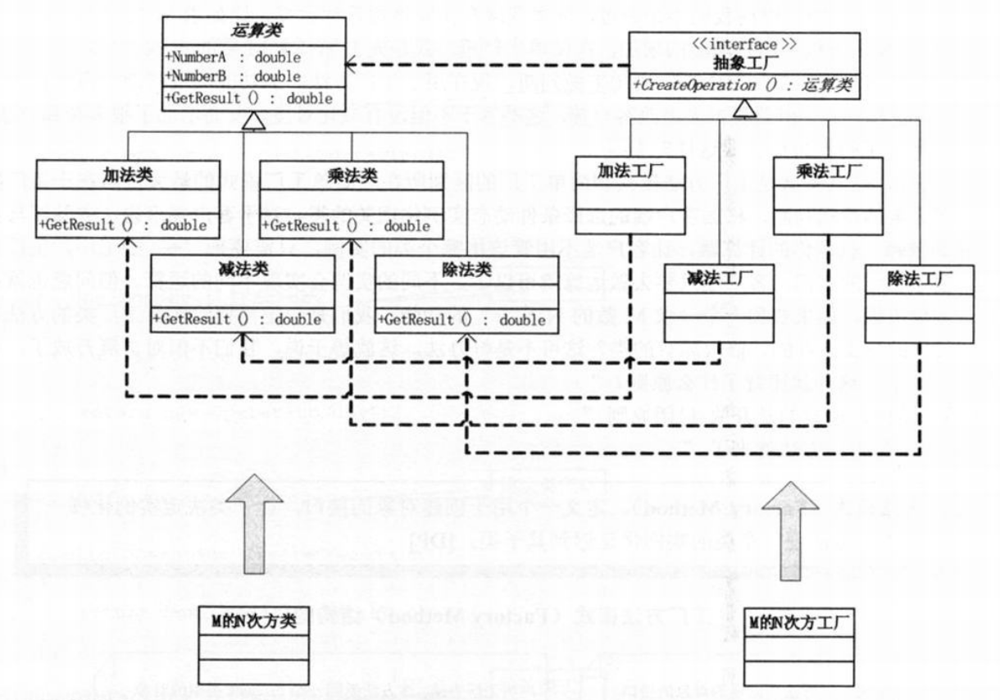

问题：再现活雷锋  
# 再现计算器的例子
- 简单工厂模式  
  
```c#
// 工厂类
class OperationFactory
{
    public static Operation createOperate(string Operate)
    {
        Operation oper = null;
        switch(operate)
        {
            case "+":
                oper = new OperationAdd();
                break;
            case "-":
                oper = new OperationSub();
                break;
            case "*":
                oper = new OperationMul();
                break;
            case "/":
                oper = new OperationDiv();
                break;
        }
        return oper;
    }
}
// 客户端
Operation oper;
oper = OperationFactory.createOperate("+");
oper.NumberA = 1;
oper.NumberB = 2;
double result = oper.GetResult();
```
- 工厂模式
  
```c#
// 工厂接口
interface IFactory
{
    Operation CreateOperation();
}
// 加减乘除各自的工厂，实现接口
class AddFactory : IFactory
{
    // 加法类工厂
    public Operation CreateOperation()
    {
        return new OperationAdd();
    }
}
class SubFactory : IFactory
{
    // 减法类工厂
    public Operation CreateOperation()
    {
        return new OperationSub();
    }
}
class MulFactory : IFactory
{
    // 乘法类工厂
    public Operation CreateOperation()
    {
        return new OperationMul();
    }
}
class DivFactory : IFactory
{
    // 除法类工厂
    public Operation CreateOperation()
    {
        return new OperationDiv();
    }
}
// 客户端
IFactory operFactory = new AddFactory();
Operation oper = operFactory.CreateOperation();
oper.NumberA = 1;
oper.NumberB = 2;
double result = oper.GetResult();
```
简单工厂模式的最大优点在于工厂类中包含了必要的逻辑判断，根据客户端的选择条件动态实例化相关的类，对于客户端来说，去除了与具体产品的依赖。  
--->但问题是，想添加一个新的功能时，必须给工厂类的方法中加一条case，这违背了开放-封闭原则。
>Note:  
>$\quad\quad$`工厂方法模式(Factory Method)`，定义一个用于创建对象的接口，让子类决定实例化哪一个类。工厂方法使一个类的实例化延迟到其子类。

  
实际上工厂类提供了抽象接口,当添加新功能时，不需要改变原有工厂类，只需增加相应的运算类和工厂类即可    
  
新的问题：工厂方法模式实现时，客户端需要决定实例化哪一个工厂来实现运算类，选择判断的问题还是存在的，也就是说，工厂方法把简单工厂的内部逻辑判断移到了客户端代码来进行。要添加新功能，原本是改工厂类，但现在是修改客户端。
# 实现雷锋工厂
```c#
// 小菜的代码 --- version1.01
// 雷锋
class LeiFeng
{
    public void Sweep()
    {
        Console.WriteLine("扫地");
    }

    public void Wash()
    {
        Console.WriteLine("洗衣");
    }

    public void BuyRice()
    {
        Console.WriteLine("买米");
    }
}
// 学雷锋的大学生
class Undergraduate : LeiFeng
{ }
// 客户端
LeiFeng xueleifeng = new Undergraduate();

xueleifeng.BuyRice();
xueleifeng.Sweep();
xueleifeng.Wash();
/*
- 可改进：大学生迟早要毕业，但是帮助老人却是长期工作，所以社区志愿者更合适
*/
```
```c#
// 小菜的代码 --- version1.02
// 社区志愿者
class Volunteer : LeiFeng
{ }
// 简单雷锋工厂
class SimpleFactory
{
    public static LeiFeng CreateLeiFeng(string type)
    {
        LeiFeng result = null;
        switch(type)
        {
            case "学雷锋的大学生":
                result = new Undergraduate();
                break;
            case "社区志愿者":
                result = new Volunteer();
                break;
        }
        return result;
    }
}
// 简单工厂模式，客户端
LeiFeng studentA = SimpleFactory.CreateLeiFeng("学雷锋的大学生");
studentA.BuyRice();
LeiFeng studentAB = SimpleFactory.CreateLeiFeng("学雷锋的大学生");
studentB.Sweep();
LeiFeng studentC = SimpleFactory.CreateLeiFeng("学雷锋的大学生");
studentC.Wash();
/*
- 三句重复的代码
*/
```
```c#
// 小菜的代码 --- version1.03
// 雷锋工厂
interface IFactory
{
    LeiFeng CreateLeiFeng();
}
// 学雷锋的大学生工厂
class UndergraduateFactory : IFactory
{
    public LeiFeng CreateLeiFeng()
    {
        return new Undergraduate();
    }
}
// 社区志愿者工厂
class VolunteerFactory : IFactory
{
    public LeiFeng CreateLeiFeng()
    {
        return new Volunteer();
    }
}
// 工厂方法模式，客户端
IFactory factory = new UndergraduateFactory();  // 要换成“社区志愿者“，修改此处即可
LeiFeng student = factory.CreateLeiFeng();

student.BuyRice();
student.Sweep();
student.Wash();
/*
- 虽然不是最佳方法，但使用工厂模式既克服了简单工厂违背开放-封闭原则的缺点，又保持了封装对象创建过程的优点。
*/
```
