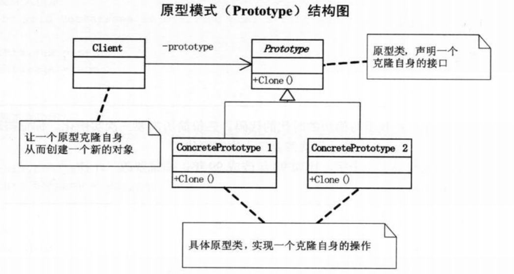
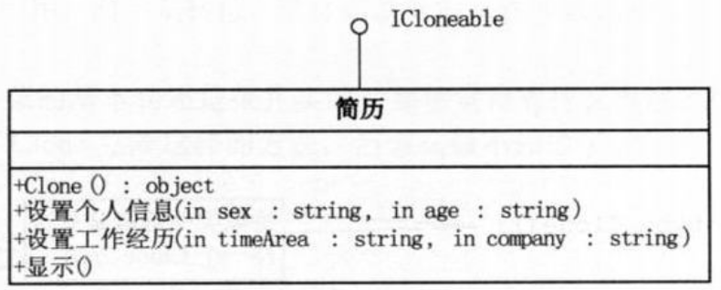
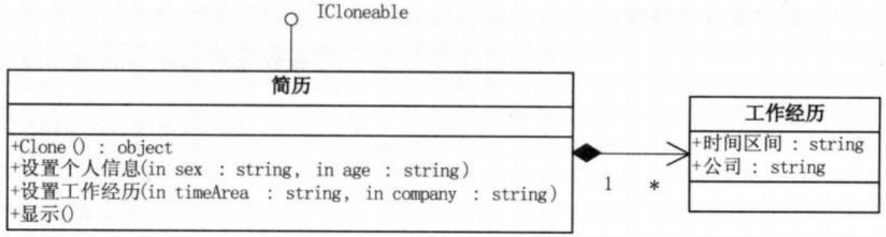
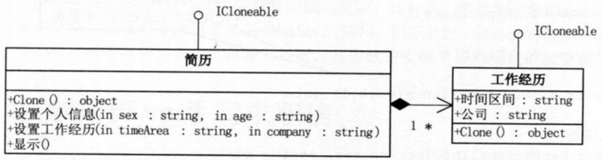

问题：简历复印，要求有一个简历类，必须要有姓名，可以设置性别和年龄，可以设置工作经历。最终需要三份简历。
```c#
// 小菜的代码 --- version1.01
// 简历
class Resume
{
    private string name;
    private string sex;
    private string age;
    private string timeArea;
    private string company;

    public Resume(string name)
    {
        this.name = name;
    }

    // 设置个人信息
    public void SetPersonalInfo(string sex,string age)
    {
        this.sex = sex;
        this.age = age;
    }

    // 设置工作经历
    public void SetWorkExperience(string timeArea,string company)
    {
        this.timeArea = timeArea;
        this.Company = company;
    }

    // 显示
    public void Display()
    {
        Console.WriteLine("{0} {1} {2}",name,sex,age);
        Console.WriteLine("工作经历： {0} {1}",timeArea,company);
    }
}
// 客户端调用代码
static void Main(string[] args)
{
    Resume a = new Resume("大鸟")；
    a.SetPersonalInfo("男","29");
    a.SetWorExperience("1998-2000","XX公司");

    Resume b = new Resume("大鸟")；
    b.SetPersonalInfo("男","29");
    b.SetWorExperience("1998-2000","XX公司");

    Resume c = new Resume("大鸟")；
    c.SetPersonalInfo("男","29");
    c.SetWorExperience("1998-2000","XX公司");

    a.Display();
    b.Display();
    c.Display();

    Console.Read();
}
/*
- 虽然实现了要求，但是若要实例化更多对象，重复代码太多，而且一个小错误需要修改很多处，不易维护和扩展
*/
```
```c#
// 小菜的代码 --- version1.02
// 修改客户端代码
static void Main(string[] args)
{
    Resume a = new Resume("大鸟");
    a.SetPersonalInfo("男","29");
    a.SetWorExperience("1998-2000","XX公司");

    Resume b = a;

    Resume c = a;


    a.Display();
    b.Display();
    c.Display();

    Console.Read();
}
/*
- 如同复印
*/
```
>Note:  
>$\quad\quad$`原型模式(Prototype)`，用原型实例指定创建对象的种类，并且通过拷贝这些原型创建新的对象。

  
- 原型模式其实就是从一个对象再创建另外一个可定制的对象，而且不需知道任何创建的细节。  
```c#
// 原型类
abstract class Prototype
{
    private string id;

    public Prototype(string id)
    {
        this.id = id;
    }

    public string Id
    {
        get { return id;}
    }
    public abstract Prototype Clone();  // 抽象类关键就是有这样一个Clone方法
}
// 具体原型类
class ConcretePrototype1 : Prototype
{
    public ConcretePrototype1(string id) : base(id)
    { }

    public override Prototype Clone()
    {
        /*
            创建当前对象的浅表副本。方法是创建一个新对象，然后将当前对象的非静态字段复制到该新对象。如果字段是值类型的，则对该字段执行逐位复制。如果字段是引用类型，则复制引用但不复制引用的对象；因此，原始对象及其副本引用同一对象。
        */
        return (Prototype)this.MemberwiseClone();
    }
}
// 客户端代码
static void Main(string[] args)
{
    ConcretePrototype1 p1 = new ConcretePrototype1("I");
    ConcretePrototype1 c1 = (ConcretePrototype1)p1.Clone(); // 克隆类ConcretePrototype1的对象p1就能得到新的实例c1
    Console.WriteLine("Cloned: {0}",c1.Id);

    Console.Read();
}
/*
- 因为克隆非常常用，.NET在System命名空间中提供了ICloneable接口，唯一方法Clone(),只需要实现这个接口就可以完成原型模式了。
*/
```
第二版结构图：  
  
```c#
// 小菜的代码 --- version1.03
// 简历类
class Resume : ICloneable
{
    private string name;
    private string sex;
    private string age;
    private string timeArea;
    private string company;

    public Resume(string name)
    {
        this.name = name;
    }

    // 设置个人信息
    public void SetPersonalInfo(string sex,string age)
    {
        this.sex = sex;
        this.age = age;
    }

    // 设置工作经历
    public void SetWorkExperience(string timeArea,string company)
    {
        this.timeArea = timeArea;
        this.Company = company;
    }

    // 显示
    public void Display()
    {
        Console.WriteLine("{0} {1} {2}",name,sex,age);
        Console.WriteLine("工作经历： {0} {1}",timeArea,company);
    }

    public Object Clone()
    {
        // 实现接口的方法，用来克隆对象
        return (Object)this.MemberwiseClone();
    }
}
// 客户端代码
static void Main(string[] args)
{
    Resume a = new Resume("大鸟");
    a.SetPersonalInfo("男","29");
    a.SetWorExperience("1998-2000","XX公司");

    // 只需要调用Clone方法就可以实现新简历的生成，并且可以再修改新简历的细节
    Resume b = (Resume)a.Clone();
    b.SetWorExperience("1998-2006","YY公司");

    Resume c = (Resume)a.Clone();
    c.SetPersonalInfo("男","24");

    a.Display();
    b.Display();
    c.Display();

    Console.Read();
}
/*
- 调用Clone方法比调用构造函数效率要高。
- 一般在初始化的信息不发生变化的情况下，克隆是最好的办法，既隐藏了对象创建的细节，又对性能是大大的提高。
- 不用重新初始化对象，而是动态地获得对象运行时的状态。
- 新的问题：MemberwiseClone()方法是，如果字段是值类型的，则对该字段执行逐位复制，如果字段是引用类型，则复制引用但不复制引用的对象；因此，原始对象及其副本引用同一对象。
*/
```
第三版本结构图：  
  
```c#
// 小菜的代码 --- version1.04
// 工作经历类
class WorkExperience
{
    private string workDate;
    public string WorDate
    {
        get { return workDate; }
        set { workDate = value; }
    }

    private string company;
    public string Company
    {
        get { return company; }
        set { company = value; }
    }
}
// 简历类
class Resume : ICloneable
{
    private string name;
    private string sex;
    private string age;

    private WorkExperience work;    // 引用“工作经历”对象

    public Resume(string name)
    {
        // 在“简历”类实例化时间时实例化“工作经历”
        this.name = name;
        work = new WorkExperience();
    }

    // 设置个人信息
    public void SetPersonalInfo(string sex,string age)
    {
        this.sex = sex;
        this.age = age;
    }

    // 设置工作经历
    public void SetWorkExperience(string workDate,string company)
    {
        // 调用此方法时，给对象的两属性赋值
        work.WorkDate = workDate;
        work.Company = company;
    }

    // 显示
    public void Display()
    {
        Console.WriteLine("{0} {1} {2}",name,sex,age);
        // 显示时，显示“工作经历”的两属性的值
        Console.WriteLine("工作经历： {0} {1}",work.WorkDate,work.Company);
    }

    public Object Clone()
    {
        return (Object)this.MemberwiseClone();
    }
}
// 客户端调用代码
static void Main(string[] args)
{
    Resume a = new Resume("大鸟");
    a.SetPersonalInfo("男","29");
    a.SetWorExperience("1998-2000","XX公司");

    // b和c都克隆于a，但当它们都设置了“工作经历”时，我们希望的结果是三个的显示不一样
    Resume b = (Resume)a.Clone();
    b.SetWorExperience("1998-2006","YY公司");

    Resume c = (Resume)a.Clone();
    c.SetWorExperience("1998-2003","ZZ公司");

    a.Display();
    b.Display();
    c.Display();

    Console.Read();
}
/*
- 可惜，三次显示的结果都是最后一次设置的值
*/
```
- `浅复制`，被复制对象的所有变量都含有与原来的对象相同的值，而所有的对其他对象的引用都仍然指向原来的对象。
- `深复制`，深复制把引用对象的变量指向复制过的新对象，而不是原有的被引用的对象。能够把要复制的对象所引用的对象都复制一遍。
- 深复制需要考虑到底要深入到多少层，而且要当心出现循环引用的问题。  

第四版本结构图：  
  
```c#
// 大鸟的代码 --- version2.01
// 工作经历类
class WorkExperience : ICloneable
{
    // 让“工作经历”实现ICloneable接口
    private string workDate;
    public string WorDate
    {
        get { return workDate; }
        set { workDate = value; }
    }

    private string company;
    public string Company
    {
        get { return company; }
        set { company = value; }
    }

    public Object Clone()
    {
        return (Object)this.MemberwiseClone();  // “工作经历”类实现克隆方法
    }
}
// 简历类
class Resume : ICloneable
{
    private string name;
    private string sex;
    private string age;
    private WorkExperience work;

    public Resume(string name)
    {
        this.name = name;
        work = new WorkExperience();
    }

    private Resume(WorkExperience work)
    {
        // 提供Clone方法调用的私有构造函数，以便克隆“工作经历”的数据
        this.work = (WorkExperience)work.Clone();
    }
    // 设置个人信息
    public void SetPersonalInfo(string sex,string age)
    {
        this.sex = sex;
        this.age = age;
    }

    // 设置工作经历
    public void SetWorkExperience(string workDate,string company)
    {
        work.WorkDate = workDate;
        work.Company = company;
    }

    // 显示
    public void Display()
    {
        Console.WriteLine("{0} {1} {2}",name,sex,age);
        Console.WriteLine("工作经历： {0} {1}",work.WorkDate,work.Company);
    }

    public Object Clone()
    {
        /*
            调用私有的构造方法，让“工作经历”克隆完成，然后再给这个“简历”对象的相关字段赋值，最终返回一个深复制的简历对象
        */
        Resume obj = new Resume(this.work);
        obj.name = this.name;
        obj.sex = this.sex;
        obj.age = this.age;
        return obj;
    }
}
// 客户端调用代码
static void Main(string[] args)
{
    Resume a = new Resume("大鸟");
    a.SetPersonalInfo("男","29");
    a.SetWorExperience("1998-2000","XX公司");

    Resume b = (Resume)a.Clone();
    b.SetWorExperience("1998-2006","YY公司");

    Resume c = (Resume)a.Clone();
    c.SetWorExperience("1998-2003","ZZ公司");

    a.Display();
    b.Display();
    c.Display();

    Console.Read();
}
/*
- 三次显示的结果各不同
*/
```
在一些特定场合会经常涉及深复制或浅复制，比方说，数据集对象DataSet，有Clone方法和Copy方法，Clone方法用来复制DataSet的结构，但不复制DataSet的数据，实现了原型模式的浅复制。Copy方法不但复制结构，也复制数据，实现了原型模式的深复制。